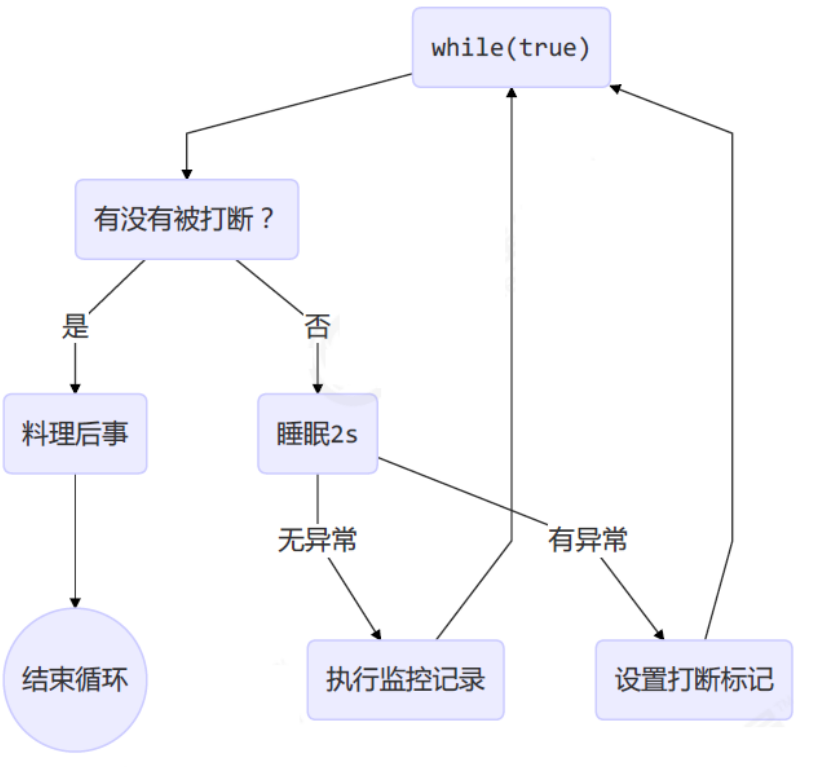

# JUC

## 进程与线程

### 概述

**进程**：程序是静止的，进程实体的运行过程就是进程，是系统进行**资源分配的基本单位**

进程的特征：并发性、异步性、动态性、独立性、结构性

**线程**：线程是属于进程的，是一个基本的 CPU 执行单元，是程序执行流的最小单元。线程是进程中的一个实体，是系统**独立调度的基本单位**，线程本身不拥有系统资源，只拥有一点在运行中必不可少的资源，与同属一个进程的其他线程共享进程所拥有的全部资源

关系：一个进程可以包含多个线程，这就是多线程，比如看视频是进程，图画、声音、广告等就是多个线程

线程的作用：使多道程序更好的并发执行，提高资源利用率和系统吞吐量，增强操作系统的并发性能

**并发并行：**

- 并行（parallel）：是同一时间动手做（doing）多件事情的能力
- 并发（concurrent）：是同一时间应对（dealing with）多件事情的能力

**同步异步：**

- 需要等待结果返回，才能继续运行就是同步
- 不需要等待结果返回，就能继续运行就是异步

### 对比

线程进程对比：

- 进程基本上相互独立的，而线程存在于进程内，是进程的一个子集

- 进程拥有共享的资源，如内存空间等，供其**内部的线程共享**

- 进程间通信较为复杂

  同一台计算机的进程通信称为 IPC（Inter-process communication）

  - 信号量：信号量是一个计数器，用于多进程对共享数据的访问，解决同步相关的问题并避免竞争条件

  - 共享存储：多个进程可以访问同一块内存空间，需要使用信号量用来同步对共享存储的访问

  - 管道通信：管道是用于连接一个读进程和一个写进程以实现它们之间通信的一个共享文件 pipe 文件，该文件同一时间只允许一个进程访问，所以只支持

    半双工通信

    - 匿名管道（Pipes）：用于具有亲缘关系的父子进程间或者兄弟进程之间的通信
    - 命名管道（Names Pipes）：以磁盘文件的方式存在，可以实现本机任意两个进程通信，遵循 FIFO

  - 消息队列：内核中存储消息的链表，由消息队列标识符标识，能在不同进程之间提供

    全双工通信

    对比管道：

    - 匿名管道存在于内存中的文件；命名管道存在于实际的磁盘介质或者文件系统；消息队列存放在内核中，只有在内核重启（操作系统重启）或者显示地删除一个消息队列时，该消息队列才被真正删除
    - 读进程可以根据消息类型有选择地接收消息，而不像 FIFO 那样只能默认地接收

  不同计算机之间的**进程通信**，需要通过网络，并遵守共同的协议，例如 HTTP

  - 套接字：与其它通信机制不同的是，可用于不同机器间的互相通信

- 线程通信相对简单，因为线程之间共享进程内的内存，一个例子是多个线程可以访问同一个共享变量

  **Java 中的通信机制**：volatile、等待/通知机制、join 方式、InheritableThreadLocal、MappedByteBuffer

- 线程更轻量，线程上下文切换成本一般上要比进程上下文切换低

## Java 线程

### 创建线程

#### Thread

Thread 创建线程方式：创建线程类，匿名内部类方式

- **start() 方法底层其实是给 CPU 注册当前线程，并且触发 run() 方法执行**
- 线程的启动必须调用 start() 方法，如果线程直接调用 run() 方法，相当于变成了普通类的执行，此时主线程将只有执行该线程
- 建议线程先创建子线程，主线程的任务放在之后，否则主线程（main）永远是先执行完

Thread 构造器：

- `public Thread()`
- `public Thread(String name)`

1. 匿名内部类方式

   ```java
   public class ThreadDemo{
       public static void main(String[] args) {
           Thread t = new Thread(){
               @Override
               public void run(){
                   System.out.println("running");
               }
           };
           t.setName("t1");
           t.start();
       }
   }
   ```

2. 创建线程类继承 Thread

   ```java
   public class ThreadDemo {
       public static void main(String[] args) {
           Thread t = new MyThread();
           t.start();
          	for(int i = 0 ; i < 100 ; i++ ){
               System.out.println("main线程" + i)
           }
           // main线程输出放在上面 就变成有先后顺序了，因为是 main 线程驱动的子线程运行
       }
   }
   class MyThread extends Thread {
       @Override
       public void run() {
           for(int i = 0 ; i < 100 ; i++ ) {
               System.out.println("子线程输出："+i)
           }
       }
   }
   ```

继承 Thread 类的优缺点：

- 优点：编码简单
- 缺点：线程类已经继承了 Thread 类无法继承其他类了，功能不能通过继承拓展（单继承的局限性）

#### Runnable

把【线程】和【任务】（要执行的代码）分开

Runnable 创建线程方式：创建线程类，匿名内部类方式

Thread 的构造器：

- `public Thread(Runnable target)`
- `public Thread(Runnable target, String name)`

```java
public class ThreadDemo{
    public static void main(String[] args) {
        // 创建线程对象
        Thread t = new Thread(new Runnable(){
            @Override
            public void run(){
                // 要执行的任务
            }
        };);
        // 启动线程
        t.start();
    }
}
```

```java
public class ThreadDemo {
    public static void main(String[] args) {
        Runnable target = new MyRunnable();
        Thread t1 = new Thread(target,"1号线程");
		t1.start();
        Thread t2 = new Thread(target);//Thread-0
    }
}

public class MyRunnable implements Runnable{
    @Override
    public void run() {
        for(int i = 0 ; i < 10 ; i++ ){
            System.out.println(Thread.currentThread().getName() + "->" + i);
        }
    }
}
```

**Thread 类本身也是实现了 Runnable 接口**，Thread 类中持有 Runnable 的属性，执行线程 run 方法底层是调用 Runnable#run：

```java
public class Thread implements Runnable {
    private Runnable target;
    
    public void run() {
        if (target != null) {
          	// 底层调用的是 Runnable 的 run 方法
            target.run();
        }
    }
}
```

Runnable 方式的优缺点：

- 缺点：代码复杂一点。
- 优点：
  1. 线程任务类只是实现了 Runnable 接口，可以继续继承其他类，避免了单继承的局限性
  2. 同一个线程任务对象可以被包装成多个线程对象
  3. 适合多个多个线程去共享同一个资源
  4. 实现解耦操作，线程任务代码可以被多个线程共享，线程任务代码和线程独立
  5. 线程池可以放入实现 Runnable 或 Callable 线程任务对象

#### Callable

实现 Callable 接口：

1. 定义一个线程任务类实现 Callable 接口，申明线程执行的结果类型
2. 重写线程任务类的 call 方法，这个方法可以直接返回执行的结果
3. 创建一个 Callable 的线程任务对象
4. 把 Callable 的线程任务对象**包装成一个未来任务对象**
5. 把未来任务对象包装成线程对象
6. 调用线程的 start() 方法启动线程

`public FutureTask(Callable<V> callable)`：未来任务对象，在线程执行完后得到线程的执行结果

- FutureTask 就是 Runnable 对象，因为 **Thread 类只能执行 Runnable 实例的任务对象**，所以把 Callable 包装成未来任务对象
- 线程池部分详解了 FutureTask 的源码

`public V get()`：同步等待 task 执行完毕的结果，如果在线程中获取另一个线程执行结果，会阻塞等待，用于线程同步

- get() 线程会阻塞等待任务执行完成
- run() 执行完后会把结果设置到 FutureTask 的一个成员变量，get() 线程可以获取到该变量的值

优缺点：

- 优点：同 Runnable，并且能得到线程执行的结果
- 缺点：编码复杂

```java
public class ThreadDemo {
    public static void main(String[] args) {
        Callable call = new MyCallable();
        FutureTask<String> task = new FutureTask<>(call);
        Thread t = new Thread(task);
        t.start();
        try {
            String s = task.get(); // 获取call方法返回的结果（正常/异常结果）
            System.out.println(s);
        }  catch (Exception e) {
            e.printStackTrace();
        }
    }

public class MyCallable implements Callable<String> {
    @Override//重写线程任务类方法
    public String call() throws Exception {
        return Thread.currentThread().getName() + "->" + "Hello World";
    }
}
```

### 线程方法

#### API

Thread 类 API：

| 方法                                        | 说明                                                         |
| ------------------------------------------- | ------------------------------------------------------------ |
| public void start()                         | 启动一个新线程，Java虚拟机调用此线程的 run 方法              |
| public void run()                           | 线程启动后调用该方法                                         |
| public void setName(String name)            | 给当前线程取名字                                             |
| public void getName()                       | 获取当前线程的名字 线程存在默认名称：子线程是 Thread-索引，主线程是 main |
| public static Thread currentThread()        | 获取当前线程对象，代码在哪个线程中执行                       |
| public static void sleep(long time)         | 让当前线程休眠多少毫秒再继续执行 **Thread.sleep(0)** : 让操作系统立刻重新进行一次 CPU 竞争 |
| public static native void yield()           | 提示线程调度器让出当前线程对 CPU 的使用                      |
| public final int getPriority()              | 返回此线程的优先级                                           |
| public final void setPriority(int priority) | 更改此线程的优先级，常用 1 5 10                              |
| public void interrupt()                     | 中断这个线程，异常处理机制                                   |
| public static boolean interrupted()         | 判断当前线程是否被打断，清除打断标记                         |
| public boolean isInterrupted()              | 判断当前线程是否被打断，不清除打断标记                       |
| public final void join()                    | 等待这个线程结束                                             |
| public final void join(long millis)         | 等待这个线程死亡 millis 毫秒，0 意味着永远等待               |
| public final native boolean isAlive()       | 线程是否存活（还没有运行完毕）                               |
| public final void setDaemon(boolean on)     | 将此线程标记为守护线程或用户线程                             |

------

#### run start

run：称为线程体，包含了要执行的这个线程的内容，方法运行结束，此线程随即终止。直接调用 run 是在主线程中执行了 run，没有启动新的线程，需要顺序执行

start：使用 start 是启动新的线程，此线程处于就绪（可运行）状态，通过新的线程间接执行 run 中的代码

说明：**线程控制资源类**

run() 方法中的异常不能抛出，只能 try/catch

- 因为父类中没有抛出任何异常，子类不能比父类抛出更多的异常
- **异常不能跨线程传播回 main() 中**，因此必须在本地进行处理

------

#### sleep yield

sleep：

- 调用 sleep 会让当前线程从 `Running` 进入 `Timed Waiting` 状态（阻塞）
- sleep() 方法的过程中，**线程不会释放对象锁**
- 其它线程可以使用 interrupt 方法打断正在睡眠的线程，这时 sleep 方法会抛出 InterruptedException
- 睡眠结束后的线程未必会立刻得到执行，需要抢占 CPU
- 建议用 TimeUnit 的 sleep 代替 Thread 的 sleep 来获得更好的可读性

yield：

- 调用 yield 会让提示线程调度器让出当前线程对 CPU 的使用
- 具体的实现依赖于操作系统的任务调度器
- **会放弃 CPU 资源，锁资源不会释放**

------

#### join

public final void join()：等待这个线程结束

原理：调用者轮询检查线程 alive 状态，t1.join() 等价于：

```java
public final synchronized void join(long millis) throws InterruptedException {
    // 调用者线程进入 thread 的 waitSet 等待, 直到当前线程运行结束
    while (isAlive()) {
        wait(0);
    }
}
```

- join 方法是被 synchronized 修饰的，本质上是一个对象锁，其内部的 wait 方法调用也是释放锁的，但是**释放的是当前的线程对象锁，而不是外面的锁**
- 当调用某个线程（t1）的 join 方法后，该线程（t1）抢占到 CPU 资源，就不再释放，直到线程执行完毕

线程同步：

- join 实现线程同步，因为会阻塞等待另一个线程的结束，才能继续向下运行
  - 需要外部共享变量，不符合面向对象封装的思想
  - 必须等待线程结束，不能配合线程池使用
- Future 实现（同步）：get() 方法阻塞等待执行结果
  - main 线程接收结果
  - get 方法是让调用线程同步等待

```java
public class Test {
    static int r = 0;
    public static void main(String[] args) throws InterruptedException {
        test1();
    }
    private static void test1() throws InterruptedException {
        Thread t1 = new Thread(() -> {
            try {
                Thread.sleep(1000);
            } catch (InterruptedException e) {
                e.printStackTrace();
            }
            r = 10;
        });
        t1.start();
        t1.join();//不等待线程执行结束，输出的10
        System.out.println(r);
    }
}
```

------

#### interrupt

##### 打断线程

`public void interrupt()`：打断这个线程，异常处理机制

`public static boolean interrupted()`：判断当前线程是否被打断，打断返回 true，**清除打断标记**，连续调用两次一定返回 false

`public boolean isInterrupted()`：判断当前线程是否被打断，不清除打断标记

打断的线程会发生上下文切换，操作系统会保存线程信息，抢占到 CPU 后会从中断的地方接着运行（打断不是停止）

- sleep、wait、join 方法都会让线程进入阻塞状态，打断线程**会清空打断状态**（false）

  ```java
  public static void main(String[] args) throws InterruptedException {
      Thread t1 = new Thread(()->{
          try {
              Thread.sleep(1000);
          } catch (InterruptedException e) {
              e.printStackTrace();
          }
      }, "t1");
      t1.start();
      Thread.sleep(500);
      t1.interrupt();
      System.out.println(" 打断状态: {}" + t1.isInterrupted());// 打断状态: {}false
  }
  ```

- 打断正常运行的线程：不会清空打断状态（true）

  ```java
  public static void main(String[] args) throws Exception {
      Thread t2 = new Thread(()->{
          while(true) {
              Thread current = Thread.currentThread();
              boolean interrupted = current.isInterrupted();
              if(interrupted) {
                  System.out.println(" 打断状态: {}" + interrupted);//打断状态: {}true
                  break;
              }
          }
      }, "t2");
      t2.start();
      Thread.sleep(500);
      t2.interrupt();
  }
  ```

------

##### 打断 park

park 作用类似 sleep，打断 park 线程，不会清空打断状态（true）

```java
public static void main(String[] args) throws Exception {
    Thread t1 = new Thread(() -> {
        System.out.println("park...");
        LockSupport.park();
        System.out.println("unpark...");
        System.out.println("打断状态：" + Thread.currentThread().isInterrupted());//打断状态：true
    }, "t1");
    t1.start();
    Thread.sleep(2000);
    t1.interrupt();
}
```

如果打断标记已经是 true, 则 park 会失效

```java
LockSupport.park();
System.out.println("unpark...");
LockSupport.park();//失效，不会阻塞
System.out.println("unpark...");//和上一个unpark同时执行
```

可以修改获取打断状态方法，使用 `Thread.interrupted()`，清除打断标记

LockSupport 类在 同步 → park-un 详解

------

##### 终止模式

终止模式之两阶段终止模式：Two Phase Termination

目标：在一个线程 T1 中如何优雅终止线程 T2？优雅指的是给 T2 一个后置处理器

错误思想：

- 使用线程对象的 stop() 方法停止线程：stop 方法会真正杀死线程，如果这时线程锁住了共享资源，当它被杀死后就再也没有机会释放锁，其它线程将永远无法获取锁
- 使用 System.exit(int) 方法停止线程：目的仅是停止一个线程，但这种做法会让整个程序都停止

两阶段终止模式图示：



打断线程可能在任何时间，所以需要考虑在任何时刻被打断的处理方法：

```java
public class Test {
    public static void main(String[] args) throws InterruptedException {
        TwoPhaseTermination tpt = new TwoPhaseTermination();
        tpt.start();
        Thread.sleep(3500);
        tpt.stop();
    }
}
class TwoPhaseTermination {
    private Thread monitor;
    // 启动监控线程
    public void start() {
        monitor = new Thread(new Runnable() {
            @Override
            public void run() {
                while (true) {
                    Thread thread = Thread.currentThread();
                    if (thread.isInterrupted()) {
                        System.out.println("后置处理");
                        break;
                    }
                    try {
                        Thread.sleep(1000);					// 睡眠
                        System.out.println("执行监控记录");	// 在此被打断不会异常
                    } catch (InterruptedException e) {		// 在睡眠期间被打断，进入异常处理的逻辑
                        e.printStackTrace();
                        // 重新设置打断标记，打断 sleep 会清除打断状态
                        thread.interrupt();
                    }
                }
            }
        });
        monitor.start();
    }
    // 停止监控线程
    public void stop() {
        monitor.interrupt();
    }
}
```

------

#### daemon

`public final void setDaemon(boolean on)`：如果是 true ，将此线程标记为守护线程

线程**启动前**调用此方法：

```java
Thread t = new Thread() {
    @Override
    public void run() {
        System.out.println("running");
    }
};
// 设置该线程为守护线程
t.setDaemon(true);
t.start();
```

用户线程：平常创建的普通线程

守护线程：服务于用户线程，只要其它非守护线程运行结束了，即使守护线程代码没有执行完，也会强制结束。守护进程是**脱离于终端并且在后台运行的进程**，脱离终端是为了避免在执行的过程中的信息在终端上显示

说明：当运行的线程都是守护线程，Java 虚拟机将退出，因为普通线程执行完后，JVM 是守护线程，不会继续运行下去

常见的守护线程：

- 垃圾回收器线程就是一种守护线程
- Tomcat 中的 Acceptor 和 Poller 线程都是守护线程，所以 Tomcat 接收到 shutdown 命令后，不会等待它们处理完当前请求

------

#### 不推荐

不推荐使用的方法，这些方法已过时，容易破坏同步代码块，造成线程死锁：

- `public final void stop()`：停止线程运行

  废弃原因：方法粗暴，除非可能执行 finally 代码块以及释放 synchronized 外，线程将直接被终止，如果线程持有 JUC 的互斥锁可能导致锁来不及释放，造成其他线程永远等待的局面

- `public final void suspend()`：**挂起（暂停）线程运行**

  废弃原因：如果目标线程在暂停时对系统资源持有锁，则在目标线程恢复之前没有线程可以访问该资源，如果**恢复目标线程的线程**在调用 resume 之前会尝试访问此共享资源，则会导致死锁

- `public final void resume()`：恢复线程运行
