# JUC

## 进程与线程

### 概述

**进程**：程序是静止的，进程实体的运行过程就是进程，是系统进行**资源分配的基本单位**

进程的特征：并发性、异步性、动态性、独立性、结构性

**线程**：线程是属于进程的，是一个基本的 CPU 执行单元，是程序执行流的最小单元。线程是进程中的一个实体，是系统**独立调度的基本单位**，线程本身不拥有系统资源，只拥有一点在运行中必不可少的资源，与同属一个进程的其他线程共享进程所拥有的全部资源

关系：一个进程可以包含多个线程，这就是多线程，比如看视频是进程，图画、声音、广告等就是多个线程

线程的作用：使多道程序更好的并发执行，提高资源利用率和系统吞吐量，增强操作系统的并发性能

**并发并行：**

- 并行（parallel）：是同一时间动手做（doing）多件事情的能力
- 并发（concurrent）：是同一时间应对（dealing with）多件事情的能力

**同步异步：**

- 需要等待结果返回，才能继续运行就是同步
- 不需要等待结果返回，就能继续运行就是异步

### 对比

线程进程对比：

- 进程基本上相互独立的，而线程存在于进程内，是进程的一个子集

- 进程拥有共享的资源，如内存空间等，供其**内部的线程共享**

- 进程间通信较为复杂

  同一台计算机的进程通信称为 IPC（Inter-process communication）

  - 信号量：信号量是一个计数器，用于多进程对共享数据的访问，解决同步相关的问题并避免竞争条件

  - 共享存储：多个进程可以访问同一块内存空间，需要使用信号量用来同步对共享存储的访问

  - 管道通信：管道是用于连接一个读进程和一个写进程以实现它们之间通信的一个共享文件 pipe 文件，该文件同一时间只允许一个进程访问，所以只支持

    半双工通信

    - 匿名管道（Pipes）：用于具有亲缘关系的父子进程间或者兄弟进程之间的通信
    - 命名管道（Names Pipes）：以磁盘文件的方式存在，可以实现本机任意两个进程通信，遵循 FIFO

  - 消息队列：内核中存储消息的链表，由消息队列标识符标识，能在不同进程之间提供

    全双工通信

    对比管道：

    - 匿名管道存在于内存中的文件；命名管道存在于实际的磁盘介质或者文件系统；消息队列存放在内核中，只有在内核重启（操作系统重启）或者显示地删除一个消息队列时，该消息队列才被真正删除
    - 读进程可以根据消息类型有选择地接收消息，而不像 FIFO 那样只能默认地接收

  不同计算机之间的**进程通信**，需要通过网络，并遵守共同的协议，例如 HTTP

  - 套接字：与其它通信机制不同的是，可用于不同机器间的互相通信

- 线程通信相对简单，因为线程之间共享进程内的内存，一个例子是多个线程可以访问同一个共享变量

  **Java 中的通信机制**：volatile、等待/通知机制、join 方式、InheritableThreadLocal、MappedByteBuffer

- 线程更轻量，线程上下文切换成本一般上要比进程上下文切换低

## Java 线程

### 创建线程

#### Thread

Thread 创建线程方式：创建线程类，匿名内部类方式

- **start() 方法底层其实是给 CPU 注册当前线程，并且触发 run() 方法执行**
- 线程的启动必须调用 start() 方法，如果线程直接调用 run() 方法，相当于变成了普通类的执行，此时主线程将只有执行该线程
- 建议线程先创建子线程，主线程的任务放在之后，否则主线程（main）永远是先执行完

Thread 构造器：

- `public Thread()`
- `public Thread(String name)`

1. 匿名内部类方式

   ```java
   public class ThreadDemo{
       public static void main(String[] args) {
           Thread t = new Thread(){
               @Override
               public void run(){
                   System.out.println("running");
               }
           };
           t.setName("t1");
           t.start();
       }
   }
   ```

2. 创建线程类继承 Thread

   ```java
   public class ThreadDemo {
       public static void main(String[] args) {
           Thread t = new MyThread();
           t.start();
          	for(int i = 0 ; i < 100 ; i++ ){
               System.out.println("main线程" + i)
           }
           // main线程输出放在上面 就变成有先后顺序了，因为是 main 线程驱动的子线程运行
       }
   }
   class MyThread extends Thread {
       @Override
       public void run() {
           for(int i = 0 ; i < 100 ; i++ ) {
               System.out.println("子线程输出："+i)
           }
       }
   }
   ```

继承 Thread 类的优缺点：

- 优点：编码简单
- 缺点：线程类已经继承了 Thread 类无法继承其他类了，功能不能通过继承拓展（单继承的局限性）

#### Runnable

把【线程】和【任务】（要执行的代码）分开

Runnable 创建线程方式：创建线程类，匿名内部类方式

Thread 的构造器：

- `public Thread(Runnable target)`
- `public Thread(Runnable target, String name)`

```java
public class ThreadDemo{
    public static void main(String[] args) {
        // 创建线程对象
        Thread t = new Thread(new Runnable(){
            @Override
            public void run(){
                // 要执行的任务
            }
        };);
        // 启动线程
        t.start();
    }
}
```

```java
public class ThreadDemo {
    public static void main(String[] args) {
        Runnable target = new MyRunnable();
        Thread t1 = new Thread(target,"1号线程");
		t1.start();
        Thread t2 = new Thread(target);//Thread-0
    }
}

public class MyRunnable implements Runnable{
    @Override
    public void run() {
        for(int i = 0 ; i < 10 ; i++ ){
            System.out.println(Thread.currentThread().getName() + "->" + i);
        }
    }
}
```

**Thread 类本身也是实现了 Runnable 接口**，Thread 类中持有 Runnable 的属性，执行线程 run 方法底层是调用 Runnable#run：

```java
public class Thread implements Runnable {
    private Runnable target;
    
    public void run() {
        if (target != null) {
          	// 底层调用的是 Runnable 的 run 方法
            target.run();
        }
    }
}
```

Runnable 方式的优缺点：

- 缺点：代码复杂一点。
- 优点：
  1. 线程任务类只是实现了 Runnable 接口，可以继续继承其他类，避免了单继承的局限性
  2. 同一个线程任务对象可以被包装成多个线程对象
  3. 适合多个多个线程去共享同一个资源
  4. 实现解耦操作，线程任务代码可以被多个线程共享，线程任务代码和线程独立
  5. 线程池可以放入实现 Runnable 或 Callable 线程任务对象

#### Callable

实现 Callable 接口：

1. 定义一个线程任务类实现 Callable 接口，申明线程执行的结果类型
2. 重写线程任务类的 call 方法，这个方法可以直接返回执行的结果
3. 创建一个 Callable 的线程任务对象
4. 把 Callable 的线程任务对象**包装成一个未来任务对象**
5. 把未来任务对象包装成线程对象
6. 调用线程的 start() 方法启动线程

`public FutureTask(Callable<V> callable)`：未来任务对象，在线程执行完后得到线程的执行结果

- FutureTask 就是 Runnable 对象，因为 **Thread 类只能执行 Runnable 实例的任务对象**，所以把 Callable 包装成未来任务对象
- 线程池部分详解了 FutureTask 的源码

`public V get()`：同步等待 task 执行完毕的结果，如果在线程中获取另一个线程执行结果，会阻塞等待，用于线程同步

- get() 线程会阻塞等待任务执行完成
- run() 执行完后会把结果设置到 FutureTask 的一个成员变量，get() 线程可以获取到该变量的值

优缺点：

- 优点：同 Runnable，并且能得到线程执行的结果
- 缺点：编码复杂

```java
public class ThreadDemo {
    public static void main(String[] args) {
        Callable call = new MyCallable();
        FutureTask<String> task = new FutureTask<>(call);
        Thread t = new Thread(task);
        t.start();
        try {
            String s = task.get(); // 获取call方法返回的结果（正常/异常结果）
            System.out.println(s);
        }  catch (Exception e) {
            e.printStackTrace();
        }
    }

public class MyCallable implements Callable<String> {
    @Override//重写线程任务类方法
    public String call() throws Exception {
        return Thread.currentThread().getName() + "->" + "Hello World";
    }
}
```

### 线程原理

#### 运行机制

**Java Virtual Machine Stacks（Java 虚拟机栈）**：每个线程启动后，虚拟机就会为其分配一块栈内存

- 每个栈由多个栈帧（Frame）组成，对应着每次方法调用时所占用的内存
- 每个线程只能有一个活动栈帧，对应着当前正在执行的那个方法

**线程上下文切换（Thread Context Switch）**：一些原因导致 CPU 不再执行当前线程，转而执行另一个线程

- 线程的 CPU 时间片用完
- 垃圾回收
- 有更高优先级的线程需要运行
- 线程自己调用了 sleep、yield、wait、join、park 等方法

**程序计数器（Program Counter Register）**：记住下一条 JVM 指令的执行地址，是线程私有的

当 Context Switch 发生时，需要由操作系统保存当前线程的状态（PCB 中），并恢复另一个线程的状态，包括程序计数器、虚拟机栈中每个栈帧的信息，如局部变量、操作数栈、返回地址等

JVM 规范并没有限定线程模型，以 HotSopot 为例：

- Java 的线程是内核级线程（1:1 线程模型），每个 Java 线程都映射到一个操作系统原生线程，需要消耗一定的内核资源（堆栈）
- **线程的调度是在内核态运行的，而线程中的代码是在用户态运行**，所以线程切换（状态改变）会导致用户与内核态转换进行系统调用，这是非常消耗性能

Java 中 main 方法启动的是一个进程也是一个主线程，main 方法里面的其他线程均为子线程，main 线程是这些线程的父线程

------

### 查看线程

Windows：

- 任务管理器可以查看进程和线程数，也可以用来杀死进程
- tasklist 查看进程
- taskkill 杀死进程

Linux：

- ps -ef 查看所有进程
- ps -fT -p 查看某个进程（PID）的所有线程
- kill 杀死进程
- top 按大写 H 切换是否显示线程
- top -H -p 查看某个进程（PID）的所有线程

Java：

- jps 命令查看所有 Java 进程
- jstack 查看某个 Java 进程（PID）的所有线程状态
- jconsole 来查看某个 Java 进程中线程的运行情况（图形界面）

------

### 线程状态

进程的状态参考操作系统：创建态、就绪态、运行态、阻塞态、终止态

线程由生到死的完整过程（生命周期）：当线程被创建并启动以后，既不是一启动就进入了执行状态，也不是一直处于执行状态，在 API 中 `java.lang.Thread.State` 这个枚举中给出了六种线程状态：

| 线程状态                   | 导致状态发生条件                                             |
| -------------------------- | ------------------------------------------------------------ |
| NEW（新建）                | 线程刚被创建，但是并未启动，还没调用 start 方法，只有线程对象，没有线程特征 |
| Runnable（可运行）         | 线程可以在 Java 虚拟机中运行的状态，可能正在运行自己代码，也可能没有，这取决于操作系统处理器，调用了 t.start() 方法：就绪（经典叫法） |
| Blocked（阻塞）            | 当一个线程试图获取一个对象锁，而该对象锁被其他的线程持有，则该线程进入 Blocked 状态；当该线程持有锁时，该线程将变成 Runnable 状态 |
| Waiting（无限等待）        | 一个线程在等待另一个线程执行一个（唤醒）动作时，该线程进入 Waiting 状态，进入这个状态后不能自动唤醒，必须等待另一个线程调用 notify 或者 notifyAll 方法才能唤醒 |
| Timed Waiting （限期等待） | 有几个方法有超时参数，调用将进入 Timed Waiting 状态，这一状态将一直保持到超时期满或者接收到唤醒通知。带有超时参数的常用方法有 Thread.sleep 、Object.wait |
| Teminated（结束）          | run 方法正常退出而死亡，或者因为没有捕获的异常终止了 run 方法而死亡 |

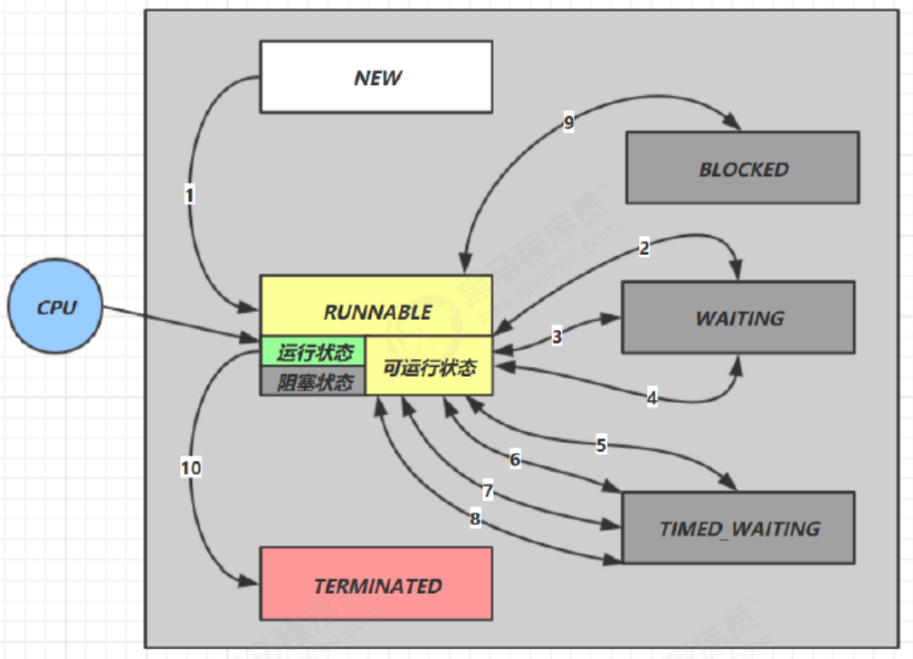

- NEW → RUNNABLE：当调用 t.start() 方法时，由 NEW → RUNNABLE

- RUNNABLE <--> WAITING：

  - 调用 obj.wait() 方法时

    调用 obj.notify()、obj.notifyAll()、t.interrupt()：

    - 竞争锁成功，t 线程从 WAITING → RUNNABLE
    - 竞争锁失败，t 线程从 WAITING → BLOCKED

  - 当前线程调用 t.join() 方法，注意是当前线程在 t 线程对象的监视器上等待

    * t 线程结束，或调用了当前线程的 interrupt() 时，当前线程从 WAITING --> RUNNABLE

  - 当前线程调用 LockSupport.park() 方法

    * 调用LockSupport.unpark(目标线程) 或调用了线程的 interrupt()，会让目标线程从 WAITING --> RUNNABLE

- RUNNABLE <--> TIMED_WAITING：调用 obj.wait(long n) 方法、当前线程调用 t.join(long n) 方法、当前线程调用 Thread.sleep(long n)、当前线程调用 LockSupport.parkNanos(long nanos) 或 LockSupport.parkUntil(long millis)

- RUNNABLE <--> BLOCKED：t 线程用 synchronized(obj) 获取了对象锁时竞争失败

- RUNNABLE-->TERMINATED: 当前线程所有代码运行完毕，进入TERMINATED

------

#### 线程调度

线程调度指系统为线程分配处理器使用权的过程，方式有两种：协同式线程调度、抢占式线程调度（Java 选择）

协同式线程调度：线程的执行时间由线程本身控制

- 优点：线程做完任务才通知系统切换到其他线程，相当于所有线程串行执行，不会出现线程同步问题
- 缺点：线程执行时间不可控，如果代码编写出现问题，可能导致程序一直阻塞，引起系统的奔溃

抢占式线程调度：线程的执行时间由系统分配

- 优点：线程执行时间可控，不会因为一个线程的问题而导致整体系统不可用
- 缺点：无法主动为某个线程多分配时间

Java 提供了线程优先级的机制，优先级会提示（hint）调度器优先调度该线程，但这仅仅是一个提示，调度器可以忽略它。在线程的就绪状态时，如果 CPU 比较忙，那么优先级高的线程会获得更多的时间片，但 CPU 闲时，优先级几乎没作用

说明：并不能通过优先级来判断线程执行的先后顺序

------

#### 未来优化

内核级线程调度的成本较大，所以引入了更轻量级的协程。用户线程的调度由用户自己实现（多对一的线程模型，多**个用户线程映射到一个内核级线程**），被设计为协同式调度，所以叫协程

- 有栈协程：协程会完整的做调用栈的保护、恢复工作，所以叫有栈协程
- 无栈协程：本质上是一种有限状态机，状态保存在闭包里，比有栈协程更轻量，但是功能有限

有栈协程中有一种特例叫纤程，在新并发模型中，一段纤程的代码被分为两部分，执行过程和调度器：

- 执行过程：用于维护执行现场，保护、恢复上下文状态
- 调度器：负责编排所有要执行的代码顺序

------

### 线程方法

#### API

Thread 类 API：

| 方法                                        | 说明                                                         |
| ------------------------------------------- | ------------------------------------------------------------ |
| public void start()                         | 启动一个新线程，Java虚拟机调用此线程的 run 方法              |
| public void run()                           | 线程启动后调用该方法                                         |
| public void setName(String name)            | 给当前线程取名字                                             |
| public void getName()                       | 获取当前线程的名字 线程存在默认名称：子线程是 Thread-索引，主线程是 main |
| public static Thread currentThread()        | 获取当前线程对象，代码在哪个线程中执行                       |
| public static void sleep(long time)         | 让当前线程休眠多少毫秒再继续执行 **Thread.sleep(0)** : 让操作系统立刻重新进行一次 CPU 竞争 |
| public static native void yield()           | 提示线程调度器让出当前线程对 CPU 的使用                      |
| public final int getPriority()              | 返回此线程的优先级                                           |
| public final void setPriority(int priority) | 更改此线程的优先级，常用 1 5 10                              |
| public void interrupt()                     | 中断这个线程，异常处理机制                                   |
| public static boolean interrupted()         | 判断当前线程是否被打断，清除打断标记                         |
| public boolean isInterrupted()              | 判断当前线程是否被打断，不清除打断标记                       |
| public final void join()                    | 等待这个线程结束                                             |
| public final void join(long millis)         | 等待这个线程死亡 millis 毫秒，0 意味着永远等待               |
| public final native boolean isAlive()       | 线程是否存活（还没有运行完毕）                               |
| public final void setDaemon(boolean on)     | 将此线程标记为守护线程或用户线程                             |

------

#### run start

run：称为线程体，包含了要执行的这个线程的内容，方法运行结束，此线程随即终止。直接调用 run 是在主线程中执行了 run，没有启动新的线程，需要顺序执行

start：使用 start 是启动新的线程，此线程处于就绪（可运行）状态，通过新的线程间接执行 run 中的代码

说明：**线程控制资源类**

run() 方法中的异常不能抛出，只能 try/catch

- 因为父类中没有抛出任何异常，子类不能比父类抛出更多的异常
- **异常不能跨线程传播回 main() 中**，因此必须在本地进行处理

------

#### sleep yield

sleep：

- 调用 sleep 会让当前线程从 `Running` 进入 `Timed Waiting` 状态（阻塞）
- sleep() 方法的过程中，**线程不会释放对象锁**
- 其它线程可以使用 interrupt 方法打断正在睡眠的线程，这时 sleep 方法会抛出 InterruptedException
- 睡眠结束后的线程未必会立刻得到执行，需要抢占 CPU
- 建议用 TimeUnit 的 sleep 代替 Thread 的 sleep 来获得更好的可读性

yield：

- 调用 yield 会让提示线程调度器让出当前线程对 CPU 的使用
- 具体的实现依赖于操作系统的任务调度器
- **会放弃 CPU 资源，锁资源不会释放**

------

#### join

public final void join()：等待这个线程结束

原理：调用者轮询检查线程 alive 状态，t1.join() 等价于：

```java
public final synchronized void join(long millis) throws InterruptedException {
    // 调用者线程进入 thread 的 waitSet 等待, 直到当前线程运行结束
    while (isAlive()) {
        wait(0);
    }
}
```

- join 方法是被 synchronized 修饰的，本质上是一个对象锁，其内部的 wait 方法调用也是释放锁的，但是**释放的是当前的线程对象锁，而不是外面的锁**
- 当调用某个线程（t1）的 join 方法后，该线程（t1）抢占到 CPU 资源，就不再释放，直到线程执行完毕

线程同步：

- join 实现线程同步，因为会阻塞等待另一个线程的结束，才能继续向下运行
  - 需要外部共享变量，不符合面向对象封装的思想
  - 必须等待线程结束，不能配合线程池使用
- Future 实现（同步）：get() 方法阻塞等待执行结果
  - main 线程接收结果
  - get 方法是让调用线程同步等待

```java
public class Test {
    static int r = 0;
    public static void main(String[] args) throws InterruptedException {
        test1();
    }
    private static void test1() throws InterruptedException {
        Thread t1 = new Thread(() -> {
            try {
                Thread.sleep(1000);
            } catch (InterruptedException e) {
                e.printStackTrace();
            }
            r = 10;
        });
        t1.start();
        t1.join();//不等待线程执行结束，输出的10
        System.out.println(r);
    }
}
```

------

#### interrupt

##### 打断线程

`public void interrupt()`：打断这个线程，异常处理机制

`public static boolean interrupted()`：判断当前线程是否被打断，打断返回 true，**清除打断标记**，连续调用两次一定返回 false

`public boolean isInterrupted()`：判断当前线程是否被打断，不清除打断标记

打断的线程会发生上下文切换，操作系统会保存线程信息，抢占到 CPU 后会从中断的地方接着运行（打断不是停止）

- sleep、wait、join 方法都会让线程进入阻塞状态，打断线程**会清空打断状态**（false）

  ```java
  public static void main(String[] args) throws InterruptedException {
      Thread t1 = new Thread(()->{
          try {
              Thread.sleep(1000);
          } catch (InterruptedException e) {
              e.printStackTrace();
          }
      }, "t1");
      t1.start();
      Thread.sleep(500);
      t1.interrupt();
      System.out.println(" 打断状态: {}" + t1.isInterrupted());// 打断状态: {}false
  }
  ```

- 打断正常运行的线程：不会清空打断状态（true）

  ```java
  public static void main(String[] args) throws Exception {
      Thread t2 = new Thread(()->{
          while(true) {
              Thread current = Thread.currentThread();
              boolean interrupted = current.isInterrupted();
              if(interrupted) {
                  System.out.println(" 打断状态: {}" + interrupted);//打断状态: {}true
                  break;
              }
          }
      }, "t2");
      t2.start();
      Thread.sleep(500);
      t2.interrupt();
  }
  ```

------

##### 打断 park

park 作用类似 sleep，打断 park 线程，不会清空打断状态（true）

```java
public static void main(String[] args) throws Exception {
    Thread t1 = new Thread(() -> {
        System.out.println("park...");
        LockSupport.park();
        System.out.println("unpark...");
        System.out.println("打断状态：" + Thread.currentThread().isInterrupted());//打断状态：true
    }, "t1");
    t1.start();
    Thread.sleep(2000);
    t1.interrupt();
}
```

如果打断标记已经是 true, 则 park 会失效

```java
LockSupport.park();
System.out.println("unpark...");
LockSupport.park();//失效，不会阻塞
System.out.println("unpark...");//和上一个unpark同时执行
```

可以修改获取打断状态方法，使用 `Thread.interrupted()`，清除打断标记

LockSupport 类在 同步 → park-un 详解

------

##### 终止模式

终止模式之两阶段终止模式：Two Phase Termination

目标：在一个线程 T1 中如何优雅终止线程 T2？优雅指的是给 T2 一个后置处理器

错误思想：

- 使用线程对象的 stop() 方法停止线程：stop 方法会真正杀死线程，如果这时线程锁住了共享资源，当它被杀死后就再也没有机会释放锁，其它线程将永远无法获取锁
- 使用 System.exit(int) 方法停止线程：目的仅是停止一个线程，但这种做法会让整个程序都停止

两阶段终止模式图示：


打断线程可能在任何时间，所以需要考虑在任何时刻被打断的处理方法：

```java
public class Test {
    public static void main(String[] args) throws InterruptedException {
        TwoPhaseTermination tpt = new TwoPhaseTermination();
        tpt.start();
        Thread.sleep(3500);
        tpt.stop();
    }
}
class TwoPhaseTermination {
    private Thread monitor;
    // 启动监控线程
    public void start() {
        monitor = new Thread(new Runnable() {
            @Override
            public void run() {
                while (true) {
                    Thread thread = Thread.currentThread();
                    if (thread.isInterrupted()) {
                        System.out.println("后置处理");
                        break;
                    }
                    try {
                        Thread.sleep(1000);					// 睡眠
                        System.out.println("执行监控记录");	// 在此被打断不会异常
                    } catch (InterruptedException e) {		// 在睡眠期间被打断，进入异常处理的逻辑
                        e.printStackTrace();
                        // 重新设置打断标记，打断 sleep 会清除打断状态
                        thread.interrupt();
                    }
                }
            }
        });
        monitor.start();
    }
    // 停止监控线程
    public void stop() {
        monitor.interrupt();
    }
}
```

------

#### daemon

`public final void setDaemon(boolean on)`：如果是 true ，将此线程标记为守护线程

线程**启动前**调用此方法：

```java
Thread t = new Thread() {
    @Override
    public void run() {
        System.out.println("running");
    }
};
// 设置该线程为守护线程
t.setDaemon(true);
t.start();
```

用户线程：平常创建的普通线程

守护线程：服务于用户线程，只要其它非守护线程运行结束了，即使守护线程代码没有执行完，也会强制结束。守护进程是**脱离于终端并且在后台运行的进程**，脱离终端是为了避免在执行的过程中的信息在终端上显示

说明：当运行的线程都是守护线程，Java 虚拟机将退出，因为普通线程执行完后，JVM 是守护线程，不会继续运行下去

常见的守护线程：

- 垃圾回收器线程就是一种守护线程
- Tomcat 中的 Acceptor 和 Poller 线程都是守护线程，所以 Tomcat 接收到 shutdown 命令后，不会等待它们处理完当前请求

------

#### 不推荐

不推荐使用的方法，这些方法已过时，容易破坏同步代码块，造成线程死锁：

- `public final void stop()`：停止线程运行

  废弃原因：方法粗暴，除非可能执行 finally 代码块以及释放 synchronized 外，线程将直接被终止，如果线程持有 JUC 的互斥锁可能导致锁来不及释放，造成其他线程永远等待的局面

- `public final void suspend()`：**挂起（暂停）线程运行**

  废弃原因：如果目标线程在暂停时对系统资源持有锁，则在目标线程恢复之前没有线程可以访问该资源，如果**恢复目标线程的线程**在调用 resume 之前会尝试访问此共享资源，则会导致死锁

- `public final void resume()`：恢复线程运行

------

## 共享模型之管程

### 临界区 Critical Section

临界资源：一次仅允许一个进程使用的资源成为临界资源

临界区：访问临界资源的代码块

* 一个程序运行多个线程是没有问题
* 问题出在多个线程访问共享资源
  * 多个线程读共享资源也没有问题
  * 在多个线程对共享资源读写操作时发生指令交错，就会出现问题

### 竞态条件 Race Condition

多个线程在临界区内执行，由于代码的执行序列不同而导致结果无法预测，称之为发生了竞态条件

### 解决方案

为了避免临界区的竞态条件发生（解决线程安全问题）：

- 阻塞式的解决方案：synchronized，lock
- 非阻塞式的解决方案：原子变量

管程（monitor）：由局部于自己的若干公共变量和所有访问这些公共变量的过程所组成的软件模块，保证同一时刻只有一个进程在管程内活动，即管程内定义的操作在同一时刻只被一个进程调用（由编译器实现）

**synchronized：对象锁，保证了临界区内代码的原子性**，采用互斥的方式让同一时刻至多只有一个线程能持有对象锁，其它线程获取这个对象锁时会阻塞，保证拥有锁的线程可以安全的执行临界区内的代码，不用担心线程上下文切换

互斥和同步都可以采用 synchronized 关键字来完成，区别：

- 互斥是保证临界区的竞态条件发生，同一时刻只能有一个线程执行临界区代码
- 同步是由于线程执行的先后、顺序不同、需要一个线程等待其它线程运行到某个点

性能：

- 线程安全，性能差
- 线程不安全性能好，假如开发中不会存在多线程安全问题，建议使用线程不安全的设计类

------

### synchronized

#### 使用锁

##### 同步块

锁对象：理论上可以是**任意的唯一对象**

synchronized 是可重入、不公平的重量级锁

原则上：

- 锁对象建议使用共享资源
- 在实例方法中使用 this 作为锁对象，锁住的 this 正好是共享资源
- 在静态方法中使用类名 .class 字节码作为锁对象，因为静态成员属于类，被所有实例对象共享，所以需要锁住类

同步代码块格式：

```java
synchronized(锁对象){
	// 访问共享资源的核心代码
}
```

实例：

```java
public class demo {
    static int counter = 0;
    //static修饰，则元素是属于类本身的，不属于对象  ，与类一起加载一次，只有一个
    static final Object room = new Object();
    public static void main(String[] args) throws InterruptedException {
        Thread t1 = new Thread(() -> {
            for (int i = 0; i < 5000; i++) {
                synchronized (room) {
                    counter++;
                }
            }
        }, "t1");
        Thread t2 = new Thread(() -> {
            for (int i = 0; i < 5000; i++) {
                synchronized (room) {
                    counter--;
                }
            }
        }, "t2");
        t1.start();
        t2.start();
        t1.join();
        t2.join();
        System.out.println(counter);
    }
}
```

------

##### 同步方法

把出现线程安全问题的核心方法锁起来，每次只能一个线程进入访问

synchronized 修饰的方法的不具备继承性，所以子类是线程不安全的，如果子类的方法也被 synchronized 修饰，两个锁对象其实是一把锁，而且是**子类对象作为锁**

用法：直接给方法加上一个修饰符 synchronized

```java
//同步方法
修饰符 synchronized 返回值类型 方法名(方法参数) { 
	方法体；
}
//同步静态方法
修饰符 static synchronized 返回值类型 方法名(方法参数) { 
	方法体；
}
```

同步方法底层也是有锁对象的：

- 如果方法是实例方法：同步方法默认用 this 作为的锁对象

  ```java
  public synchronized void test() {} 
  //等价于
  public void test() {
      synchronized(this) {}
  }
  ```

- 如果方法是静态方法：同步方法默认用类名 .class 作为的锁对象

  ```java
  class Test{
  	public synchronized static void test() {}
  }
  //等价于
  class Test{
      public void test() {
          synchronized(Test.class) {}
  	}
  }
  ```

------

##### 线程八锁

线程八锁就是考察 synchronized 锁住的是哪个对象，直接百度搜索相关的实例

说明：主要关注锁住的对象是不是同一个

- 锁住类对象，所有类的实例的方法都是安全的，类的所有实例都相当于同一把锁
- 锁住 this 对象，只有在当前实例对象的线程内是安全的，如果有多个实例就不安全


以下例子线程不安全：因为锁住的不是同一个对象，线程 1 调用 a 方法锁住的类对象，线程 2 调用 b 方法锁住的 n2 对象，不是同一个对象

```java
class Number{
    public static synchronized void a(){
		Thread.sleep(1000);
        System.out.println("1");
    }
    public synchronized void b() {
        System.out.println("2");
    }
}
public static void main(String[] args) {
    Number n1 = new Number();
    Number n2 = new Number();
    new Thread(()->{ n1.a(); }).start();
    new Thread(()->{ n2.b(); }).start();
}
```

以下例子线程安全：因为 n1 调用 a() 方法，锁住的是类对象，n2 调用 b() 方法，锁住的也是类对象，所以线程安全

```java
class Number{
    public static synchronized void a(){
		Thread.sleep(1000);
        System.out.println("1");
    }
    public static synchronized void b() {
        System.out.println("2");
    }
}
public static void main(String[] args) {
    Number n1 = new Number();
    Number n2 = new Number();
    new Thread(()->{ n1.a(); }).start();
    new Thread(()->{ n2.b(); }).start();
}
```

------

### 常见线程安全类

* String
* Integer
* StringBuffer
* Random
* Vector
* Hashtable
* java.util.concurrent 包下的类

这里说它们是线程安全的是指，多个线程协调调用它们同一实例的某个方法时，是线程安全的。也可以理解为：

* 它们的每个方法是原子的
* 但注意它们多个方法的组合不是原子的

**不可变类线程安全性**

String、Integer等都是不可变类，因为其内部的状态不可以改变，因此它们的方法都是线程安全的

------

#### 锁原理

##### Monitor

Monitor 被翻译为监视器或管程

每个 Java 对象都可以关联一个 Monitor 对象，Monitor 也是 class，其**实例存储在堆中**，如果使用 synchronized 给对象上锁（重量级）之后，该对象头的 Mark Word 中就被设置指向 Monitor 对象的指针，这就是重量级锁

**JAVA对象头**

以32位虚拟机为例

* 普通对象

  

- 数组对象

  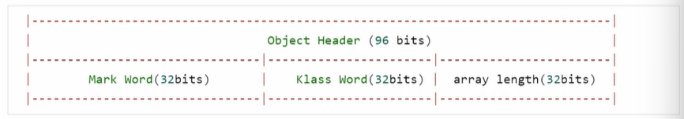

- Mark Word 结构：最后两位是**锁标志位**

  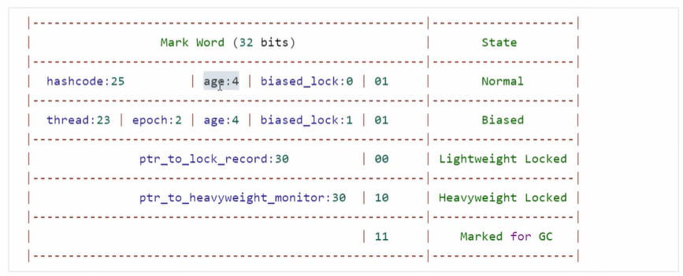

Monitor结构如下

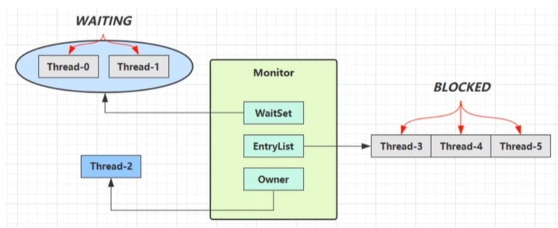

- 开始时 Monitor 中 Owner 为 null

- 当 Thread-2 执行 synchronized(obj) 就会将 Monitor 的所有者 Owner 置为 Thread-2，Monitor 中只能有一个 Owner，**obj 对象的 Mark Word 指向 Monitor**，把**对象原有的 MarkWord 存入线程栈中的锁记录**中（轻量级锁部分详解）

  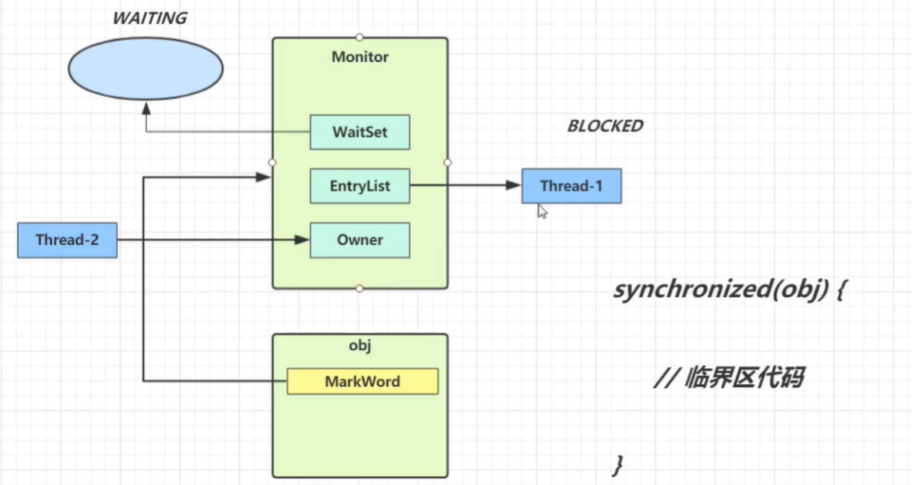

- 在 Thread-2 上锁的过程，Thread-3、Thread-4、Thread-5 也执行 synchronized(obj)，就会进入 EntryList BLOCKED（双向链表）
- Thread-2 执行完同步代码块的内容，根据 obj 对象头中 Monitor 地址寻找，设置 Owner 为空，把线程栈的锁记录中的对象头的值设置回 MarkWord
- 唤醒 EntryList 中等待的线程来竞争锁，竞争是**非公平的**，如果这时有新的线程想要获取锁，可能直接就抢占到了，阻塞队列的线程就会继续阻塞
- WaitSet 中的 Thread-0，是以前获得过锁，但条件不满足进入 WAITING 状态的线程（wait-notify 机制）

注意：

- synchronized 必须是进入同一个对象的 Monitor 才有上述的效果
- 不加 synchronized 的对象不会关联监视器，不遵从以上规则

------

##### 字节码

代码：

```java
public static void main(String[] args) {
    Object lock = new Object();
    synchronized (lock) {
        System.out.println("ok");
    }
}
```

```
0: 	new				#2		// new Object
3: 	dup
4: 	invokespecial 	#1 		// invokespecial <init>:()V，非虚方法
7: 	astore_1 				// lock引用 -> lock
8: 	aload_1					// lock （synchronized开始）
9: 	dup						// 一份用来初始化，一份用来引用
10: astore_2 				// lock引用 -> slot 2
11: monitorenter 			// 【将 lock对象 MarkWord 置为 Monitor 指针】
12: getstatic 		#3		// System.out
15: ldc 			#4		// "ok"
17: invokevirtual 	#5 		// invokevirtual println:(Ljava/lang/String;)V
20: aload_2 				// slot 2(lock引用)
21: monitorexit 			// 【将 lock对象 MarkWord 重置, 唤醒 EntryList】
22: goto 30
25: astore_3 				// any -> slot 3
26: aload_2 				// slot 2(lock引用)
27: monitorexit 			// 【将 lock对象 MarkWord 重置, 唤醒 EntryList】
28: aload_3
29: athrow
30: return
Exception table:
    from to target type
      12 22 25 		any
      25 28 25 		any
LineNumberTable: ...
LocalVariableTable:
    Start Length Slot Name Signature
    	0 	31 		0 args [Ljava/lang/String;
    	8 	23 		1 lock Ljava/lang/Object;
```

说明：

- 通过异常 **try-catch 机制**，确保一定会被解锁
- 方法级别的 synchronized 不会在字节码指令中有所体现

------

#### 锁升级

##### 升级过程

**synchronized 是可重入、不公平的重量级锁**，所以可以对其进行优化

```
无锁 -> 偏向锁 -> 轻量级锁 -> 重量级锁	// 随着竞争的增加，只能锁升级，不能降级
```

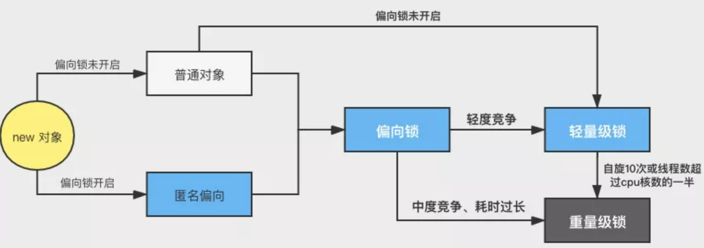

##### 轻量级锁

一个对象有多个线程要加锁，但加锁的时间是错开的（没有竞争），可以使用轻量级锁来优化，轻量级锁对使用者是透明的（不可见）

可重入锁：线程可以进入任何一个它已经拥有的锁所同步着的代码块，可重入锁最大的作用是**避免死锁**

轻量级锁在没有竞争时（锁重入时），每次重入仍然需要执行 CAS 操作，Java 6 才引入的偏向锁来优化

锁重入实例：

```java
static final Object obj = new Object();
public static void method1() {
    synchronized( obj ) {
        // 同步块 A
        method2();
    }
}
public static void method2() {
    synchronized( obj ) {
    	// 同步块 B
    }
}
```

创建锁记录（Lock Record）对象，每个线程的**栈帧**都会包含一个锁记录的结构，存储锁定对象的 Mark Word

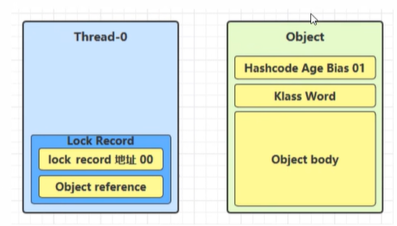

- 让锁记录中 Object reference 指向锁住的对象，并尝试用 CAS 替换 Object 的 Mark Word，将 Mark Word 的值存入锁记录
- 如果 CAS 替换成功，对象头中存储了锁记录地址和状态 00（轻量级锁） ，表示由该线程给对象加锁

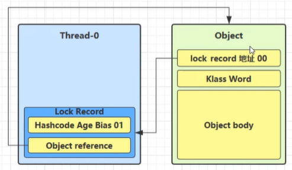

如果 CAS 失败，有两种情况：

- 如果是其它线程已经持有了该 Object 的轻量级锁，这时表明有竞争，进入锁膨胀过程
- 如果是线程自己执行了 synchronized 锁重入，就添加一条 Lock Record 作为重入的计数

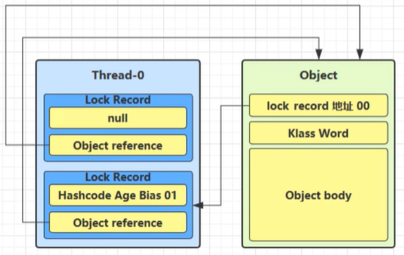

当退出 synchronized 代码块（解锁时）

- 如果有取值为 null 的锁记录，表示有重入，这时重置锁记录，表示重入计数减 1

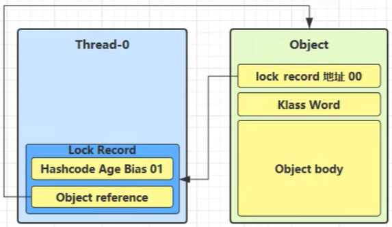

当退出 synchronized 代码块（解锁时）锁记录的值不为 null，这时使用 CAS 将 Mark Word 的值恢复给对象头

- 成功，则解锁成功
- 失败，说明轻量级锁进行了锁膨胀或已经升级为重量级锁，进入重量级锁解锁流程

##### 锁膨胀

在尝试加轻量级锁的过程中，CAS 操作无法成功，可能是其它线程为此对象加上了轻量级锁（有竞争），这时需要进行锁膨胀，将轻量级锁变为**重量级锁**

- 当 Thread-1 进行轻量级加锁时，Thread-0 已经对该对象加了轻量级锁

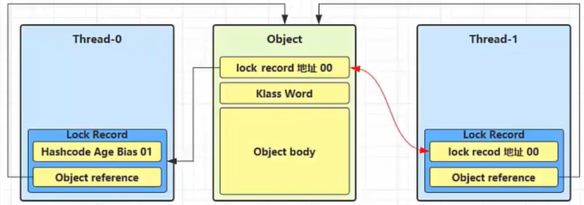

* Thread-1 加轻量级锁失败，进入锁膨胀流程：为 Object 对象申请 Monitor 锁，**通过 Object 对象头获取到持锁线程**，将 Monitor 的 Owner 置为 Thread-0，将 Object 的对象头指向重量级锁地址，然后自己进入 Monitor 的 EntryList BLOCKED

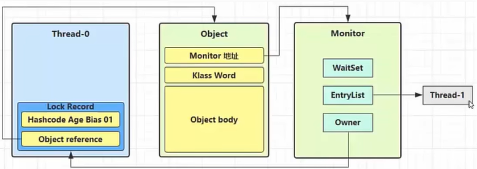

- 当 Thread-0 退出同步块解锁时，使用 CAS 将 Mark Word 的值恢复给对象头失败，这时进入重量级解锁流程，即按照 Monitor 地址找到 Monitor 对象，设置 Owner 为 null，唤醒 EntryList 中 BLOCKED 线程

-----

#### 锁优化

##### 自旋锁

重量级锁竞争时，尝试获取锁的线程不会立即阻塞，可以使用**自旋**（默认 10 次）来进行优化，采用循环的方式去尝试获取锁

注意：

- 自旋占用 CPU 时间，单核 CPU 自旋就是浪费时间，因为同一时刻只能运行一个线程，多核 CPU 自旋才能发挥优势
- 自旋失败的线程会进入阻塞状态

优点：不会进入阻塞状态，**减少线程上下文切换的消耗**

缺点：当自旋的线程越来越多时，会不断的消耗 CPU 资源

**自旋锁情况**

* 自旋成功的情况：

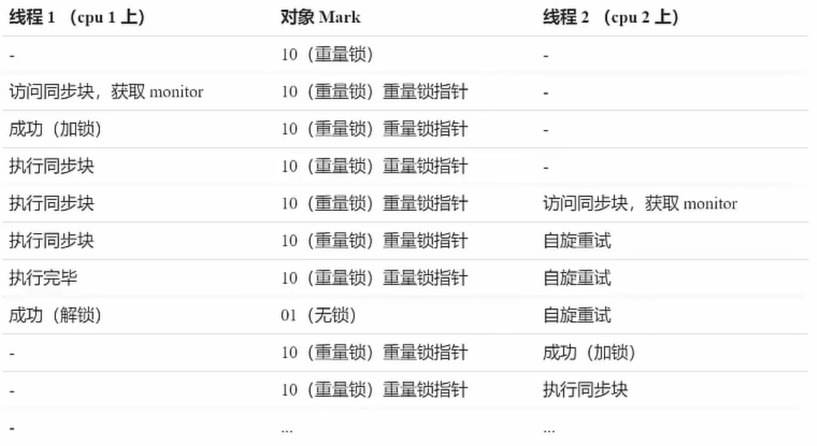

* 自旋失败的情况：

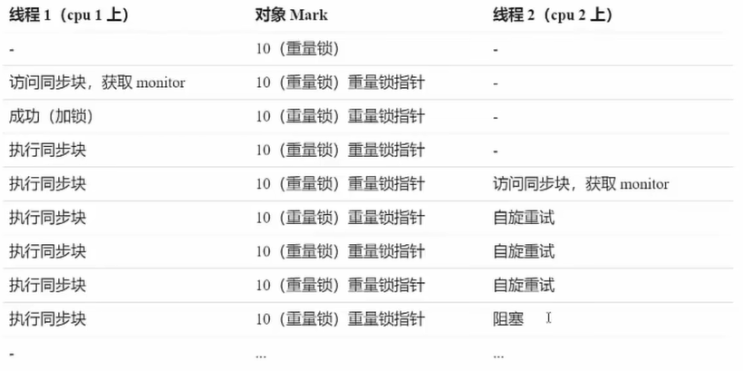

自旋锁说明：

- 在 Java 6 之后自旋锁是自适应的，比如对象刚刚的一次自旋操作成功过，那么认为这次自旋成功的可能性会高，就多自旋几次；反之，就少自旋甚至不自旋，比较智能
- Java 7 之后不能控制是否开启自旋功能，由 JVM 控制

```java
//手写自旋锁
public class SpinLock {
    // 泛型装的是Thread，原子引用线程
    AtomicReference<Thread> atomicReference = new AtomicReference<>();

    public void lock() {
        Thread thread = Thread.currentThread();
        System.out.println(thread.getName() + " come in");

        //开始自旋，期望值为null，更新值是当前线程
        while (!atomicReference.compareAndSet(null, thread)) {
            Thread.sleep(1000);
            System.out.println(thread.getName() + " 正在自旋");
        }
        System.out.println(thread.getName() + " 自旋成功");
    }

    public void unlock() {
        Thread thread = Thread.currentThread();

        //线程使用完锁把引用变为null
		atomicReference.compareAndSet(thread, null);
        System.out.println(thread.getName() + " invoke unlock");
    }

    public static void main(String[] args) throws InterruptedException {
        SpinLock lock = new SpinLock();
        new Thread(() -> {
            //占有锁
            lock.lock();
            Thread.sleep(10000); 

            //释放锁
            lock.unlock();
        },"t1").start();

        // 让main线程暂停1秒，使得t1线程，先执行
        Thread.sleep(1000);

        new Thread(() -> {
            lock.lock();
            lock.unlock();
        },"t2").start();
    }
}
```

------

##### 偏向锁

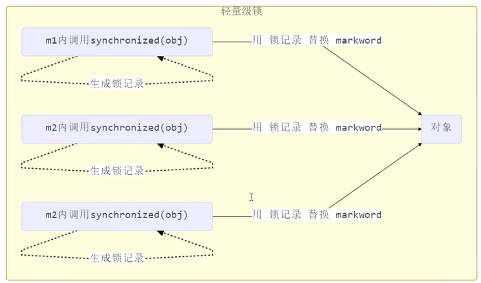

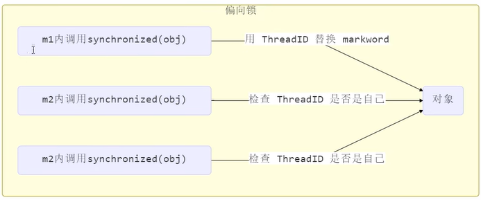

偏向锁的思想是偏向于让第一个获取锁对象的线程，这个线程之后重新获取该锁不再需要同步操作：

- 当锁对象第一次被线程获得的时候进入偏向状态，标记为 101，同时**使用 CAS 操作将线程 ID 记录到 Mark Word**。如果 CAS 操作成功，这个线程以后进入这个锁相关的同步块，查看这个线程 ID 是自己的就表示没有竞争，就不需要再进行任何同步操作
- 当有另外一个线程去尝试获取这个锁对象时，偏向状态就宣告结束，此时撤销偏向（Revoke Bias）后恢复到未锁定或轻量级锁状态


回忆一下对象头格式：

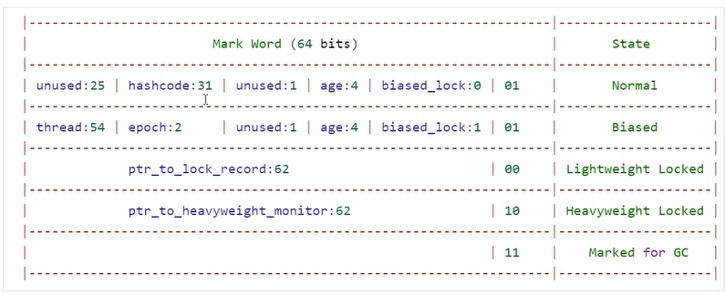

一个对象创建时：

- 如果开启了偏向锁（默认开启），那么对象创建后，MarkWord 值为 0x05 即最后 3 位为 101，thread、epoch、age 都为 0
- 偏向锁是默认是延迟的，不会在程序启动时立即生效，如果想避免延迟，可以加 VM 参数 `-XX:BiasedLockingStartupDelay=0` 来禁用延迟。JDK 8 延迟 4s 开启偏向锁原因：在刚开始执行代码时，会有好多线程来抢锁，如果开偏向锁效率反而降低
- 当一个对象已经计算过 hashCode，就再也无法进入偏向状态了
- 添加 VM 参数 `-XX:-UseBiasedLocking` 禁用偏向锁

撤销偏向锁的状态：

- 调用对象的 hashCode：偏向锁的对象 MarkWord 中存储的是线程 id，调用 hashCode 导致偏向锁被撤销
- 当有其它线程使用偏向锁对象时，会将偏向锁升级为轻量级锁
- 调用 wait/notify，需要申请 Monitor，进入 WaitSet

**批量撤销**：如果对象被多个线程访问，但没有竞争，这时偏向了线程 T1 的对象仍有机会重新偏向 T2，重偏向会重置对象的 Thread ID

- 批量重偏向：当撤销偏向锁阈值超过 20 次后，JVM 会觉得是不是偏向错了，于是在给这些对象加锁时重新偏向至加锁线程
- 批量撤销：当撤销偏向锁阈值超过 40 次后，JVM 会觉得自己确实偏向错了，根本就不该偏向，于是整个类的所有对象都会变为不可偏向的，新建的对象也是不可偏向的

------

##### 锁消除

锁消除是指对于被检测出不可能存在竞争的共享数据的锁进行消除，这是 JVM **即时编译器的优化**

锁消除主要是通过**逃逸分析**来支持，如果堆上的共享数据不可能逃逸出去被其它线程访问到，那么就可以把它们当成私有数据对待，也就可以将它们的锁进行消除（同步消除：JVM 逃逸分析）

------

##### 锁粗化

对相同对象多次加锁，导致线程发生多次重入，频繁的加锁操作就会导致性能损耗，可以使用锁粗化方式优化

如果虚拟机探测到一串的操作都对同一个对象加锁，将会把加锁的范围扩展（粗化）到整个操作序列的外部

- 一些看起来没有加锁的代码，其实隐式的加了很多锁：

  ```java
  public static String concatString(String s1, String s2, String s3) {
      return s1 + s2 + s3;
  }
  ```

- String 是一个不可变的类，编译器会对 String 的拼接自动优化。在 JDK 1.5 之前，转化为 StringBuffer 对象的连续 append() 操作，每个 append() 方法中都有一个同步块

  ```java
  public static String concatString(String s1, String s2, String s3) {
      StringBuffer sb = new StringBuffer();
      sb.append(s1);
      sb.append(s2);
      sb.append(s3);
      return sb.toString();
  }
  ```

扩展到第一个 append() 操作之前直至最后一个 append() 操作之后，只需要加锁一次就可以

------

#### 多把锁

多把不相干的锁：一间大屋子有两个功能睡觉、学习，互不相干。现在一人要学习，一人要睡觉，如果只用一间屋子（一个对象锁）的话，那么并发度很低

将锁的粒度细分：

- 好处，是可以增强并发度
- 坏处，如果一个线程需要同时获得多把锁，就容易发生死锁

解决方法：准备多个对象锁

```java
public static void main(String[] args) {
    BigRoom bigRoom = new BigRoom();
    new Thread(() -> { bigRoom.study(); }).start();
    new Thread(() -> { bigRoom.sleep(); }).start();
}
class BigRoom {
    private final Object studyRoom = new Object();
    private final Object sleepRoom = new Object();

    public void sleep() throws InterruptedException {
        synchronized (sleepRoom) {
            System.out.println("sleeping 2 小时");
            Thread.sleep(2000);
        }
    }

    public void study() throws InterruptedException {
        synchronized (studyRoom) {
            System.out.println("study 1 小时");
            Thread.sleep(1000);
        }
    }
}
```

-----

#### 活跃性

##### 死锁

###### 形成

死锁：多个线程同时被阻塞，它们中的一个或者全部都在等待某个资源被释放，由于线程被无限期地阻塞，因此程序不可能正常终止

Java 死锁产生的四个必要条件：

1. 互斥条件，即当资源被一个线程使用（占有）时，别的线程不能使用
2. 不可剥夺条件，资源请求者不能强制从资源占有者手中夺取资源，资源只能由资源占有者主动释放
3. 请求和保持条件，即当资源请求者在请求其他的资源的同时保持对原有资源的占有
4. 循环等待条件，即存在一个等待循环队列：p1 要 p2 的资源，p2 要 p1 的资源，形成了一个等待环路

四个条件都成立的时候，便形成死锁。死锁情况下打破上述任何一个条件，便可让死锁消失

```java
public class Dead {
    public static Object resources1 = new Object();
    public static Object resources2 = new Object();
    public static void main(String[] args) {
        new Thread(() -> {
            // 线程1：占用资源1 ，请求资源2
            synchronized(resources1){
                System.out.println("线程1已经占用了资源1，开始请求资源2");
                Thread.sleep(2000);//休息两秒，防止线程1直接运行完成。
                //2秒内线程2肯定可以锁住资源2
                synchronized (resources2){
                    System.out.println("线程1已经占用了资源2");
                }
        }).start();
        new Thread(() -> {
            // 线程2：占用资源2 ，请求资源1
            synchronized(resources2){
                System.out.println("线程2已经占用了资源2，开始请求资源1");
                Thread.sleep(2000);
                synchronized (resources1){
                    System.out.println("线程2已经占用了资源1");
                }
            }}
        }).start();
    }
}
```

------

###### 定位

定位死锁的方法：

- 使用 jps 定位进程 id，再用 `jstack id` 定位死锁，找到死锁的线程去查看源码，解决优化

  ```java
  "Thread-1" #12 prio=5 os_prio=0 tid=0x000000001eb69000 nid=0xd40 waiting formonitor entry [0x000000001f54f000]
  	java.lang.Thread.State: BLOCKED (on object monitor)
  #省略    
  "Thread-1" #12 prio=5 os_prio=0 tid=0x000000001eb69000 nid=0xd40 waiting for monitor entry [0x000000001f54f000]
  	java.lang.Thread.State: BLOCKED (on object monitor)
  #省略
  
  Found one Java-level deadlock:
  ===================================================
  "Thread-1":
      waiting to lock monitor 0x000000000361d378 (object 0x000000076b5bf1c0, a java.lang.Object),
      which is held by "Thread-0"
  "Thread-0":
      waiting to lock monitor 0x000000000361e768 (object 0x000000076b5bf1d0, a java.lang.Object),
      which is held by "Thread-1"
      
  Java stack information for the threads listed above:
  ===================================================
  "Thread-1":
      at thread.TestDeadLock.lambda$main$1(TestDeadLock.java:28)
      - waiting to lock <0x000000076b5bf1c0> (a java.lang.Object)
      - locked <0x000000076b5bf1d0> (a java.lang.Object)
      at thread.TestDeadLock$$Lambda$2/883049899.run(Unknown Source)
      at java.lang.Thread.run(Thread.java:745)
  "Thread-0":
      at thread.TestDeadLock.lambda$main$0(TestDeadLock.java:15)
      - waiting to lock <0x000000076b5bf1d0> (a java.lang.Object)
      - locked <0x000000076b5bf1c0> (a java.lang.Object)
      at thread.TestDeadLock$$Lambda$1/495053715
  ```

- Linux 下可以通过 top 先定位到 CPU 占用高的 Java 进程，再利用 `top -Hp 进程id` 来定位是哪个线程，最后再用 jstack 的输出来看各个线程栈

- 避免死锁：避免死锁要注意加锁顺序

- 可以使用 jconsole 工具，在 `jdk\bin` 目录下

------

##### 活锁

活锁：指的是任务或者执行者没有被阻塞，由于某些条件没有满足，导致一直重复尝试—失败—尝试—失败的过程

两个线程互相改变对方的结束条件，最后谁也无法结束：

```java
class TestLiveLock {
    static volatile int count = 10;
    static final Object lock = new Object();
    public static void main(String[] args) {
        new Thread(() -> {
            // 期望减到 0 退出循环
            while (count > 0) {
                Thread.sleep(200);
                count--;
                System.out.println("线程一count:" + count);
            }
        }, "t1").start();
        new Thread(() -> {
            // 期望超过 20 退出循环
            while (count < 20) {
                Thread.sleep(200);
                count++;
                System.out.println("线程二count:"+ count);
            }
        }, "t2").start();
    }
}
```

------

##### 饥饿

饥饿：一个线程由于优先级太低，始终得不到 CPU 调度执行，也不能够结束

------

### ReentrantLock

相对于 synchronized 它具备如下特点

* 可中断
* 可以设置超时时间
* 可以设置为公平锁
* 支持多个条件变量

与 synchronized 一样，都支持可重入

基本语法

```java
// 获取锁
reentrantLock.lock();
try{
    // 临界区
} finally {
    // 释放锁
    reentrantLock.unlock();
}
```

#### 可重入

可重入是指同一个线程如果首次获得这把锁，那么因为它是这把锁的拥有者，因此有权利再次获取这把锁

如果是不可重入锁，那么第二次获得锁时，自己也会被锁挡住

#### 可打断

#### 锁超时

#### 公平锁

ReentrantLock 默认是不公平锁

也可以更改为公平锁

```java
RenntrantLock lock = new ReentrantLock(true);
```

公平锁一般没有必要，会降低并发度

#### 条件变量

Synchronized 中也有条件变量，就是我们讲原理时那个 waitSet 休息室，当条件不满足时进入 waitSet 等待

ReentrantLock 的条件变量比 synchronized 强大之处在于，它是支持多个条件变量的，这就好比

* synchronized 是那些不满足条件的线程都在一间休息室等消息
* 而 ReentrantLock 支持多间休息室，有专门的等烟休息室，专门等早餐的休息室、唤醒时也是按休息室来唤醒

使用流程：

* await 前需要获得锁
* await 执行后，会释放锁，进入 conditionObject 等待
* await 的线程被唤醒（或打断、或超时）取重新竞争 lock 锁
* 竞争 lock 锁成功后，从 await 后继续执行

------

### wait-ify

#### 基本使用

需要获取对象锁后才可以调用 `锁对象.wait()`，notify 随机唤醒一个线程，notifyAll 唤醒所有线程去竞争 CPU

Object 类 API：

```java
public final void notify():唤醒正在等待对象监视器的单个线程。
public final void notifyAll():唤醒正在等待对象监视器的所有线程。
public final void wait():导致当前线程等待，直到另一个线程调用该对象的notify()方法或 notifyAll()方法。
public final native void wait(long timeout):有时限的等待, 到n毫秒后结束等待，或是被唤醒
```

说明：**wait 是挂起线程，需要唤醒的都是挂起操作**，阻塞线程可以自己去争抢锁，挂起的线程需要唤醒后去争抢锁

对比 sleep()：

- 原理不同：sleep() 方法是属于 Thread 类，是线程用来控制自身流程的，使此线程暂停执行一段时间而把执行机会让给其他线程；wait() 方法属于 Object 类，用于线程间通信
- 对**锁的处理机制**不同：调用 sleep() 方法的过程中，线程不会释放对象锁，当调用 wait() 方法的时候，线程会放弃对象锁，进入等待此对象的等待锁定池（不释放锁其他线程怎么抢占到锁执行唤醒操作），但是都会释放 CPU
- 使用区域不同：wait() 方法必须放在**同步控制方法和同步代码块（先获取锁）**中使用，sleep() 方法则可以放在任何地方使用

底层原理：

- Owner 线程发现条件不满足，调用 wait 方法，即可进入 WaitSet 变为 WAITING 状态
- BLOCKED 和 WAITING 的线程都处于阻塞状态，不占用 CPU 时间片
- BLOCKED 线程会在 Owner 线程释放锁时唤醒
- WAITING 线程会在 Owner 线程调用 notify 或 notifyAll 时唤醒，唤醒后并不意味者立刻获得锁，**需要进入 EntryList 重新竞争**

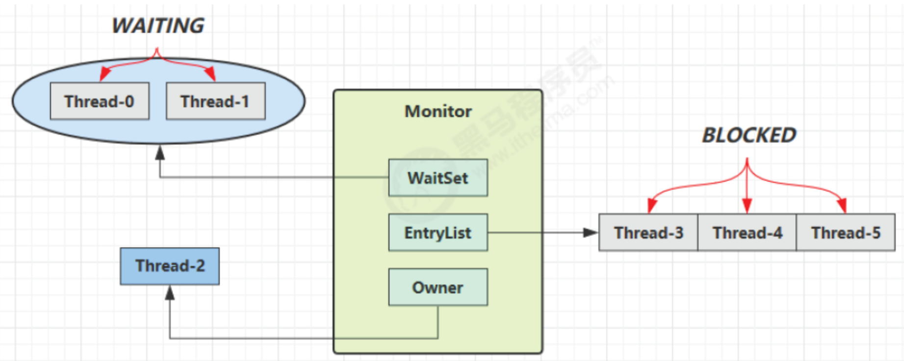

#### 代码优化

虚假唤醒：notify 只能随机唤醒一个 WaitSet 中的线程，这时如果有其它线程也在等待，那么就可能唤醒不了正确的线程

解决方法：采用 notifyAll

notifyAll 仅解决某个线程的唤醒问题，使用 if + wait 判断仅有一次机会，一旦条件不成立，无法重新判断

解决方法：用 while + wait，当条件不成立，再次 wait

```java
@Slf4j(topic = "c.demo")
public class demo {
    static final Object room = new Object();
    static boolean hasCigarette = false;    //有没有烟
    static boolean hasTakeout = false;

    public static void main(String[] args) throws InterruptedException {
        new Thread(() -> {
            synchronized (room) {
                log.debug("有烟没？[{}]", hasCigarette);
                while (!hasCigarette) {//while防止虚假唤醒
                    log.debug("没烟，先歇会！");
                    try {
                        room.wait();
                    } catch (InterruptedException e) {
                        e.printStackTrace();
                    }
                }
                log.debug("有烟没？[{}]", hasCigarette);
                if (hasCigarette) {
                    log.debug("可以开始干活了");
                } else {
                    log.debug("没干成活...");
                }
            }
        }, "小南").start();

        new Thread(() -> {
            synchronized (room) {
                Thread thread = Thread.currentThread();
                log.debug("外卖送到没？[{}]", hasTakeout);
                if (!hasTakeout) {
                    log.debug("没外卖，先歇会！");
                    try {
                        room.wait();
                    } catch (InterruptedException e) {
                        e.printStackTrace();
                    }
                }
                log.debug("外卖送到没？[{}]", hasTakeout);
                if (hasTakeout) {
                    log.debug("可以开始干活了");
                } else {
                    log.debug("没干成活...");
                }
            }
        }, "小女").start();


        Thread.sleep(1000);
        new Thread(() -> {
        // 这里能不能加 synchronized (room)？
            synchronized (room) {
                hasTakeout = true;
				//log.debug("烟到了噢！");
                log.debug("外卖到了噢！");
                room.notifyAll();
            }
        }, "送外卖的").start();
    }
}
```

#### 交替输出 wait-notify

输出：abcabcabcabcabc

```java
/*
	输出内容	等待标记	下一个标记
	a		   1		  2
	b		   2		  3
	c		   3		  1
*/
class WaitNotify{
    // 等待标记
    private int flag;
    
    // 循环次数
    private int loopNumber;
    
    public WaitNotify(int flag, int loopNumber){
        this.flag = flag;
        this.loopNumber = loopNumber;
    }
    
    public void print(String str, int waitFlag, int nextFlag){
        for (int i = 0; i < loopNumber, i++){
            synchronized (this){
                while(flag != waitFlag) {
                    try {
                        this.wait();
                    } catch (InterruptedException e) {
                        e.printStackTrace();
                    }
                }
                System.out.print(str);
                flag = nextFlag;
                this.notifyAll();
            }
        }
    }
}

// 测试代码
public static void main(String[] args){
    WaitNotify wn = new WaitNotify(1, 5);
    new Thread(() -> {
        wn.print("a", 1, 2);
    }).start();
    
    new Thread(() -> {
        wn.print("b", 2, 3);
    }).start();
    
    new Thread(() -> {
        wn.print("c", 3, 1);
    }).start();
}
```

#### 交替输出 await-signal

```java
public class Main {
    public static void Main(String[] args) {
        AwaitSignal awaitSignal = new AwaitSignal(5);
        Condition a = awaitSignal.newCondition();
        Condition b = awaitSignal.newCondition();
        Condition c = awaitSignal.newCondition();
        new Thread(() -> {
            awaitSignal.print("a", a, b);
        }).start();
        new Thread(() -> {
            awaitSignal.print("b", b, c);
        }).start();
        new Thread(() -> {
            awaitSignal.print("c", c, a);
        }).start();
        
        Thread.sleep(1000);
        awaitSignal.lock();
        try {
            System.out.println("开始...");
            a.signal();
        } finally {
            awaitSignal.unlock();
        }
    }
}

class AwaitSignal extends ReentrantLock{
    private int loopNumber;
    
    public AwaitSignal(int loopNumber) {
        this.loopNumber = loopNumber;
    }
    
    public void print(String str, Condition current, Condition next){
        for (int i = 0; i < loopNumber; i++){
            lock();
            try{
                current.await();
                System.out.print(str);
                next.signal();
            } catch (InterruptedException e){
                e.printStackTrace();
            } finally {
                unlock();
            }
        }
    }
}
```

------

### park-un

LockSupport 是用来创建锁和其他同步类的**线程原语**

LockSupport 类方法：

- `LockSupport.park()`：暂停当前线程，挂起原语
- `LockSupport.unpark(暂停的线程对象)`：恢复某个线程的运行

```
public static void main(String[] args) {
    Thread t1 = new Thread(() -> {
        System.out.println("start...");	//1
		Thread.sleep(1000);// Thread.sleep(3000)
        // 先 park 再 unpark 和先 unpark 再 park 效果一样，都会直接恢复线程的运行
        System.out.println("park...");	//2
        LockSupport.park();
        System.out.println("resume...");//4
    },"t1");
    t1.start();
   	Thread.sleep(2000);
    System.out.println("unpark...");	//3
    LockSupport.unpark(t1);
}
```

LockSupport 出现就是为了增强 wait & notify 的功能：

- wait，notify 和 notifyAll 必须配合 Object Monitor 一起使用，而 park、unpark 不需要
- park & unpark **以线程为单位**来阻塞和唤醒线程，而 notify 只能随机唤醒一个等待线程，notifyAll 是唤醒所有等待线程
- park & unpark 可以先 unpark，而 wait & notify 不能先 notify。类比生产消费，先消费发现有产品就消费，没有就等待；先生产就直接产生商品，然后线程直接消费
- wait 会释放锁资源进入等待队列，**park 不会释放锁资源**，只负责阻塞当前线程，会释放 CPU

原理：类似生产者消费者

- 先 park：
  1. 当前线程调用 Unsafe.park() 方法
  2. 检查 _counter ，本情况为 0，这时获得 _mutex 互斥锁
  3. 线程进入 _cond 条件变量挂起
  4. 调用 Unsafe.unpark(Thread_0) 方法，设置 _counter 为 1
  5. 唤醒 _cond 条件变量中的 Thread_0，Thread_0 恢复运行，设置 _counter 为 0

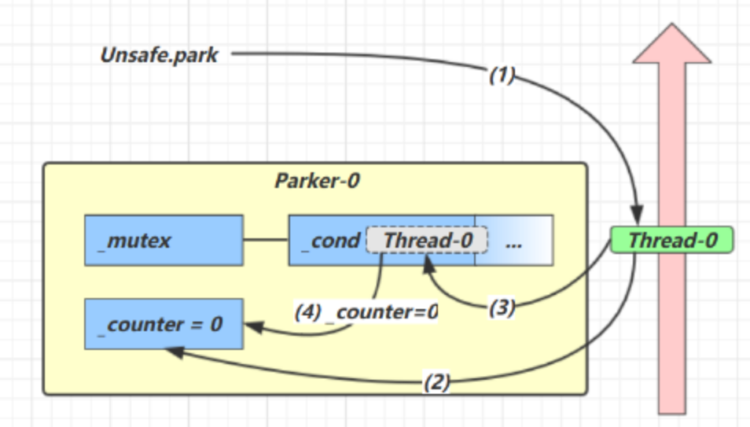

* 先 unpark：
  1. 调用 Unsafe.unpark(Thread_0) 方法，设置 _counter 为 1
  2. 当前线程调用 Unsafe.park() 方法
  3. 检查 _counter ，本情况为 1，这时线程无需挂起，继续运行，设置 _counter 为 0

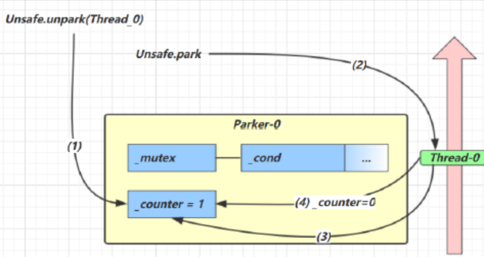

------

#### 交替输出 park-unPark

```java
public class Main{
    static Thread t1;
    static Thread t2;
    static Thread t3;
    
    public static void main(String[] args){
        ParkUnpark pu = new ParkUnpark(5);
        t1 = new Thread(() -> {
            pu.print("a", t2);
        });
        t2 = new Thread(() -> {
            pu.print("a", t3);
        });
        t3 = new Thread(() -> {
            pu.print("a", t1);
        });
        t1.start();
        t2.start();
        t3.start();
        
        LockSupport.unpark(t1);
    }
}

class ParkUnpark{
    private int loopNumber;
    
    public ParkUnpark(int loopNumber) {
        this.loopNumber = loopNumber;
    }
    
    public void print(String str, Thread next){
        for (int i = 0; i < loopNumber; i++){
            LockSupport.park();
            System.out.print(str);
            LockSupport.unpark(next);
        }
    }
}
```

------

### 安全分析

成员变量和静态变量：

- 如果它们没有共享，则线程安全
- 如果它们被共享了，根据它们的状态是否能够改变，分两种情况：
  - 如果只有读操作，则线程安全
  - 如果有读写操作，则这段代码是临界区，需要考虑线程安全问题

局部变量：

- 局部变量是线程安全的
- 局部变量引用的对象不一定线程安全（逃逸分析）：
  - 如果该对象没有逃离方法的作用访问，它是线程安全的（每一个方法有一个栈帧）
  - 如果该对象逃离方法的作用范围，需要考虑线程安全问题（暴露引用）

常见线程安全类：String、Integer、StringBuffer、Random、Vector、Hashtable、java.util.concurrent 包

- 线程安全的是指，多个线程调用它们同一个实例的某个方法时，是线程安全的

- **每个方法是原子的，但多个方法的组合不是原子的**，只能保证调用的方法内部安全：

  ```java
  Hashtable table = new Hashtable();
  // 线程1，线程2
  if(table.get("key") == null) {
  	table.put("key", value);
  }
  ```

无状态类线程安全，就是没有成员变量的类

不可变类线程安全：String、Integer 等都是不可变类，**内部的状态不可以改变**，所以方法是线程安全

- replace 等方法底层是新建一个对象，复制过去

  ```java
  Map<String,Object> map = new HashMap<>();	// 线程不安全
  String S1 = "...";							// 线程安全
  final String S2 = "...";					// 线程安全
  Date D1 = new Date();						// 线程不安全
  final Date D2 = new Date();					// 线程不安全，final让D2引用的对象不能变，但对象的内容可以变
  ```

抽象方法如果有参数，被重写后行为不确定可能造成线程不安全，被称之为外星方法：`public abstract foo(Student s);`

------

### 同步模式

#### 保护性暂停

##### 单任务版

Guarded Suspension，用在一个线程等待另一个线程的执行结果

- 有一个结果需要从一个线程传递到另一个线程，让它们关联同一个 GuardedObject
- 如果有结果不断从一个线程到另一个线程那么可以使用消息队列（见生产者/消费者）
- JDK 中，join 的实现、Future 的实现，采用的就是此模式

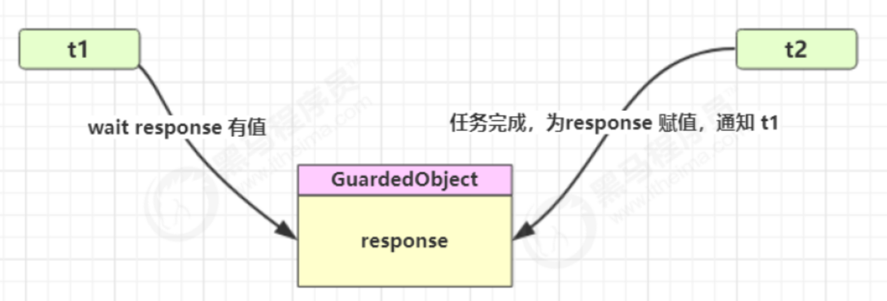

```java
public static void main(String[] args) {
    GuardedObject object = new GuardedObjectV2();
    new Thread(() -> {
        sleep(1);
        object.complete(Arrays.asList("a", "b", "c"));
    }).start();
    
    Object response = object.get(2500);
    if (response != null) {
        log.debug("get response: [{}] lines", ((List<String>) response).size());
    } else {
        log.debug("can't get response");
    }
}

class GuardedObject {
    private Object response;
    private final Object lock = new Object();

    //获取结果
    //timeout :最大等待时间
    public Object get(long millis) {
        synchronized (lock) {
            // 1) 记录最初时间
            long begin = System.currentTimeMillis();
            // 2) 已经经历的时间
            long timePassed = 0;
            while (response == null) {
                // 4) 假设 millis 是 1000，结果在 400 时唤醒了，那么还有 600 要等
                long waitTime = millis - timePassed;
                log.debug("waitTime: {}", waitTime);
                //经历时间超过最大等待时间退出循环
                if (waitTime <= 0) {
                    log.debug("break...");
                    break;
                }
                try {
                    lock.wait(waitTime);
                } catch (InterruptedException e) {
                    e.printStackTrace();
                }
                // 3) 如果提前被唤醒，这时已经经历的时间假设为 400
                timePassed = System.currentTimeMillis() - begin;
                log.debug("timePassed: {}, object is null {}",
                        timePassed, response == null);
            }
            return response;
        }
    }

    //产生结果
    public void complete(Object response) {
        synchronized (lock) {
            // 条件满足，通知等待线程
            this.response = response;
            log.debug("notify...");
            lock.notifyAll();
        }
    }
}
```

##### 多任务版

多任务版保护性暂停：

```java
public static void main(String[] args) throws InterruptedException {
    for (int i = 0; i < 3; i++) {
        new People().start();
    }
    Thread.sleep(1000);
    for (Integer id : Mailboxes.getIds()) {
        new Postman(id, id + "号快递到了").start();
    }
}

@Slf4j(topic = "c.People")
class People extends Thread{
    @Override
    public void run() {
        // 收信
        GuardedObject guardedObject = Mailboxes.createGuardedObject();
        log.debug("开始收信i d:{}", guardedObject.getId());
        Object mail = guardedObject.get(5000);
        log.debug("收到信id:{}，内容:{}", guardedObject.getId(),mail);
    }
}

class Postman extends Thread{
    private int id;
    private String mail;
    //构造方法
    @Override
    public void run() {
        GuardedObject guardedObject = Mailboxes.getGuardedObject(id);
        log.debug("开始送信i d:{}，内容:{}", guardedObject.getId(),mail);
        guardedObject.complete(mail);
    }
}

class  Mailboxes {
    private static Map<Integer, GuardedObject> boxes = new Hashtable<>();
    private static int id = 1;

    //产生唯一的id
    private static synchronized int generateId() {
        return id++;
    }

    public static GuardedObject getGuardedObject(int id) {
        return boxes.remove(id);
    }

    public static GuardedObject createGuardedObject() {
        GuardedObject go = new GuardedObject(generateId());
        boxes.put(go.getId(), go);
        return go;
    }

    public static Set<Integer> getIds() {
        return boxes.keySet();
    }
}
class GuardedObject {
    //标识，Guarded Object
    private int id;//添加get set方法
}
```

#### 顺序输出

顺序输出 2 1

```java
public static void main(String[] args) throws InterruptedException {
    Thread t1 = new Thread(() -> {
        while (true) {
            //try { Thread.sleep(1000); } catch (InterruptedException e) { }
            // 当没有许可时，当前线程暂停运行；有许可时，用掉这个许可，当前线程恢复运行
            LockSupport.park();
            System.out.println("1");
        }
    });
    Thread t2 = new Thread(() -> {
        while (true) {
            System.out.println("2");
            // 给线程 t1 发放『许可』（多次连续调用 unpark 只会发放一个『许可』）
            LockSupport.unpark(t1);
            try { Thread.sleep(500); } catch (InterruptedException e) { }
        }
    });
    t1.start();
    t2.start();
}
```

------

#### 交替输出

连续输出 5 次 abc

```java
public class day2_14 {
    public static void main(String[] args) throws InterruptedException {
        AwaitSignal awaitSignal = new AwaitSignal(5);
        Condition a = awaitSignal.newCondition();
        Condition b = awaitSignal.newCondition();
        Condition c = awaitSignal.newCondition();
        new Thread(() -> {
            awaitSignal.print("a", a, b);
        }).start();
        new Thread(() -> {
            awaitSignal.print("b", b, c);
        }).start();
        new Thread(() -> {
            awaitSignal.print("c", c, a);
        }).start();

        Thread.sleep(1000);
        awaitSignal.lock();
        try {
            a.signal();
        } finally {
            awaitSignal.unlock();
        }
    }
}

class AwaitSignal extends ReentrantLock {
    private int loopNumber;

    public AwaitSignal(int loopNumber) {
        this.loopNumber = loopNumber;
    }
    //参数1：打印内容  参数二：条件变量  参数二：唤醒下一个
    public void print(String str, Condition condition, Condition next) {
        for (int i = 0; i < loopNumber; i++) {
            lock();
            try {
                condition.await();
                System.out.print(str);
                next.signal();
            } catch (InterruptedException e) {
                e.printStackTrace();
            } finally {
                unlock();
            }
        }
    }
}
```

------

### 异步模式

#### 传统版

异步模式之生产者/消费者：

```java
class ShareData {
    private int number = 0;
    private Lock lock = new ReentrantLock();
    private Condition condition = lock.newCondition();

    public void increment() throws Exception{
        // 同步代码块，加锁
        lock.lock();
        try {
            // 判断  防止虚假唤醒
            while(number != 0) {
                // 等待不能生产
                condition.await();
            }
            // 干活
            number++;
            System.out.println(Thread.currentThread().getName() + "\t " + number);
            // 通知 唤醒
            condition.signalAll();
        } catch (Exception e) {
            e.printStackTrace();
        } finally {
            lock.unlock();
        }
    }

    public void decrement() throws Exception{
        // 同步代码块，加锁
        lock.lock();
        try {
            // 判断 防止虚假唤醒
            while(number == 0) {
                // 等待不能消费
                condition.await();
            }
            // 干活
            number--;
            System.out.println(Thread.currentThread().getName() + "\t " + number);
            // 通知 唤醒
            condition.signalAll();
        } catch (Exception e) {
            e.printStackTrace();
        } finally {
            lock.unlock();
        }
    }
}

public class TraditionalProducerConsumer {
	public static void main(String[] args) {
        ShareData shareData = new ShareData();
        // t1线程，生产
        new Thread(() -> {
            for (int i = 0; i < 5; i++) {
            	shareData.increment();
            }
        }, "t1").start();

        // t2线程，消费
        new Thread(() -> {
            for (int i = 0; i < 5; i++) {
				shareData.decrement();
            }
        }, "t2").start(); 
    }
}
```

#### 改进版

异步模式之生产者/消费者：

- 消费队列可以用来平衡生产和消费的线程资源，不需要产生结果和消费结果的线程一一对应
- 生产者仅负责产生结果数据，不关心数据该如何处理，而消费者专心处理结果数据
- 消息队列是有容量限制的，满时不会再加入数据，空时不会再消耗数据
- JDK 中各种阻塞队列，采用的就是这种模式

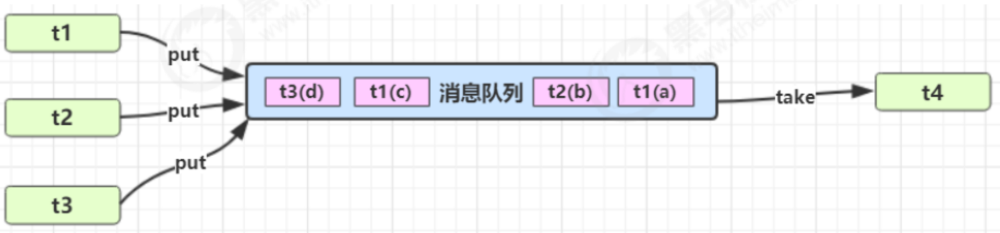

```java
public class demo {
    public static void main(String[] args) {
        MessageQueue queue = new MessageQueue(2);
        for (int i = 0; i < 3; i++) {
            int id = i;
            new Thread(() -> {
                queue.put(new Message(id,"值"+id));
            }, "生产者" + i).start();
        }
        
        new Thread(() -> {
            while (true) {
                try {
                    Thread.sleep(1000);
                    Message message = queue.take();
                } catch (InterruptedException e) {
                    e.printStackTrace();
                }
            }
        },"消费者").start();
    }
}

//消息队列类，Java间线程之间通信
class MessageQueue {
    private LinkedList<Message> list = new LinkedList<>();//消息的队列集合
    private int capacity;//队列容量
    public MessageQueue(int capacity) {
        this.capacity = capacity;
    }

    //获取消息
    public Message take() {
        //检查队列是否为空
        synchronized (list) {
            while (list.isEmpty()) {
                try {
                    sout(Thread.currentThread().getName() + ":队列为空，消费者线程等待");
                    list.wait();
                } catch (InterruptedException e) {
                    e.printStackTrace();
                }
            }
            //从队列的头部获取消息返回
            Message message = list.removeFirst();
            sout(Thread.currentThread().getName() + "：已消费消息--" + message);
            list.notifyAll();
            return message;
        }
    }

    //存入消息
    public void put(Message message) {
        synchronized (list) {
            //检查队列是否满
            while (list.size() == capacity) {
                try {
                    sout(Thread.currentThread().getName()+":队列为已满，生产者线程等待");
                    list.wait();
                } catch (InterruptedException e) {
                    e.printStackTrace();
                }
            }
            //将消息加入队列尾部
            list.addLast(message);
            sout(Thread.currentThread().getName() + ":已生产消息--" + message);
            list.notifyAll();
        }
    }
}

final class Message {
    private int id;
    private Object value;
	//get set
}
```

#### 阻塞队列

```java
public static void main(String[] args) {
    ExecutorService consumer = Executors.newFixedThreadPool(1);
    ExecutorService producer = Executors.newFixedThreadPool(1);
    BlockingQueue<Integer> queue = new SynchronousQueue<>();
    producer.submit(() -> {
        try {
            System.out.println("生产...");
            Thread.sleep(1000);
            queue.put(10);
        } catch (InterruptedException e) {
            e.printStackTrace();
        }
    });
    consumer.submit(() -> {
        try {
            System.out.println("等待消费...");
            Integer result = queue.take();
            System.out.println("结果为:" + result);
        } catch (InterruptedException e) {
            e.printStackTrace();
        }
    });
}
```

------

## 共享模型之内存

## 内存

### JMM

#### 内存模型

Java 内存模型是 Java Memory Model（JMM），本身是一种**抽象的概念**，实际上并不存在，描述的是一组规则或规范，通过这组规范定义了程序中各个变量（包括实例字段，静态字段和构成数组对象的元素）的访问方式

JMM 作用：

- 屏蔽各种硬件和操作系统的内存访问差异，实现让 Java 程序在各种平台下都能达到一致的内存访问效果
- 规定了线程和内存之间的一些关系

根据 JMM 的设计，系统存在一个主内存（Main Memory），Java 中所有变量都存储在主存中，对于所有线程都是共享的；每条线程都有自己的工作内存（Working Memory），工作内存中保存的是主存中某些**变量的拷贝**，线程对所有变量的操作都是先对变量进行拷贝，然后在工作内存中进行，不能直接操作主内存中的变量；线程之间无法相互直接访问，线程间的通信（传递）必须通过主内存来完成

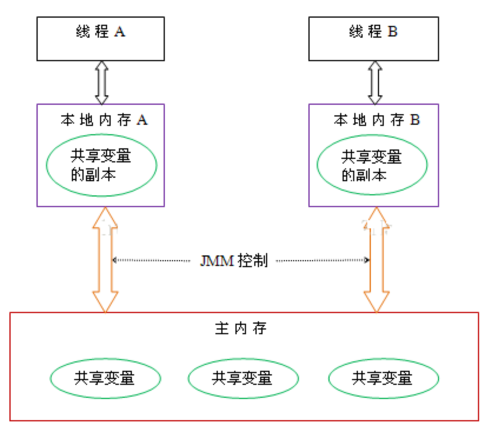

主内存和工作内存：

- 主内存：计算机的内存，也就是经常提到的 8G 内存，16G 内存，存储所有共享变量的值
- 工作内存：存储该线程使用到的共享变量在主内存的的值的副本拷贝

**JVM 和 JMM 之间的关系**：JMM 中的主内存、工作内存与 JVM 中的 Java 堆、栈、方法区等并不是同一个层次的内存划分，这两者基本上是没有关系的，如果两者一定要勉强对应起来：

- 主内存主要对应于 Java 堆中的对象实例数据部分，而工作内存则对应于虚拟机栈中的部分区域
- 从更低层次上说，主内存直接对应于物理硬件的内存，工作内存对应寄存器和高速缓存

------

#### 内存交互

Java 内存模型定义了 8 个操作来完成主内存和工作内存的交互操作，每个操作都是**原子**的

非原子协定：没有被 volatile 修饰的 long、double 外，默认按照两次 32 位的操作

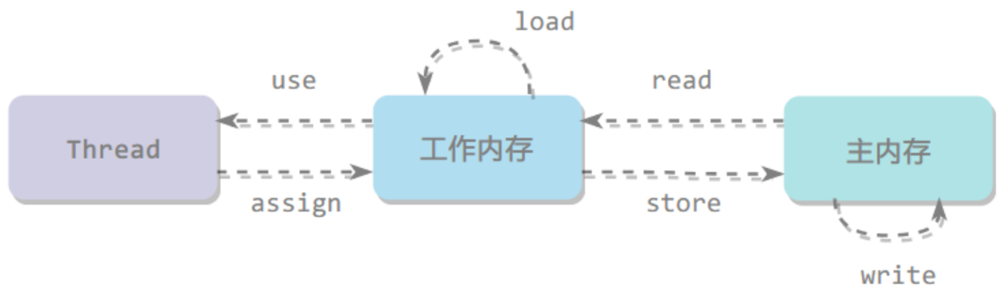

- lock：作用于主内存，将一个变量标识为被一个线程独占状态（对应 monitorenter）
- unclock：作用于主内存，将一个变量从独占状态释放出来，释放后的变量才可以被其他线程锁定（对应 monitorexit）
- read：作用于主内存，把一个变量的值从主内存传输到工作内存中
- load：作用于工作内存，在 read 之后执行，把 read 得到的值放入工作内存的变量副本中
- use：作用于工作内存，把工作内存中一个变量的值传递给**执行引擎**，每当遇到一个使用到变量的操作时都要使用该指令
- assign：作用于工作内存，把从执行引擎接收到的一个值赋给工作内存的变量
- store：作用于工作内存，把工作内存的一个变量的值传送到主内存中
- write：作用于主内存，在 store 之后执行，把 store 得到的值放入主内存的变量中

------

#### 三大特性

##### 可见性

可见性：是指当多个线程访问同一个变量时，一个线程修改了这个变量的值，其他线程能够立即看得到修改的值

存在不可见问题的根本原因是由于缓存的存在，线程持有的是共享变量的副本，无法感知其他线程对于共享变量的更改，导致读取的值不是最新的。但是 final 修饰的变量是**不可变**的，就算有缓存，也不会存在不可见的问题

main 线程对 run 变量的修改对于 t 线程不可见，导致了 t 线程无法停止：

```java
static boolean run = true;	//添加volatile
public static void main(String[] args) throws InterruptedException {
    Thread t = new Thread(()->{
        while(run){
        // ....
        }
	});
    t.start();
    sleep(1);
    run = false; // 线程t不会如预想的停下来
}
```

原因：

- 初始状态， t 线程刚开始从主内存读取了 run 的值到工作内存
- 因为 t 线程要频繁从主内存中读取 run 的值，JIT 编译器会将 run 的值缓存至自己工作内存中的高速缓存中，减少对主存中 run 的访问，提高效率
- 1 秒之后，main 线程修改了 run 的值，并同步至主存，而 t 是从自己工作内存中的高速缓存中读取这个变量的值，结果永远是旧值

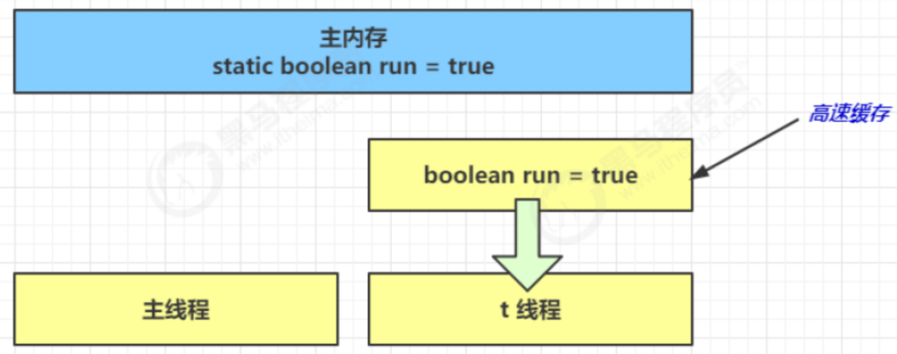

解决办法：

volatile（易变关键字）

它可以用来修饰成员变量和静态成员变量，它可以避免线程从自己的工作缓存中查找变量的值，必须到主内存中获取它的值，线程操作 volatile 变量都是直接操作主存

```java
// 不会从缓存中获取，而从主内存中拿到值
volatile static boolean run = true;	//添加volatile
public static void main(String[] args) throws InterruptedException {
    Thread t = new Thread(()->{
        while(run){
        // ....
        }
	});
    t.start();
    sleep(1);
    run = false; // 线程t不会如预想的停下来
}
```

------

##### 原子性

原子性：不可分割，完整性，也就是说某个线程正在做某个具体业务时，中间不可以被分割，需要具体完成，要么同时成功，要么同时失败，保证指令不会受到线程上下文切换的影响

定义原子操作的使用规则：

1. 不允许 read 和 load、store 和 write 操作之一单独出现，必须顺序执行，但是不要求连续
2. 不允许一个线程丢弃 assign 操作，必须同步回主存
3. 不允许一个线程无原因地（没有发生过任何 assign 操作）把数据从工作内存同步会主内存中
4. 一个新的变量只能在主内存中诞生，不允许在工作内存中直接使用一个未被初始化（assign 或者 load）的变量，即对一个变量实施 use 和 store 操作之前，必须先自行 assign 和 load 操作
5. 一个变量在同一时刻只允许一条线程对其进行 lock 操作，但 lock 操作可以被同一线程重复执行多次，多次执行 lock 后，只有**执行相同次数的 unlock** 操作，变量才会被解锁，**lock 和 unlock 必须成对出现**
6. 如果对一个变量执行 lock 操作，将会**清空工作内存中此变量的值**，在执行引擎使用这个变量之前需要重新从主存加载
7. 如果一个变量事先没有被 lock 操作锁定，则不允许执行 unlock 操作，也不允许去 unlock 一个被其他线程锁定的变量
8. 对一个变量执行 unlock 操作之前，必须**先把此变量同步到主内存**中（执行 store 和 write 操作）

> 注意： synchronized 语句块既可以保证代码块的原子性，也同时保证代码块内变量的可见性。但缺点是 synchronized 是属于重量级操作，性能相对更低。
>
> 如果在前面示例的死循环中加入 System.out.println() 会发现即使不加 volatile 修饰符，线程 t 也能正确看到对 run 变量的修改了，这是为什么？
>
> 因为 println() 底层也是用到了 synchronized 修饰

------

##### 有序性

有序性：在本线程内观察，所有操作都是有序的；在一个线程观察另一个线程，所有操作都是无序的，无序是因为发生了指令重排序

CPU 的基本工作是执行存储的指令序列，即程序，程序的执行过程实际上是不断地取出指令、分析指令、执行指令的过程，为了提高性能，编译器和处理器会对指令重排，一般分为以下三种：

```
源代码 -> 编译器优化的重排 -> 指令并行的重排 -> 内存系统的重排 -> 最终执行指令
```

现代 CPU 支持多级指令流水线，几乎所有的冯•诺伊曼型计算机的 CPU，其工作都可以分为 5 个阶段：取指令、指令译码、执行指令、访存取数和结果写回，可以称之为**五级指令流水线**。CPU 可以在一个时钟周期内，同时运行五条指令的**不同阶段**（每个线程不同的阶段），本质上流水线技术并不能缩短单条指令的执行时间，但变相地提高了指令地吞吐率

处理器在进行重排序时，必须要考虑**指令之间的数据依赖性**

- 单线程环境也存在指令重排，由于存在依赖性，最终执行结果和代码顺序的结果一致
- 多线程环境中线程交替执行，由于编译器优化重排，会获取其他线程处在不同阶段的指令同时执行

补充知识：

- 指令周期是取出一条指令并执行这条指令的时间，一般由若干个机器周期组成
- 机器周期也称为 CPU 周期，一条指令的执行过程划分为若干个阶段（如取指、译码、执行等），每一阶段完成一个基本操作，完成一个基本操作所需要的时间称为机器周期
- 振荡周期指周期性信号作周期性重复变化的时间间隔

------

### cache

#### 缓存机制

##### 缓存结构

在计算机系统中，CPU 高速缓存（CPU Cache，简称缓存）是用于减少处理器访问内存所需平均时间的部件；在存储体系中位于自顶向下的第二层，仅次于 CPU 寄存器；其容量远小于内存，但速度却可以接近处理器的频率

CPU 处理器速度远远大于在主内存中的，为了解决速度差异，在它们之间架设了多级缓存，如 L1、L2、L3 级别的缓存，这些缓存离 CPU 越近就越快，将频繁操作的数据缓存到这里，加快访问速度

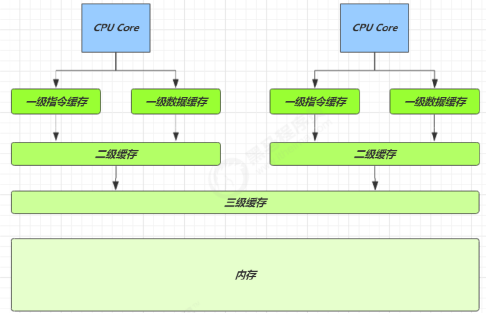

| 从 CPU 到 | 大约需要的时钟周期                |
| --------- | --------------------------------- |
| 寄存器    | 1 cycle (4GHz 的 CPU 约为 0.25ns) |
| L1        | 3~4 cycle                         |
| L2        | 10~20 cycle                       |
| L3        | 40~45 cycle                       |
| 内存      | 120~240 cycle                     |

##### 缓存使用

当处理器发出内存访问请求时，会先查看缓存内是否有请求数据，如果存在（命中），则不用访问内存直接返回该数据；如果不存在（失效），则要先把内存中的相应数据载入缓存，再将其返回处理器

缓存之所以有效，主要因为程序运行时对内存的访问呈现局部性（Locality）特征。既包括空间局部性（Spatial Locality），也包括时间局部性（Temporal Locality），有效利用这种局部性，缓存可以达到极高的命中率

------

#### 伪共享

**缓存以缓存行 cache line 为单位**，每个缓存行对应着一块内存，一般是 64 byte（8 个 long），在 CPU 从主存获取数据时，以 cache line 为单位加载，于是相邻的数据会一并加载到缓存中

缓存会造成数据副本的产生，即同一份数据会缓存在不同核心的缓存行中，CPU 要保证数据的一致性，需要做到某个 CPU 核心更改了数据，其它 CPU 核心对应的**整个缓存行必须失效**，这就是伪共享

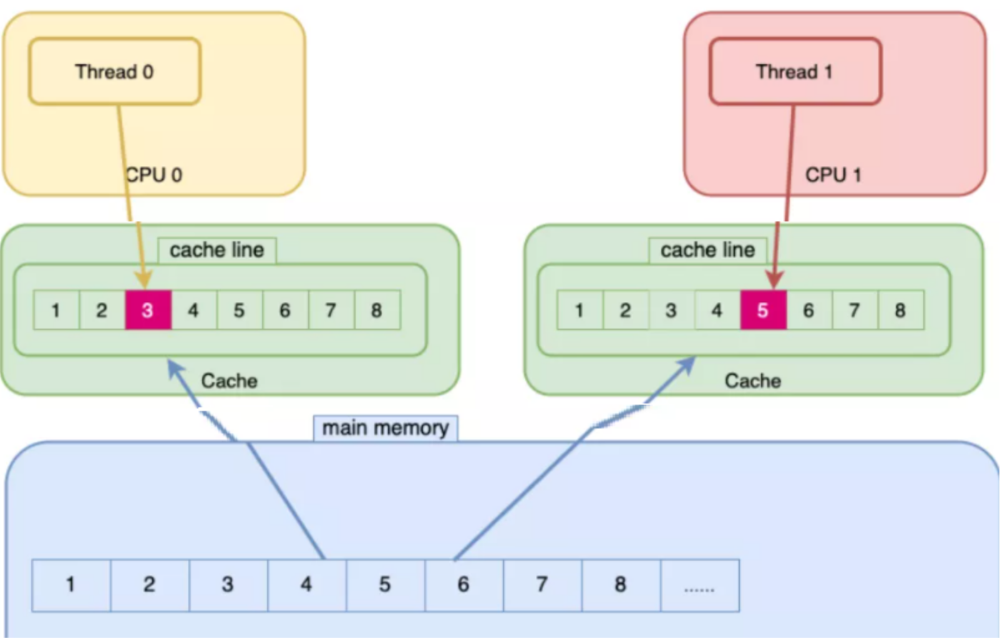

解决方法：

- padding：通过填充，让数据落在不同的 cache line 中
- @Contended：原理参考 无锁 → Adder → 优化机制 → 伪共享

Linux 查看 CPU 缓存行：

- 命令：`cat /sys/devices/system/cpu/cpu0/cache/index0/coherency_line_size64`
- 内存地址格式：[高位组标记] [低位索引] [偏移量]

------

#### 缓存一致

缓存一致性：当多个处理器运算任务都涉及到同一块主内存区域的时候，将可能导致各自的缓存数据不一样

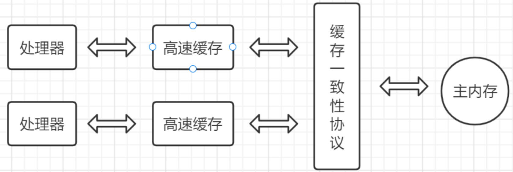

MESI（Modified Exclusive Shared Or Invalid）是一种广泛使用的**支持写回策略的缓存一致性协议**，CPU 中每个缓存行（caceh line）使用 4 种状态进行标记（使用额外的两位 bit 表示)：

- M：被修改（Modified）

  该缓存行只被缓存在该 CPU 的缓存中，并且是被修改过的，与主存中的数据不一致 (dirty)，该缓存行中的内存需要写回 (write back) 主存。该状态的数据再次被修改不会发送广播，因为其他核心的数据已经在第一次修改时失效一次

  当被写回主存之后，该缓存行的状态会变成独享 (exclusive) 状态

- E：独享的（Exclusive）

  该缓存行只被缓存在该 CPU 的缓存中，是未被修改过的 (clear)，与主存中数据一致，修改数据不需要通知其他 CPU 核心，该状态可以在任何时刻有其它 CPU 读取该内存时变成共享状态 (shared)

  当 CPU 修改该缓存行中内容时，该状态可以变成 Modified 状态

- S：共享的（Shared）

  该状态意味着该缓存行可能被多个 CPU 缓存，并且各个缓存中的数据与主存数据一致，当 CPU 修改该缓存行中，会向其它 CPU 核心广播一个请求，使该缓存行变成无效状态 (Invalid)，然后再更新当前 Cache 里的数据

- I：无效的（Invalid）

  该缓存是无效的，可能有其它 CPU 修改了该缓存行

解决方法：各个处理器访问缓存时都遵循一些协议，在读写时要根据协议进行操作，协议主要有 MSI、MESI 等

------

#### 处理机制

单核 CPU 处理器会自动保证基本内存操作的原子性

多核 CPU 处理器，每个 CPU 处理器内维护了一块内存，每个内核内部维护着一块缓存，当多线程并发读写时，就会出现缓存数据不一致的情况。处理器提供：

- 总线锁定：当处理器要操作共享变量时，在 BUS 总线上发出一个 LOCK 信号，其他处理器就无法操作这个共享变量，该操作会导致大量阻塞，从而增加系统的性能开销（**平台级别的加锁**）
- 缓存锁定：当处理器对缓存中的共享变量进行了操作，其他处理器有嗅探机制，将各自缓存中的该共享变量的失效，读取时会重新从主内存中读取最新的数据，基于 MESI 缓存一致性协议来实现

有如下两种情况处理器不会使用缓存锁定：

- 当操作的数据跨多个缓存行，或没被缓存在处理器内部，则处理器会使用总线锁定
- 有些处理器不支持缓存锁定，比如：Intel 486 和 Pentium 处理器也会调用总线锁定

总线机制：

- 总线嗅探：每个处理器通过嗅探在总线上传播的数据来检查自己缓存值是否过期了，当处理器发现自己的缓存对应的内存地址的数据被修改，就**将当前处理器的缓存行设置为无效状态**，当处理器对这个数据进行操作时，会重新从内存中把数据读取到处理器缓存中
- 总线风暴：当某个 CPU 核心更新了 Cache 中的数据，要把该事件广播通知到其他核心（**写传播**），CPU 需要每时每刻监听总线上的一切活动，但是不管别的核心的 Cache 是否缓存相同的数据，都需要发出一个广播事件，不断的从主内存嗅探和 CAS 循环，无效的交互会导致总线带宽达到峰值；因此不要大量使用 volatile 关键字，使用 volatile、syschonized 都需要根据实际场景

------

### volatile

#### 同步机制

volatile 是 Java 虚拟机提供的**轻量级**的同步机制（三大特性）

- 保证可见性
- 不保证原子性
- 保证有序性（禁止指令重排）

性能：volatile 修饰的变量进行读操作与普通变量几乎没什么差别，但是写操作相对慢一些，因为需要在本地代码中插入很多内存屏障来保证指令不会发生乱序执行，但是开销比锁要小

synchronized 无法禁止指令重排和处理器优化，为什么可以保证有序性可见性

- 加了锁之后，只能有一个线程获得到了锁，获得不到锁的线程就要阻塞，所以同一时间只有一个线程执行，相当于单线程，由于数据依赖性的存在，单线程的指令重排是没有问题的
- 线程加锁前，将**清空工作内存**中共享变量的值，使用共享变量时需要从主内存中重新读取最新的值；线程解锁前，必须把共享变量的最新值**刷新到主内存**中（JMM 内存交互章节有讲）

------

#### 指令重排

volatile 修饰的变量，可以禁用指令重排

指令重排实例：

- example 1：

  ```java
  public void mySort() {
  	int x = 11;	//语句1
  	int y = 12;	//语句2  谁先执行效果一样
  	x = x + 5;	//语句3
  	y = x * x;	//语句4
  }
  ```

  执行顺序是：1 2 3 4、2 1 3 4、1 3 2 4

  指令重排也有限制不会出现：4321，语句 4 需要依赖于 y 以及 x 的申明，因为存在数据依赖，无法首先执行

- example 2：

  ```java
  int num = 0;
  boolean ready = false;
  // 线程1 执行此方法
  public void actor1(I_Result r) {
      if(ready) {
      	r.r1 = num + num;
      } else {
      	r.r1 = 1;
      }
  }
  // 线程2 执行此方法
  public void actor2(I_Result r) {
  	num = 2;
  	ready = true;
  }
  ```

  情况一：线程 1 先执行，ready = false，结果为 r.r1 = 1

  情况二：线程 2 先执行 num = 2，但还没执行 ready = true，线程 1 执行，结果为 r.r1 = 1

  情况三：线程 2 先执行 ready = true，线程 1 执行，进入 if 分支结果为 r.r1 = 4

  情况四：线程 2 执行 ready = true，切换到线程 1，进入 if 分支为 r.r1 = 0，再切回线程 2 执行 num = 2，发生指令重排

------

#### 底层原理

##### 缓存一致

使用 volatile 修饰的共享变量，总线会开启 **CPU 总线嗅探机制**来解决 JMM 缓存一致性问题，也就是共享变量在多线程中可见性的问题，实现 MESI 缓存一致性协议

底层是通过汇编 lock 前缀指令，共享变量加了 lock 前缀指令就会进行缓存锁定，在线程修改完共享变量后写回主存，其他的 CPU 核心上运行的线程根据总线嗅探机制会修改其共享变量为失效状态，读取时会重新从主内存中读取最新的数据

lock 前缀指令就相当于内存屏障，Memory Barrier（Memory Fence）

- 对 volatile 变量的写指令后会加入写屏障
- 对 volatile 变量的读指令前会加入读屏障

内存屏障有三个作用：

- 确保对内存的读-改-写操作原子执行
- 阻止屏障两侧的指令重排序
- 强制把缓存中的脏数据写回主内存，让缓存行中相应的数据失效

##### 内存屏障

保证**可见性**：

- 写屏障（sfence，Store Barrier）保证在该屏障之前的，对共享变量的改动，都同步到主存当中

  ```java
  public void actor2(I_Result r) {
      num = 2;
      ready = true; // ready 是 volatile 赋值带写屏障
      // 写屏障
  }
  ```

- 读屏障（lfence，Load Barrier）保证在该屏障之后的，对共享变量的读取，从主存刷新变量值，加载的是主存中最新数据

  ```java
  public void actor1(I_Result r) {
      // 读屏障
      // ready 是 volatile 读取值带读屏障
      if(ready) {
      	r.r1 = num + num;
      } else {
      	r.r1 = 1;
      }
  }
  ```

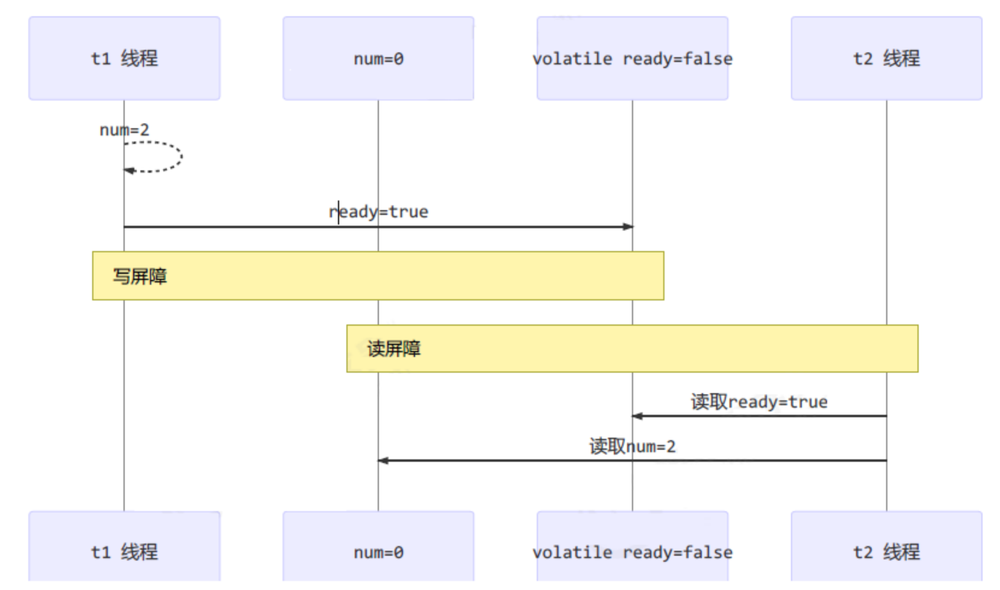

- 全能屏障：mfence（modify/mix Barrier），兼具 sfence 和 lfence 的功能

保证**有序性**：

- 写屏障会确保指令重排序时，不会将写屏障之前的代码排在写屏障之后
- 读屏障会确保指令重排序时，不会将读屏障之后的代码排在读屏障之前

不能解决指令交错：

- 写屏障仅仅是保证之后的读能够读到最新的结果，但不能保证其他线程的读跑到写屏障之前

- 有序性的保证也只是保证了本线程内相关代码不被重排序

  ```java
  volatile i = 0;
  new Thread(() -> {i++});
  new Thread(() -> {i--});
  ```

  i++ 反编译后的指令：

  ```java
  0: iconst_1			// 当int取值 -1~5 时，JVM采用iconst指令将常量压入栈中
  1: istore_1			// 将操作数栈顶数据弹出，存入局部变量表的 slot 1
  2: iinc		1, 1	
  ```

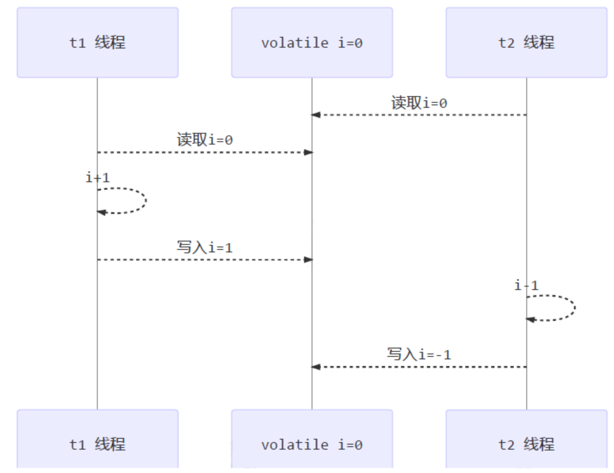

##### 交互规则

对于 volatile 修饰的变量：

- 线程对变量的 use 与 load、read 操作是相关联的，所以变量使用前必须先从主存加载
- 线程对变量的 assign 与 store、write 操作是相关联的，所以变量使用后必须同步至主存
- 线程 1 和线程 2 谁先对变量执行 read 操作，就会先进行 write 操作，防止指令重排

------

#### 双端检锁

##### 检锁机制

Double-Checked Locking：双端检锁机制

DCL（双端检锁）机制不一定是线程安全的，原因是有指令重排的存在，加入 volatile 可以禁止指令重排

```java
public final class Singleton {
    private Singleton() { }
    private static Singleton INSTANCE = null;
    
    public static Singleton getInstance() {
        if(INSTANCE == null) { // t2，这里的判断不是线程安全的
            // 首次访问会同步，而之后的使用没有 synchronized
            synchronized(Singleton.class) {
                // 这里是线程安全的判断，防止其他线程在当前线程等待锁的期间完成了初始化
                if (INSTANCE == null) { 
                    INSTANCE = new Singleton();
                }
            }
        }
        return INSTANCE;
    }
}
```

不锁 INSTANCE 的原因：

- INSTANCE 要重新赋值
- INSTANCE 是 null，线程加锁之前需要获取对象的引用，设置对象头，null 没有引用

实现特点：

- 懒惰初始化
- 首次使用 getInstance() 才使用 synchronized 加锁，后续使用时无需加锁
- 第一个 if 使用了 INSTANCE 变量，是在同步块之外，但在多线程环境下会产生问题

##### DCL问题

getInstance 方法对应的字节码为：

```java
0: 	getstatic 		#2 		// Field INSTANCE:Ltest/Singleton;
3: 	ifnonnull 		37
6: 	ldc 			#3 		// class test/Singleton
8: 	dup
9: 	astore_0
10: monitorenter
11: getstatic 		#2 		// Field INSTANCE:Ltest/Singleton;
14: ifnonnull 27
17: new 			#3 		// class test/Singleton
20: dup
21: invokespecial 	#4 		// Method "<init>":()V
24: putstatic 		#2 		// Field INSTANCE:Ltest/Singleton;
27: aload_0
28: monitorexit
29: goto 37
32: astore_1
33: aload_0
34: monitorexit
35: aload_1
36: athrow
37: getstatic 		#2 		// Field INSTANCE:Ltest/Singleton;
40: areturn
```

- 17 表示创建对象，将对象引用入栈
- 20 表示复制一份对象引用，引用地址
- 21 表示利用一个对象引用，调用构造方法初始化对象
- 24 表示利用一个对象引用，赋值给 static INSTANCE

**步骤 21 和 24 之间不存在数据依赖关系**，而且无论重排前后，程序的执行结果在单线程中并没有改变，因此这种重排优化是允许的

- 关键在于 0:getstatic 这行代码在 monitor 控制之外，可以越过 monitor 读取 INSTANCE 变量的值
- 当其他线程访问 INSTANCE 不为 null 时，由于 INSTANCE 实例未必已初始化，那么 t2 拿到的是将是一个未初始化完毕的单例返回，这就造成了线程安全的问题

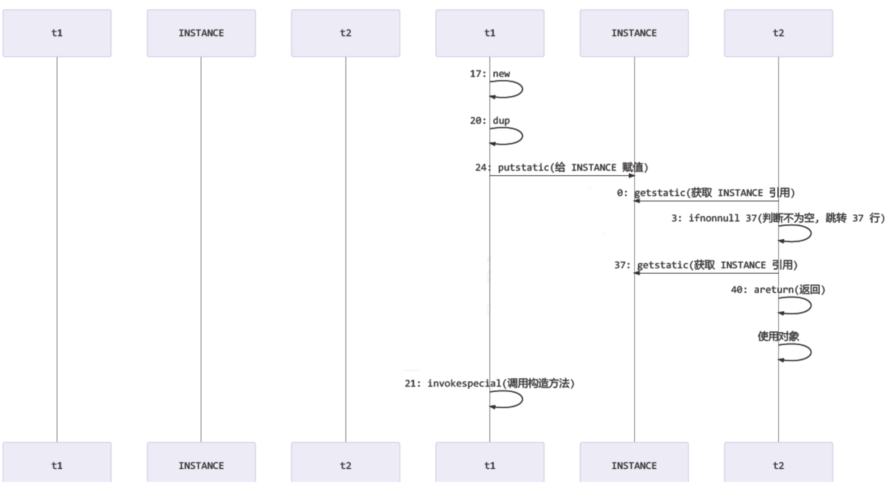

##### 解决方法

指令重排只会保证串行语义的执行一致性（单线程），但并不会关系多线程间的语义一致性

引入 volatile，来保证出现指令重排的问题，从而保证单例模式的线程安全性：

```java
private static volatile SingletonDemo INSTANCE = null;
```

------

happens-before

Java 内存模型具备一些先天的“有序性”，即不需要通过任何同步手段（volatile、synchronized 等）就能够得到保证的安全，这个通常也称为 happens-before 原则，它是可见性与有序性的一套规则总结

不符合 happens-before 规则，JMM 并不能保证一个线程的可见性和有序性

1. 程序次序规则 (Program Order Rule)：一个线程内，逻辑上书写在前面的操作先行发生于书写在后面的操作 ，因为多个操作之间有先后依赖关系，则不允许对这些操作进行重排序

2. 锁定规则 (Monitor Lock Rule)：一个 unlock 操作先行发生于后面（时间的先后）对同一个锁的 lock 操作，所以线程解锁 m 之前对变量的写（解锁前会刷新到主内存中），对于接下来对 m 加锁的其它线程对该变量的读可见

3. **volatile 变量规则** (Volatile Variable Rule)：对 volatile 变量的写操作先行发生于后面对这个变量的读

4. 传递规则 (Transitivity)：具有传递性，如果操作 A 先行发生于操作 B，而操作 B 又先行发生于操作 C，则可以得出操作 A 先行发生于操作 C

5. 线程启动规则 (Thread Start Rule)：Thread 对象的 start()方 法先行发生于此线程中的每一个操作

   ```java
   static int x = 10;//线程 start 前对变量的写，对该线程开始后对该变量的读可见
   new Thread(()->{	System.out.println(x);	},"t1").start();
   ```

6. 线程中断规则 (Thread Interruption Rule)：对线程 interrupt() 方法的调用先行发生于被中断线程的代码检测到中断事件的发生

7. 线程终止规则 (Thread Termination Rule)：线程中所有的操作都先行发生于线程的终止检测，可以通过 Thread.join() 方法结束、Thread.isAlive() 的返回值手段检测到线程已经终止执行

8. 对象终结规则（Finaizer Rule）：一个对象的初始化完成（构造函数执行结束）先行发生于它的 finalize() 方法的开始

------

### 设计模式

#### 终止模式

终止模式之两阶段终止模式：停止标记用 volatile 是为了保证该变量在多个线程之间的可见性

```java
class TwoPhaseTermination {
    // 监控线程
    private Thread monitor;
    // 停止标记
    private volatile boolean stop = false;;

    // 启动监控线程
    public void start() {
        monitor = new Thread(() -> {
            while (true) {
                Thread thread = Thread.currentThread();
                if (stop) {
                    System.out.println("后置处理");
                    break;
                }
                try {
                    Thread.sleep(1000);// 睡眠
                    System.out.println(thread.getName() + "执行监控记录");
                } catch (InterruptedException e) {
                   	System.out.println("被打断，退出睡眠");
                }
            }
        });
        monitor.start();
    }

    // 停止监控线程
    public void stop() {
        stop = true;
        monitor.interrupt();// 让线程尽快退出Timed Waiting
    }
}
// 测试
public static void main(String[] args) throws InterruptedException {
    TwoPhaseTermination tpt = new TwoPhaseTermination();
    tpt.start();
    Thread.sleep(3500);
    System.out.println("停止监控");
    tpt.stop();
}
```

------

#### Balking

Balking （犹豫）模式用在一个线程发现另一个线程或本线程已经做了某一件相同的事，那么本线程就无需再做了，直接结束返回

```java
public class MonitorService {
    // 用来表示是否已经有线程已经在执行启动了
    private volatile boolean starting = false;
    public void start() {
        System.out.println("尝试启动监控线程...");
        synchronized (this) {
            if (starting) {
            	return;
            }
            starting = true;
        }
        // 真正启动监控线程...
    }
}
```

对比保护性暂停模式：保护性暂停模式用在一个线程等待另一个线程的执行结果，当条件不满足时线程等待

例子：希望 doInit() 方法仅被调用一次，下面的实现出现的问题：

- 当 t1 线程进入 init() 准备 doInit()，t2 线程进来，initialized 还为f alse，则 t2 就又初始化一次
- volatile 适合一个线程写，其他线程读的情况，这个代码需要加锁

```java
public class TestVolatile {
    volatile boolean initialized = false;
    
    void init() {
        if (initialized) {
            return;
        }
    	doInit();
    	initialized = true;
    }
    private void doInit() {
    }
}
```

------

## 无锁

### CAS

#### 原理

无锁编程：Lock Free

CAS 的全称是 Compare-And-Swap，是 **CPU 并发原语**

- CAS 并发原语体现在 Java 语言中就是 sun.misc.Unsafe 类的各个方法，调用 UnSafe 类中的 CAS 方法，JVM 会实现出 CAS 汇编指令，这是一种完全依赖于硬件的功能，实现了原子操作
- CAS 是一种系统原语，原语属于操作系统范畴，是由若干条指令组成 ，用于完成某个功能的一个过程，并且原语的执行必须是连续的，执行过程中不允许被中断，所以 CAS 是一条 CPU 的原子指令，不会造成数据不一致的问题，是线程安全的

底层原理：CAS 的底层是 `lock cmpxchg` 指令（X86 架构），在单核和多核 CPU 下都能够保证比较交换的原子性

- 程序是在单核处理器上运行，会省略 lock 前缀，单处理器自身会维护处理器内的顺序一致性，不需要 lock 前缀的内存屏障效果
- 程序是在多核处理器上运行，会为 cmpxchg 指令加上 lock 前缀。当某个核执行到带 lock 的指令时，CPU 会执行**总线锁定或缓存锁定**，将修改的变量写入到主存，这个过程不会被线程的调度机制所打断，保证了多个线程对内存操作的原子性

作用：比较当前工作内存中的值和主物理内存中的值，如果相同则执行规定操作，否则继续比较直到主内存和工作内存的值一致为止

CAS 特点：

- CAS 体现的是**无锁并发、无阻塞并发**，线程不会陷入阻塞，线程不需要频繁切换状态（上下文切换，系统调用）
- CAS 是基于乐观锁的思想

CAS 缺点：

- 执行的是循环操作，如果比较不成功一直在循环，最差的情况某个线程一直取到的值和预期值都不一样，就会无限循环导致饥饿，**使用 CAS 线程数不要超过 CPU 的核心数**，采用分段 CAS 和自动迁移机制
- 只能保证一个共享变量的原子操作
  - 对于一个共享变量执行操作时，可以通过循环 CAS 的方式来保证原子操作
  - 对于多个共享变量操作时，循环 CAS 就无法保证操作的原子性，这个时候**只能用锁来保证原子性**
- 引出来 ABA 问题

------

#### 乐观锁

CAS 与 synchronized 总结：

- synchronized 是从悲观的角度出发：总是假设最坏的情况，每次去拿数据的时候都认为别人会修改，所以每次在拿数据的时候都会上锁，这样别人想拿这个数据就会阻塞（共享资源每次只给一个线程使用，其它线程阻塞，用完后再把资源转让给其它线程），因此 synchronized 也称之为悲观锁，ReentrantLock 也是一种悲观锁，性能较差
- CAS 是从乐观的角度出发：总是假设最好的情况，每次去拿数据的时候都认为别人不会修改，所以不会上锁，但是在更新的时候会判断一下在此期间别人有没有去更新这个数据。**如果别人修改过，则获取现在最新的值，如果别人没修改过，直接修改共享数据的值**，CAS 这种机制也称之为乐观锁，综合性能较好

------

### Atomic 原子整数

#### 常用API

常见原子类：AtomicInteger、AtomicBoolean、AtomicLong

构造方法：

- `public AtomicInteger()`：初始化一个默认值为 0 的原子型 Integer
- `public AtomicInteger(int initialValue)`：初始化一个指定值的原子型 Integer

常用API：

| 方法                                  | 作用                                                         |
| ------------------------------------- | ------------------------------------------------------------ |
| public final int get()                | 获取 AtomicInteger 的值                                      |
| public final int getAndIncrement()    | 以原子方式将当前值加 1，返回的是自增前的值                   |
| public final int incrementAndGet()    | 以原子方式将当前值加 1，返回的是自增后的值                   |
| public final int getAndSet(int value) | 以原子方式设置为 newValue 的值，返回旧值                     |
| public final int addAndGet(int data)  | 以原子方式将输入的数值与实例中的值相加并返回 实例：AtomicInteger 里的 value |

------

#### 原理分析

**AtomicInteger 原理**：自旋锁 + CAS 算法

CAS 算法：有 3 个操作数（内存值 V， 旧的预期值 A，要修改的值 B）

- 当旧的预期值 A == 内存值 V 此时可以修改，将 V 改为 B
- 当旧的预期值 A != 内存值 V 此时不能修改，并重新获取现在的最新值，重新获取的动作就是自旋

分析 getAndSet 方法：

- AtomicInteger：

  ```java
  public final int getAndSet(int newValue) {
      /**
      * this: 		当前对象
      * valueOffset:	内存偏移量，内存地址
      */
      return unsafe.getAndSetInt(this, valueOffset, newValue);
  }
  ```

  valueOffset：偏移量表示该变量值相对于当前对象地址的偏移，Unsafe 就是根据内存偏移地址获取数据

  ```java
  valueOffset = unsafe.objectFieldOffset
                  (AtomicInteger.class.getDeclaredField("value"));
  //调用本地方法   -->
  public native long objectFieldOffset(Field var1);
  ```

- unsafe 类：

  ```java
  // val1: AtomicInteger对象本身，var2: 该对象值得引用地址，var4: 需要变动的数
  public final int getAndSetInt(Object var1, long var2, int var4) {
      int var5;
      do {
          // var5: 用 var1 和 var2 找到的内存中的真实值
          var5 = this.getIntVolatile(var1, var2);
      } while(!this.compareAndSwapInt(var1, var2, var5, var4));
  
      return var5;
  }
  ```

  var5：从主内存中拷贝到工作内存中的值（每次都要从主内存拿到最新的值到本地内存），然后执行 `compareAndSwapInt()` 再和主内存的值进行比较，假设方法返回 false，那么就一直执行 while 方法，直到期望的值和真实值一样，修改数据

- 变量 value 用 volatile 修饰，保证了多线程之间的内存可见性，避免线程从工作缓存中获取失效的变量

  ```
  private volatile int value
  ```

  **CAS 必须借助 volatile 才能读取到共享变量的最新值来实现比较并交换的效果**

分析 getAndUpdate 方法：

- getAndUpdate：

  ```java
  public final int getAndUpdate(IntUnaryOperator updateFunction) {
      int prev, next;
      do {
          prev = get();	//当前值，cas的期望值
          next = updateFunction.applyAsInt(prev);//期望值更新到该值
      } while (!compareAndSet(prev, next));//自旋
      return prev;
  }
  ```

  函数式接口：可以自定义操作逻辑

  ```java
  AtomicInteger a = new AtomicInteger();
  a.getAndUpdate(i -> i + 10);
  ```

- compareAndSet：

  ```java
  public final boolean compareAndSet(int expect, int update) {
      /**
      * this: 		当前对象
      * valueOffset:	内存偏移量，内存地址
      * expect:		期望的值
      * update: 		更新的值
      */
      return unsafe.compareAndSwapInt(this, valueOffset, expect, update);
  }
  ```

------

#### 原子引用

原子引用：对 Object 进行原子操作，提供一种读和写都是原子性的对象引用变量

原子引用类：AtomicReference、AtomicStampedReference、AtomicMarkableReference

AtomicReference 类：

- 构造方法：`AtomicReference<T> atomicReference = new AtomicReference<T>()`
- 常用 API：
  - `public final boolean compareAndSet(V expectedValue, V newValue)`：CAS 操作
  - `public final void set(V newValue)`：将值设置为 newValue
  - `public final V get()`：返回当前值

```java
public class AtomicReferenceDemo {
    public static void main(String[] args) {
        Student s1 = new Student(33, "z3");
        
        // 创建原子引用包装类
        AtomicReference<Student> atomicReference = new AtomicReference<>();
        // 设置主内存共享变量为s1
        atomicReference.set(s1);

        // 比较并交换，如果现在主物理内存的值为 z3，那么交换成 l4
        while (true) {
            Student s2 = new Student(44, "l4");
            if (atomicReference.compareAndSet(s1, s2)) {
                break;
            }
        }
        System.out.println(atomicReference.get());
    }
}

class Student {
    private int id;
    private String name;
    // ...
}
```

------

#### 原子数组

原子数组类：AtomicIntegerArray、AtomicLongArray、AtomicReferenceArray

AtomicIntegerArray 类方法：

```java
/**
*   i		the index
* expect 	the expected value
* update 	the new value
*/
public final boolean compareAndSet(int i, int expect, int update) {
    return compareAndSetRaw(checkedByteOffset(i), expect, update);
}
```

------

#### 原子更新器

原子更新器类：AtomicReferenceFieldUpdater、AtomicIntegerFieldUpdater、AtomicLongFieldUpdater

利用字段更新器，可以针对对象的某个域（Field）进行原子操作，只能配合 volatile 修饰的字段使用，否则会出现异常 `IllegalArgumentException: Must be volatile type`

常用 API：

- `static <U> AtomicIntegerFieldUpdater<U> newUpdater(Class<U> c, String fieldName)`：构造方法
- `abstract boolean compareAndSet(T obj, int expect, int update)`：CAS

```java
public class UpdateDemo {
    private volatile int field;
    
    public static void main(String[] args) {
        AtomicIntegerFieldUpdater fieldUpdater = AtomicIntegerFieldUpdater
            		.newUpdater(UpdateDemo.class, "field");
        UpdateDemo updateDemo = new UpdateDemo();
        fieldUpdater.compareAndSet(updateDemo, 0, 10);
        System.out.println(updateDemo.field);//10
    }
}
```

------

#### 原子累加器

原子累加器类：LongAdder、DoubleAdder、LongAccumulator、DoubleAccumulator

LongAdder 和 LongAccumulator 区别：

相同点：

- LongAddr 与 LongAccumulator 类都是使用非阻塞算法 CAS 实现的
- LongAddr 类是 LongAccumulator 类的一个特例，只是 LongAccumulator 提供了更强大的功能，可以自定义累加规则，当accumulatorFunction 为 null 时就等价于 LongAddr

不同点：

- 调用 casBase 时，LongAccumulator 使用 function.applyAsLong(b = base, x) 来计算，LongAddr 使用 casBase(b = base, b + x)
- LongAccumulator 类功能更加强大，构造方法参数中
  - accumulatorFunction 是一个双目运算器接口，可以指定累加规则，比如累加或者相乘，其根据输入的两个参数返回一个计算值，LongAdder 内置累加规则
  - identity 则是 LongAccumulator 累加器的初始值，LongAccumulator 可以为累加器提供非0的初始值，而 LongAdder 只能提供默认的 0

------

### Adder

#### 优化机制

LongAdder 是 Java8 提供的类，跟 AtomicLong 有相同的效果，但对 CAS 机制进行了优化，尝试使用分段 CAS 以及自动分段迁移的方式来大幅度提升多线程高并发执行 CAS 操作的性能

CAS 底层实现是在一个循环中不断地尝试修改目标值，直到修改成功。如果竞争不激烈修改成功率很高，否则失败率很高，失败后这些重复的原子性操作会耗费性能（导致大量线程**空循环，自旋转**）

优化核心思想：数据分离，将 AtomicLong 的**单点的更新压力分担到各个节点，空间换时间**，在低并发的时候直接更新，可以保障和 AtomicLong 的性能基本一致，而在高并发的时候通过分散减少竞争，提高了性能

**分段 CAS 机制**：

- 在发生竞争时，创建 Cell 数组用于将不同线程的操作离散（通过 hash 等算法映射）到不同的节点上
- 设置多个累加单元（会根据需要扩容，最大为 CPU 核数），Therad-0 累加 Cell[0]，而 Thread-1 累加 Cell[1] 等，最后将结果汇总
- 在累加时操作的不同的 Cell 变量，因此减少了 CAS 重试失败，从而提高性能

**自动分段迁移机制**：某个 Cell 的 value 执行 CAS 失败，就会自动寻找另一个 Cell 分段内的 value 值进行 CAS 操作

------

#### 伪共享

Cell 为累加单元：数组访问索引是通过 Thread 里的 threadLocalRandomProbe 域取模实现的，这个域是 ThreadLocalRandom 更新的

```java
// Striped64.Cell
@sun.misc.Contended static final class Cell {
    volatile long value;
    Cell(long x) { value = x; }
    // 用 cas 方式进行累加, prev 表示旧值, next 表示新值
    final boolean cas(long prev, long next) {
    	return UNSAFE.compareAndSwapLong(this, valueOffset, prev, next);
    }
    // 省略不重要代码
}
```

Cell 是数组形式，**在内存中是连续存储的**，64 位系统中，一个 Cell 为 24 字节（16 字节的对象头和 8 字节的 value），每一个 cache line 为 64 字节，因此缓存行可以存下 2 个的 Cell 对象，当 Core-0 要修改 Cell[0]、Core-1 要修改 Cell[1]，无论谁修改成功都会导致当前缓存行失效，从而导致对方的数据失效，需要重新去主存获取，影响效率

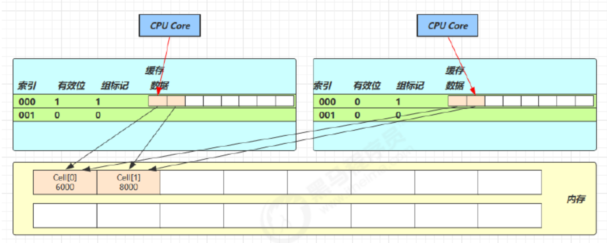

@sun.misc.Contended：防止缓存行伪共享，在使用此注解的对象或字段的前后各增加 128 字节大小的 padding，使用 2 倍于大多数硬件缓存行让 CPU 将对象预读至缓存时**占用不同的缓存行**，这样就不会造成对方缓存行的失效

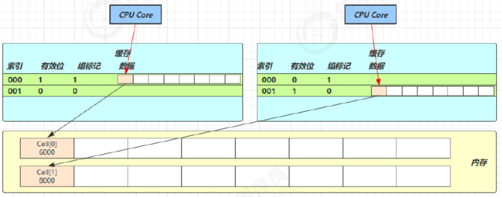

------

#### 源码解析

Striped64 类成员属性：

```java
// 表示当前计算机CPU数量
static final int NCPU = Runtime.getRuntime().availableProcessors()
// 累加单元数组, 懒惰初始化
transient volatile Cell[] cells;
// 基础值, 如果没有竞争, 则用 cas 累加这个域，当 cells 扩容时，也会将数据写到 base 中
transient volatile long base;
// 在 cells 初始化或扩容时只能有一个线程执行, 通过 CAS 更新 cellsBusy 置为 1 来实现一个锁
transient volatile int cellsBusy;
```

工作流程：

- cells 占用内存是相对比较大的，是惰性加载的，在无竞争或者其他线程正在初始化 cells 数组的情况下，直接更新 base 域
- 在第一次发生竞争时（casBase 失败）会创建一个大小为 2 的 cells 数组，将当前累加的值包装为 Cell 对象，放入映射的槽位上
- 分段累加的过程中，如果当前线程对应的 cells 槽位为空，就会新建 Cell 填充，如果出现竞争，就会重新计算线程对应的槽位，继续自旋尝试修改
- 分段迁移后还出现竞争就会扩容 cells 数组长度为原来的两倍，然后 rehash，**数组长度总是 2 的 n 次幂**，默认最大为 CPU 核数，但是可以超过，如果核数是 6 核，数组最长是 8

方法分析：

- LongAdder#add：累加方法

  ```java
  public void add(long x) {
      // as 为累加单元数组的引用，b 为基础值，v 表示期望值
      // m 表示 cells 数组的长度 - 1，a 表示当前线程命中的 cell 单元格
      Cell[] as; long b, v; int m; Cell a;
      
      // cells 不为空说明 cells 已经被初始化，线程发生了竞争，去更新对应的 cell 槽位
      // 进入 || 后的逻辑去更新 base 域，更新失败表示发生竞争进入条件
      if ((as = cells) != null || !casBase(b = base, b + x)) {
          // uncontended 为 true 表示 cell 没有竞争
          boolean uncontended = true;
          
          // 条件一: true 说明 cells 未初始化，多线程写 base 发生竞争需要进行初始化 cells 数组
          //		  fasle 说明 cells 已经初始化，进行下一个条件寻找自己的 cell 去累加
          // 条件二: getProbe() 获取 hash 值，& m 的逻辑和 HashMap 的逻辑相同，保证散列的均匀性
          // 		  true 说明当前线程对应下标的 cell 为空，需要创建 cell
          //        false 说明当前线程对应的 cell 不为空，进行下一个条件【将 x 值累加到对应的 cell 中】
          // 条件三: 有取反符号，false 说明 cas 成功，直接返回，true 说明失败，当前线程对应的 cell 有竞争
          if (as == null || (m = as.length - 1) < 0 ||
              (a = as[getProbe() & m]) == null ||
              !(uncontended = a.cas(v = a.value, v + x)))
              longAccumulate(x, null, uncontended);
          	// 【uncontended 在对应的 cell 上累加失败的时候才为 false，其余情况均为 true】
      }
  }
  ```

- Striped64#longAccumulate：cell 数组创建

  ```java
  							// x  			null 			false | true
  final void longAccumulate(long x, LongBinaryOperator fn, boolean wasUncontended) {
      int h;
      // 当前线程还没有对应的 cell, 需要随机生成一个 hash 值用来将当前线程绑定到 cell
      if ((h = getProbe()) == 0) {
          // 初始化 probe，获取 hash 值
          ThreadLocalRandom.current(); 
          h = getProbe();	
          // 默认情况下 当前线程肯定是写入到了 cells[0] 位置，不把它当做一次真正的竞争
          wasUncontended = true;
      }
      // 表示【扩容意向】，false 一定不会扩容，true 可能会扩容
      boolean collide = false; 
      //自旋
      for (;;) {
          // as 表示cells引用，a 表示当前线程命中的 cell，n 表示 cells 数组长度，v 表示 期望值
          Cell[] as; Cell a; int n; long v;
          // 【CASE1】: 表示 cells 已经初始化了，当前线程应该将数据写入到对应的 cell 中
          if ((as = cells) != null && (n = as.length) > 0) {
              // CASE1.1: true 表示当前线程对应的索引下标的 Cell 为 null，需要创建 new Cell
              if ((a = as[(n - 1) & h]) == null) {
                  // 判断 cellsBusy 是否被锁
                  if (cellsBusy == 0) {   
                      // 创建 cell, 初始累加值为 x
                      Cell r = new Cell(x);  
                      // 加锁
                      if (cellsBusy == 0 && casCellsBusy()) {
                          // 创建成功标记，进入【创建 cell 逻辑】
                          boolean created = false;	
                          try {
                              Cell[] rs; int m, j;
                              // 把当前 cells 数组赋值给 rs，并且不为 null
                              if ((rs = cells) != null &&
                                  (m = rs.length) > 0 &&
                                  // 再次判断防止其它线程初始化过该位置，当前线程再次初始化该位置会造成数据丢失
                                  // 因为这里是线程安全的判断，进行的逻辑不会被其他线程影响
                                  rs[j = (m - 1) & h] == null) {
                                  // 把新创建的 cell 填充至当前位置
                                  rs[j] = r;
                                  created = true;	// 表示创建完成
                              }
                          } finally {
                              cellsBusy = 0;		// 解锁
                          }
                          if (created)			// true 表示创建完成，可以推出循环了
                              break;
                          continue;
                      }
                  }
                  collide = false;
              }
              // CASE1.2: 条件成立说明线程对应的 cell 有竞争, 改变线程对应的 cell 来重试 cas
              else if (!wasUncontended)
                  wasUncontended = true;
              // CASE 1.3: 当前线程 rehash 过，如果新命中的 cell 不为空，就尝试累加，false 说明新命中也有竞争
              else if (a.cas(v = a.value, ((fn == null) ? v + x : fn.applyAsLong(v, x))))
                  break;
              // CASE 1.4: cells 长度已经超过了最大长度 CPU 内核的数量或者已经扩容
              else if (n >= NCPU || cells != as)
                  collide = false; 		// 扩容意向改为false，【表示不能扩容了】
              // CASE 1.5: 更改扩容意向，如果 n >= NCPU，这里就永远不会执行到，case1.4 永远先于 1.5 执行
              else if (!collide)
                  collide = true;
              // CASE 1.6: 【扩容逻辑】，进行加锁
              else if (cellsBusy == 0 && casCellsBusy()) {
                  try {
                      // 线程安全的检查，防止期间被其他线程扩容了
                      if (cells == as) {     
                          // 扩容为以前的 2 倍
                          Cell[] rs = new Cell[n << 1];
                          // 遍历移动值
                          for (int i = 0; i < n; ++i)
                              rs[i] = as[i];
                          // 把扩容后的引用给 cells
                          cells = rs;
                      }
                  } finally {
                      cellsBusy = 0;	// 解锁
                  }
                  collide = false;	// 扩容意向改为 false，表示不扩容了
                  continue;
              }
              // 重置当前线程 Hash 值，这就是【分段迁移机制】
              h = advanceProbe(h);
          }
  
          // 【CASE2】: 运行到这说明 cells 还未初始化，as 为null
          // 判断是否没有加锁，没有加锁就用 CAS 加锁
          // 条件二判断是否其它线程在当前线程给 as 赋值之后修改了 cells，这里不是线程安全的判断
          else if (cellsBusy == 0 && cells == as && casCellsBusy()) {
              // 初始化标志，开始 【初始化 cells 数组】
              boolean init = false;
              try { 
                 	// 再次判断 cells == as 防止其它线程已经提前初始化了，当前线程再次初始化导致丢失数据
                  // 因为这里是【线程安全的，重新检查，经典 DCL】
                  if (cells == as) {
                      Cell[] rs = new Cell[2];	// 初始化数组大小为2
                      rs[h & 1] = new Cell(x);	// 填充线程对应的cell
                      cells = rs;
                      init = true;				// 初始化成功，标记置为 true
                  }
              } finally {
                  cellsBusy = 0;					// 解锁啊
              }
              if (init)
                  break;							// 初始化成功直接跳出自旋
          }
          // 【CASE3】: 运行到这说明其他线程在初始化 cells，当前线程将值累加到 base，累加成功直接结束自旋
          else if (casBase(v = base, ((fn == null) ? v + x :
                                      fn.applyAsLong(v, x))))
              break; 
      }
  }
  ```

- sum：获取最终结果通过 sum 整合，**保证最终一致性，不保证强一致性**

  ```java
  public long sum() {
      Cell[] as = cells; Cell a;
      long sum = base;
      if (as != null) {
          // 遍历 累加
          for (int i = 0; i < as.length; ++i) {
              if ((a = as[i]) != null)
                  sum += a.value;
          }
      }
      return sum;
  }
  ```

------

### ABA

ABA 问题：当进行获取主内存值时，该内存值在写入主内存时已经被修改了 N 次，但是最终又改成原来的值

其他线程先把 A 改成 B 又改回 A，主线程**仅能判断出共享变量的值与最初值 A 是否相同**，不能感知到这种从 A 改为 B 又 改回 A 的情况，这时 CAS 虽然成功，但是过程存在问题

- 构造方法：
  - `public AtomicStampedReference(V initialRef, int initialStamp)`：初始值和初始版本号
- 常用API：
  - ` public boolean compareAndSet(V expectedReference, V newReference, int expectedStamp, int newStamp)`：**期望引用和期望版本号都一致**才进行 CAS 修改数据
  - `public void set(V newReference, int newStamp)`：设置值和版本号
  - `public V getReference()`：返回引用的值
  - `public int getStamp()`：返回当前版本号

```java
public static void main(String[] args) {
    AtomicStampedReference<Integer> atomicReference = new AtomicStampedReference<>(100,1);
    int startStamp = atomicReference.getStamp();
    new Thread(() ->{
        int stamp = atomicReference.getStamp();
        atomicReference.compareAndSet(100, 101, stamp, stamp + 1);
        stamp = atomicReference.getStamp();
        atomicReference.compareAndSet(101, 100, stamp, stamp + 1);
    },"t1").start();

    new Thread(() ->{
        try {
            Thread.sleep(1000);
        } catch (InterruptedException e) {
            e.printStackTrace();
        }
        if (!atomicReference.compareAndSet(100, 200, startStamp, startStamp + 1)) {
            System.out.println(atomicReference.getReference());//100
            System.out.println(Thread.currentThread().getName() + "线程修改失败");
        }
    },"t2").start();
}
```

------

### Unsafe

Unsafe 是 CAS 的核心类，由于 Java 无法直接访问底层系统，需要通过本地（Native）方法来访问

Unsafe 类存在 sun.misc 包，其中所有方法都是 native 修饰的，都是直接调用**操作系统底层资源**执行相应的任务，基于该类可以直接操作特定的内存数据，其内部方法操作类似 C 的指针

模拟实现原子整数：

```java
public static void main(String[] args) {
    MyAtomicInteger atomicInteger = new MyAtomicInteger(10);
    if (atomicInteger.compareAndSwap(20)) {
        System.out.println(atomicInteger.getValue());
    }
}

class MyAtomicInteger {
    private static final Unsafe UNSAFE;
    private static final long VALUE_OFFSET;
    private volatile int value;

    static {
        try {
            //Unsafe unsafe = Unsafe.getUnsafe()这样会报错，需要反射获取
            Field theUnsafe = Unsafe.class.getDeclaredField("theUnsafe");
            theUnsafe.setAccessible(true);
            UNSAFE = (Unsafe) theUnsafe.get(null);
            // 获取 value 属性的内存地址，value 属性指向该地址，直接设置该地址的值可以修改 value 的值
            VALUE_OFFSET = UNSAFE.objectFieldOffset(
                		   MyAtomicInteger.class.getDeclaredField("value"));
        } catch (NoSuchFieldException | IllegalAccessException e) {
            e.printStackTrace();
            throw new RuntimeException();
        }
    }

    public MyAtomicInteger(int value) {
        this.value = value;
    }
    public int getValue() {
        return value;
    }

    public boolean compareAndSwap(int update) {
        while (true) {
            int prev = this.value;
            int next = update;
            //							当前对象  内存偏移量    期望值 更新值
            if (UNSAFE.compareAndSwapInt(this, VALUE_OFFSET, prev, update)) {
                System.out.println("CAS成功");
                return true;
            }
        }
    }
}
```

------

### final

#### 原理

```java
public class TestFinal {
	final int a = 20;
}
```

字节码：

```java
0: aload_0
1: invokespecial #1 // Method java/lang/Object."<init>":()V
4: aload_0
5: bipush 20		// 将值直接放入栈中
7: putfield #2 		// Field a:I
<-- 写屏障
10: return
```

final 变量的赋值通过 putfield 指令来完成，在这条指令之后也会加入写屏障，保证在其它线程读到它的值时不会出现为 0 的情况

其他线程访问 final 修饰的变量**会复制一份放入栈中**，效率更高

------

#### 不可变

不可变：如果一个对象不能够修改其内部状态（属性），那么就是不可变对象

不可变对象线程安全的，不存在并发修改和可见性问题，是另一种避免竞争的方式

String 类也是不可变的，该类和类中所有属性都是 final 的

- 类用 final 修饰保证了该类中的方法不能被覆盖，防止子类无意间破坏不可变性

- 无写入方法（set）确保外部不能对内部属性进行修改

- 属性用 final 修饰保证了该属性是只读的，不能修改

  ```java
  public final class String
      implements java.io.Serializable, Comparable<String>, CharSequence {
      /** The value is used for character storage. */
      private final char value[];
      //....
  }
  ```

- 更改 String 类数据时，会构造新字符串对象，生成新的 char[] value，通过**创建副本对象来避免共享的方式称之为保护性拷贝**

------

### State

无状态：成员变量保存的数据也可以称为状态信息，无状态就是没有成员变量

Servlet 为了保证其线程安全，一般不为 Servlet 设置成员变量，这种没有任何成员变量的类是线程安全的

------

## 享元模式

### 包装类

在JDK中，Boolean，Byte，Short，Integer, Long, Character 等包装类提供了 valueOf 方法，例如 Long的valueOf 会缓存 -128 ~ 127 之间的Long对象，在这个范围之间用重用对象，大于这个范围，才会新建Long对象：

```java
public static long valueOf(long l){
    final int offset = 128;
    if (l >= -128 && l <= 127){
        // will cache
        return LongCache.cache[(int)l + offset];
    }
    return new Long(1);
}
```

> 注意：
>
> Byte, Short, Long 缓存的范围都是 -128~127
>
> Character 缓存的范围是 0~127
>
> Integer 的默认范围是 -128~127，最小值不能变，但最大值可以通过调整虚拟机参数 - Djava.lang.Integer.IntegerCache.high 来改变
>
> Boolean 缓存了 TRUE 和 FALSE

### String 串池

### BigDecimal BigInteger

------

### Local

#### 基本介绍

ThreadLocal 类用来提供线程内部的局部变量，这种变量在多线程环境下访问（通过 get 和 set 方法访问）时能保证各个线程的变量相对独立于其他线程内的变量，分配在堆内的 **TLAB** 中

ThreadLocal 实例通常来说都是 `private static` 类型的，属于一个线程的本地变量，用于关联线程和线程上下文。每个线程都会在 ThreadLocal 中保存一份该线程独有的数据，所以是线程安全的

ThreadLocal 作用：

- 线程并发：应用在多线程并发的场景下
- 传递数据：通过 ThreadLocal 实现在同一线程不同函数或组件中传递公共变量，减少传递复杂度
- 线程隔离：每个线程的变量都是独立的，不会互相影响

对比 synchronized：

|        | synchronized                                                 | ThreadLocal                                                  |
| ------ | ------------------------------------------------------------ | ------------------------------------------------------------ |
| 原理   | 同步机制采用**以时间换空间**的方式，只提供了一份变量，让不同的线程排队访问 | ThreadLocal 采用**以空间换时间**的方式，为每个线程都提供了一份变量的副本，从而实现同时访问而相不干扰 |
| 侧重点 | 多个线程之间访问资源的同步                                   | 多线程中让每个线程之间的数据相互隔离                         |

------

#### 基本使用

##### 常用方法

| 方法                       | 描述                         |
| -------------------------- | ---------------------------- |
| ThreadLocal<>()            | 创建 ThreadLocal 对象        |
| protected T initialValue() | 返回当前线程局部变量的初始值 |
| public void set( T value)  | 设置当前线程绑定的局部变量   |
| public T get()             | 获取当前线程绑定的局部变量   |
| public void remove()       | 移除当前线程绑定的局部变量   |

```java
public class MyDemo {

    private static ThreadLocal<String> tl = new ThreadLocal<>();

    private String content;

    private String getContent() {
        // 获取当前线程绑定的变量
        return tl.get();
    }

    private void setContent(String content) {
        // 变量content绑定到当前线程
        tl.set(content);
    }

    public static void main(String[] args) {
        MyDemo demo = new MyDemo();
        for (int i = 0; i < 5; i++) {
            Thread thread = new Thread(new Runnable() {
                @Override
                public void run() {
                    // 设置数据
                    demo.setContent(Thread.currentThread().getName() + "的数据");
                    System.out.println("-----------------------");
                    System.out.println(Thread.currentThread().getName() + "--->" + demo.getContent());
                }
            });
            thread.setName("线程" + i);
            thread.start();
        }
    }
}
```

------

##### 应用场景

ThreadLocal 适用于下面两种场景：

- 每个线程需要有自己单独的实例
- 实例需要在多个方法中共享，但不希望被多线程共享

ThreadLocal 方案有两个突出的优势：

1. 传递数据：保存每个线程绑定的数据，在需要的地方可以直接获取，避免参数直接传递带来的代码耦合问题
2. 线程隔离：各线程之间的数据相互隔离却又具备并发性，避免同步方式带来的性能损失

ThreadLocal 用于数据连接的事务管理：

```java
public class JdbcUtils {
    // ThreadLocal对象，将connection绑定在当前线程中
    private static final ThreadLocal<Connection> tl = new ThreadLocal();
    // c3p0 数据库连接池对象属性
    private static final ComboPooledDataSource ds = new ComboPooledDataSource();
    // 获取连接
    public static Connection getConnection() throws SQLException {
        //取出当前线程绑定的connection对象
        Connection conn = tl.get();
        if (conn == null) {
            //如果没有，则从连接池中取出
            conn = ds.getConnection();
            //再将connection对象绑定到当前线程中，非常重要的操作
            tl.set(conn);
        }
        return conn;
    }
	// ...
}
```

用 ThreadLocal 使 SimpleDateFormat 从独享变量变成单个线程变量：

```java
public class ThreadLocalDateUtil {
    private static ThreadLocal<DateFormat> threadLocal = new ThreadLocal<DateFormat>() {
        @Override
        protected DateFormat initialValue() {
            return new SimpleDateFormat("yyyy-MM-dd HH:mm:ss");
        }
    };

    public static Date parse(String dateStr) throws ParseException {
        return threadLocal.get().parse(dateStr);
    }

    public static String format(Date date) {
        return threadLocal.get().format(date);
    }
}
```

------

#### 实现原理

##### 底层结构

JDK8 以前：每个 ThreadLocal 都创建一个 Map，然后用线程作为 Map 的 key，要存储的局部变量作为 Map 的 value，达到各个线程的局部变量隔离的效果。这种结构会造成 Map 结构过大和内存泄露，因为 Thread 停止后无法通过 key 删除对应的数据

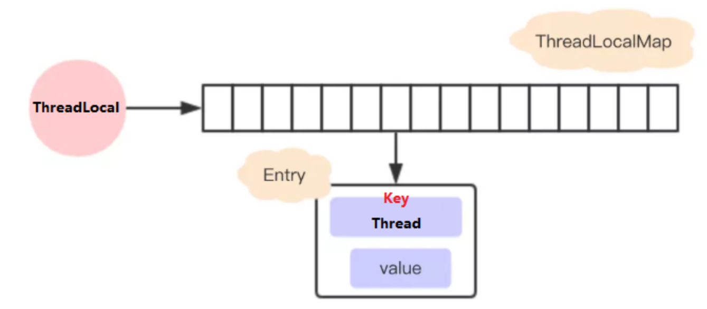

JDK8 以后：每个 Thread 维护一个 ThreadLocalMap，这个 Map 的 key 是 ThreadLocal 实例本身，value 是真正要存储的值

- **每个 Thread 线程内部都有一个 Map (ThreadLocalMap)**
- Map 里面存储 ThreadLocal 对象（key）和线程的私有变量（value）
- Thread 内部的 Map 是由 ThreadLocal 维护的，由 ThreadLocal 负责向 map 获取和设置线程的变量值
- 对于不同的线程，每次获取副本值时，别的线程并不能获取到当前线程的副本值，形成副本的隔离，互不干扰

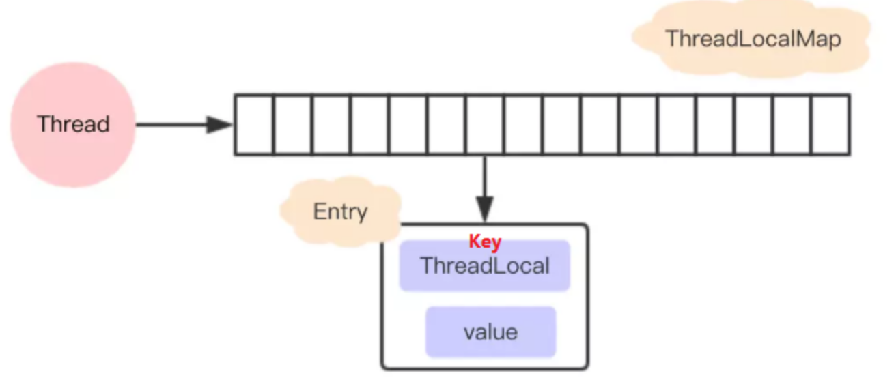

JDK8 前后对比：

- 每个 Map 存储的 Entry 数量会变少，因为之前的存储数量由 Thread 的数量决定，现在由 ThreadLocal 的数量决定，在实际编程当中，往往 ThreadLocal 的数量要少于 Thread 的数量
- 当 Thread 销毁之后，对应的 ThreadLocalMap 也会随之销毁，能减少内存的使用，**防止内存泄露**

------

##### 成员变量

- Thread 类的相关属性：**每一个线程持有一个 ThreadLocalMap 对象**，存放由 ThreadLocal 和数据组成的 Entry 键值对

  ```java
  ThreadLocal.ThreadLocalMap threadLocals = null
  ```

- 计算 ThreadLocal 对象的哈希值：

  ```java
  private final int threadLocalHashCode = nextHashCode()
  ```

  使用 `threadLocalHashCode & (table.length - 1)` 计算当前 entry 需要存放的位置

- 每创建一个 ThreadLocal 对象就会使用 nextHashCode 分配一个 hash 值给这个对象：

  ```java
  private static AtomicInteger nextHashCode = new AtomicInteger()
  ```

- 斐波那契数也叫黄金分割数，hash 的**增量**就是这个数字，带来的好处是 hash 分布非常均匀：

  ```java
  private static final int HASH_INCREMENT = 0x61c88647
  ```

------

##### 成员方法

方法都是线程安全的，因为 ThreadLocal 属于一个线程的，ThreadLocal 中的方法，逻辑都是获取当前线程维护的 ThreadLocalMap 对象，然后进行数据的增删改查，没有指定初始值的 threadlcoal 对象默认赋值为 null

- initialValue()：返回该线程局部变量的初始值

  - 延迟调用的方法，在执行 get 方法时才执行
  - 该方法缺省（默认）实现直接返回一个 null
  - 如果想要一个初始值，可以重写此方法， 该方法是一个 `protected` 的方法，为了让子类覆盖而设计的

  ```java
  protected T initialValue() {
      return null;
  }
  ```

- nextHashCode()：计算哈希值，ThreadLocal 的散列方式称之为**斐波那契散列**，每次获取哈希值都会加上 HASH_INCREMENT，这样做可以尽量避免 hash 冲突，让哈希值能均匀的分布在 2 的 n 次方的数组中

  ```java
  private static int nextHashCode() {
      // 哈希值自增一个 HASH_INCREMENT 数值
      return nextHashCode.getAndAdd(HASH_INCREMENT);
  }
  ```

- set()：修改当前线程与当前 threadlocal 对象相关联的线程局部变量

  ```java
  public void set(T value) {
      // 获取当前线程对象
      Thread t = Thread.currentThread();
      // 获取此线程对象中维护的 ThreadLocalMap 对象
      ThreadLocalMap map = getMap(t);
      // 判断 map 是否存在
      if (map != null)
          // 调用 threadLocalMap.set 方法进行重写或者添加
          map.set(this, value);
      else
          // map 为空，调用 createMap 进行 ThreadLocalMap 对象的初始化。参数1是当前线程，参数2是局部变量
          createMap(t, value);
  }
  ```

  ```java
  // 获取当前线程 Thread 对应维护的 ThreadLocalMap 
  ThreadLocalMap getMap(Thread t) {
      return t.threadLocals;
  }
  // 创建当前线程Thread对应维护的ThreadLocalMap 
  void createMap(Thread t, T firstValue) {
      // 【这里的 this 是调用此方法的 threadLocal】，创建一个新的 Map 并设置第一个数据
      t.threadLocals = new ThreadLocalMap(this, firstValue);
  }
  ```

- get()：获取当前线程与当前 ThreadLocal 对象相关联的线程局部变量

  ```java
  public T get() {
      Thread t = Thread.currentThread();
      ThreadLocalMap map = getMap(t);
      // 如果此map存在
      if (map != null) {
          // 以当前的 ThreadLocal 为 key，调用 getEntry 获取对应的存储实体 e
          ThreadLocalMap.Entry e = map.getEntry(this);
          // 对 e 进行判空 
          if (e != null) {
              // 获取存储实体 e 对应的 value值
              T result = (T)e.value;
              return result;
          }
      }
      /*有两种情况有执行当前代码
        第一种情况: map 不存在，表示此线程没有维护的 ThreadLocalMap 对象
        第二种情况: map 存在, 但是【没有与当前 ThreadLocal 关联的 entry】，就会设置为默认值 */
      // 初始化当前线程与当前 threadLocal 对象相关联的 value
      return setInitialValue();
  }
  ```

  ```java
  private T setInitialValue() {
      // 调用initialValue获取初始化的值，此方法可以被子类重写, 如果不重写默认返回 null
      T value = initialValue();
      Thread t = Thread.currentThread();
      ThreadLocalMap map = getMap(t);
      // 判断 map 是否初始化过
      if (map != null)
          // 存在则调用 map.set 设置此实体 entry，value 是默认的值
          map.set(this, value);
      else
          // 调用 createMap 进行 ThreadLocalMap 对象的初始化中
          createMap(t, value);
      // 返回线程与当前 threadLocal 关联的局部变量
      return value;
  }
  ```

- remove()：移除当前线程与当前 threadLocal 对象相关联的线程局部变量

  ```java
  public void remove() {
      // 获取当前线程对象中维护的 ThreadLocalMap 对象
      ThreadLocalMap m = getMap(Thread.currentThread());
      if (m != null)
          // map 存在则调用 map.remove，this时当前ThreadLocal，以this为key删除对应的实体
          m.remove(this);
  }
  ```

------

#### LocalMap

##### 成员属性

ThreadLocalMap 是 ThreadLocal 的内部类，没有实现 Map 接口，用独立的方式实现了 Map 的功能，其内部 Entry 也是独立实现

```java
// 初始化当前 map 内部散列表数组的初始长度 16
private static final int INITIAL_CAPACITY = 16;

// 存放数据的table，数组长度必须是2的整次幂。
private Entry[] table;

// 数组里面 entrys 的个数，可以用于判断 table 当前使用量是否超过阈值
private int size = 0;

// 进行扩容的阈值，表使用量大于它的时候进行扩容。
private int threshold;
```

存储结构 Entry：

- Entry 继承 WeakReference，key 是弱引用，目的是将 ThreadLocal 对象的生命周期和线程生命周期解绑
- Entry 限制只能用 ThreadLocal 作为 key，key 为 null (entry.get() == null) 意味着 key 不再被引用，entry 也可以从 table 中清除

```java
static class Entry extends WeakReference<ThreadLocal<?>> {
    Object value;
    Entry(ThreadLocal<?> k, Object v) {
        // this.referent = referent = key;
        super(k);
        value = v;
    }
}
```

构造方法：延迟初始化的，线程第一次存储 threadLocal - value 时才会创建 threadLocalMap 对象

```java
ThreadLocalMap(ThreadLocal<?> firstKey, Object firstValue) {
    // 初始化table，创建一个长度为16的Entry数组
    table = new Entry[INITIAL_CAPACITY];
    // 【寻址算法】计算索引
    int i = firstKey.threadLocalHashCode & (INITIAL_CAPACITY - 1);
    // 创建 entry 对象，存放到指定位置的 slot 中
    table[i] = new Entry(firstKey, firstValue);
    // 数据总量是 1
    size = 1;
    // 将阈值设置为 （当前数组长度 * 2）/ 3。
    setThreshold(INITIAL_CAPACITY);
}
```

------

##### 成员方法

- set()：添加数据，ThreadLocalMap 使用**线性探测法来解决哈希冲突**

  - 该方法会一直探测下一个地址，直到有空的地址后插入，若插入后 Map 数量超过阈值，数组会扩容为原来的 2 倍

    假设当前 table 长度为16，计算出来 key 的 hash 值为 14，如果 table[14] 上已经有值，并且其 key 与当前 key 不一致，那么就发生了 hash 冲突，这个时候将 14 加 1 得到 15，取 table[15] 进行判断，如果还是冲突会回到 0，取 table[0]，以此类推，直到可以插入，可以把 Entry[] table 看成一个**环形数组**

  - 线性探测法会出现**堆积问题**，可以采取平方探测法解决

  - 在探测过程中 ThreadLocal 会复用 key 为 null 的脏 Entry 对象，并进行垃圾清理，防止出现内存泄漏

  ```java
  private void set(ThreadLocal<?> key, Object value) {
      // 获取散列表
      ThreadLocal.ThreadLocalMap.Entry[] tab = table;
      int len = tab.length;
      // 哈希寻址
      int i = key.threadLocalHashCode & (len-1);
      // 使用线性探测法向后查找元素，碰到 entry 为空时停止探测
      for (ThreadLocal.ThreadLocalMap.Entry e = tab[i]; e != null; e = tab[i = nextIndex(i, len)]) {
          // 获取当前元素 key
          ThreadLocal<?> k = e.get();
          // ThreadLocal 对应的 key 存在，【直接覆盖之前的值】
          if (k == key) {
              e.value = value;
              return;
          }
          // 【这两个条件谁先成立不一定，所以 replaceStaleEntry 中还需要判断 k == key 的情况】
          
          // key 为 null，但是值不为 null，说明之前的 ThreadLocal 对象已经被回收了，当前是【过期数据】
          if (k == null) {
              // 【碰到一个过期的 slot，当前数据复用该槽位，替换过期数据】
              // 这个方法还进行了垃圾清理动作，防止内存泄漏
              replaceStaleEntry(key, value, i);
              return;
          }
      }
  	// 逻辑到这说明碰到 slot == null 的位置，则在空元素的位置创建一个新的 Entry
      tab[i] = new Entry(key, value);
      // 数量 + 1
      int sz = ++size;
      
      // 【做一次启发式清理】，如果没有清除任何 entry 并且【当前使用量达到了负载因子所定义，那么进行 rehash
      if (!cleanSomeSlots(i, sz) && sz >= threshold)
          // 扩容
          rehash();
  }
  ```

  ```java
  // 获取【环形数组】的下一个索引
  private static int nextIndex(int i, int len) {
      // 索引越界后从 0 开始继续获取
      return ((i + 1 < len) ? i + 1 : 0);
  }
  ```

  ```java
  // 在指定位置插入指定的数据
  private void replaceStaleEntry(ThreadLocal<?> key, Object value, int staleSlot) {
      // 获取散列表
      Entry[] tab = table;
      int len = tab.length;
      Entry e;
  	// 探测式清理的开始下标，默认从当前 staleSlot 开始
      int slotToExpunge = staleSlot;
      // 以当前 staleSlot 开始【向前迭代查找】，找到索引靠前过期数据，找到以后替换 slotToExpunge 值
      // 【保证在一个区间段内，从最前面的过期数据开始清理】
      for (int i = prevIndex(staleSlot, len); (e = tab[i]) != null; i = prevIndex(i, len))
          if (e.get() == null)
              slotToExpunge = i;
  
  	// 以 staleSlot 【向后去查找】，直到碰到 null 为止，还是线性探测
      for (int i = nextIndex(staleSlot, len); (e = tab[i]) != null; i = nextIndex(i, len)) {
          // 获取当前节点的 key
          ThreadLocal<?> k = e.get();
  		// 条件成立说明是【替换逻辑】
          if (k == key) {
              e.value = value;
              // 因为本来要在 staleSlot 索引处插入该数据，现在找到了i索引处的key与数据一致
              // 但是 i 位置距离正确的位置更远，因为是向后查找，所以还是要在 staleSlot 位置插入当前 entry
              // 然后将 table[staleSlot] 这个过期数据放到当前循环到的 table[i] 这个位置，
              tab[i] = tab[staleSlot];
              tab[staleSlot] = e;
  			
              // 条件成立说明向前查找过期数据并未找到过期的 entry，但 staleSlot 位置已经不是过期数据了，i 位置才是
              if (slotToExpunge == staleSlot)
                  slotToExpunge = i;
              
              // 【清理过期数据，expungeStaleEntry 探测式清理，cleanSomeSlots 启发式清理】
              cleanSomeSlots(expungeStaleEntry(slotToExpunge), len);
              return;
          }
  		// 条件成立说明当前遍历的 entry 是一个过期数据，并且该位置前面也没有过期数据
          if (k == null && slotToExpunge == staleSlot)
              // 探测式清理过期数据的开始下标修改为当前循环的 index，因为 staleSlot 会放入要添加的数据
              slotToExpunge = i;
      }
  	// 向后查找过程中并未发现 k == key 的 entry，说明当前是一个【取代过期数据逻辑】
      // 删除原有的数据引用，防止内存泄露
      tab[staleSlot].value = null;
      // staleSlot 位置添加数据，【上面的所有逻辑都不会更改 staleSlot 的值】
      tab[staleSlot] = new Entry(key, value);
  
      // 条件成立说明除了 staleSlot 以外，还发现其它的过期 slot，所以要【开启清理数据的逻辑】
      if (slotToExpunge != staleSlot)
          cleanSomeSlots(expungeStaleEntry(slotToExpunge), len);
  }
  ```

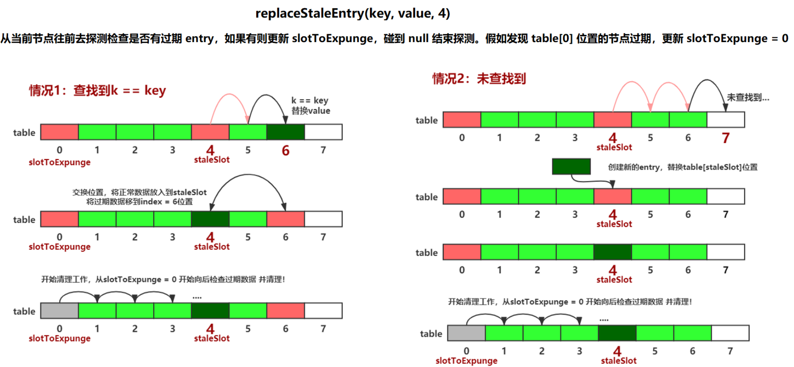

- ```java
  private static int prevIndex(int i, int len) {
      // 形成一个环绕式的访问，头索引越界后置为尾索引
      return ((i - 1 >= 0) ? i - 1 : len - 1);
  }
  ```

- getEntry()：ThreadLocal 的 get 方法以当前的 ThreadLocal 为 key，调用 getEntry 获取对应的存储实体 e

  ```java
  private Entry getEntry(ThreadLocal<?> key) {
      // 哈希寻址
      int i = key.threadLocalHashCode & (table.length - 1);
      // 访问散列表中指定指定位置的 slot 
      Entry e = table[i];
      // 条件成立，说明 slot 有值并且 key 就是要寻找的 key，直接返回
      if (e != null && e.get() == key)
          return e;
      else
          // 进行线性探测
          return getEntryAfterMiss(key, i, e);
  }
  // 线性探测寻址
  private Entry getEntryAfterMiss(ThreadLocal<?> key, int i, Entry e) {
      // 获取散列表
      Entry[] tab = table;
      int len = tab.length;
  
      // 开始遍历，碰到 slot == null 的情况，搜索结束
      while (e != null) {
  		// 获取当前 slot 中 entry 对象的 key
          ThreadLocal<?> k = e.get();
          // 条件成立说明找到了，直接返回
          if (k == key)
              return e;
          if (k == null)
               // 过期数据，【探测式过期数据回收】
              expungeStaleEntry(i);
          else
              // 更新 index 继续向后走
              i = nextIndex(i, len);
          // 获取下一个槽位中的 entry
          e = tab[i];
      }
      // 说明当前区段没有找到相应数据
      // 【因为存放数据是线性的向后寻找槽位，都是紧挨着的，不可能越过一个 空槽位 在后面放】，可以减少遍历的次数
      return null;
  }
  ```

- rehash()：触发一次全量清理，如果数组长度大于等于长度的 `2/3 * 3/4 = 1/2`，则进行 resize

  ```java
  private void rehash() {
      // 清楚当前散列表内的【所有】过期的数据
      expungeStaleEntries();
      
      // threshold = len * 2 / 3，就是 2/3 * (1 - 1/4)
      if (size >= threshold - threshold / 4)
          resize();
  }
  ```

  ```java
  private void expungeStaleEntries() {
      Entry[] tab = table;
      int len = tab.length;
      // 【遍历所有的槽位，清理过期数据】
      for (int j = 0; j < len; j++) {
          Entry e = tab[j];
          if (e != null && e.get() == null)
              expungeStaleEntry(j);
      }
  }
  ```

  Entry **数组为扩容为原来的 2 倍** ，重新计算 key 的散列值，如果遇到 key 为 null 的情况，会将其 value 也置为 null，帮助 GC

  ```java
  private void resize() {
      Entry[] oldTab = table;
      int oldLen = oldTab.length;
      // 新数组的长度是老数组的二倍
      int newLen = oldLen * 2;
      Entry[] newTab = new Entry[newLen];
      // 统计新table中的entry数量
      int count = 0;
  	// 遍历老表，进行【数据迁移】
      for (int j = 0; j < oldLen; ++j) {
          // 访问老表的指定位置的 entry
          Entry e = oldTab[j];
          // 条件成立说明老表中该位置有数据，可能是过期数据也可能不是
          if (e != null) {
              ThreadLocal<?> k = e.get();
              // 过期数据
              if (k == null) {
                  e.value = null; // Help the GC
              } else {
                  // 非过期数据，在新表中进行哈希寻址
                  int h = k.threadLocalHashCode & (newLen - 1);
                  // 【线程探测】
                  while (newTab[h] != null)
                      h = nextIndex(h, newLen);
                  // 将数据存放到新表合适的 slot 中
                  newTab[h] = e;
                  count++;
              }
          }
      }
  	// 设置下一次触发扩容的指标：threshold = len * 2 / 3;
      setThreshold(newLen);
      size = count;
      // 将扩容后的新表赋值给 threadLocalMap 内部散列表数组引用
      table = newTab;
  }
  ```

- remove()：删除 Entry

  ```java
  private void remove(ThreadLocal<?> key) {
      Entry[] tab = table;
      int len = tab.length;
      // 哈希寻址
      int i = key.threadLocalHashCode & (len-1);
      for (Entry e = tab[i]; e != null; e = tab[i = nextIndex(i, len)]) {
          // 找到了对应的 key
          if (e.get() == key) {
              // 设置 key 为 null
              e.clear();
              // 探测式清理
              expungeStaleEntry(i);
              return;
          }
      }
  }
  ```

------

##### 清理方法

- 探测式清理：沿着开始位置向后探测清理过期数据，沿途中碰到未过期数据则将此数据 rehash 在 table 数组中的定位，重定位后的元素理论上更接近 `i = entry.key & (table.length - 1)`，让**数据的排列更紧凑**，会优化整个散列表查询性能

  ```java
  // table[staleSlot] 是一个过期数据，以这个位置开始继续向后查找过期数据
  private int expungeStaleEntry(int staleSlot) {
      // 获取散列表和数组长度
      Entry[] tab = table;
      int len = tab.length;
  
      // help gc，先把当前过期的 entry 置空，在取消对 entry 的引用
      tab[staleSlot].value = null;
      tab[staleSlot] = null;
      // 数量-1
      size--;
  
      Entry e;
      int i;
      // 从 staleSlot 开始向后遍历，直到碰到 slot == null 结束，【区间内清理过期数据】
      for (i = nextIndex(staleSlot, len); (e = tab[i]) != null; i = nextIndex(i, len)) {
          ThreadLocal<?> k = e.get();
          // 当前 entry 是过期数据
          if (k == null) {
              // help gc
              e.value = null;
              tab[i] = null;
              size--;
          } else {
              // 当前 entry 不是过期数据的逻辑，【rehash】
              // 重新计算当前 entry 对应的 index
              int h = k.threadLocalHashCode & (len - 1);
              // 条件成立说明当前 entry 存储时发生过 hash 冲突，向后偏移过了
              if (h != i) {
                  // 当前位置置空
                  tab[i] = null;
                  // 以正确位置 h 开始，向后查找第一个可以存放 entry 的位置
                  while (tab[h] != null)
                      h = nextIndex(h, len);
                  // 将当前元素放入到【距离正确位置更近的位置，有可能就是正确位置】
                  tab[h] = e;
              }
          }
      }
      // 返回 slot = null 的槽位索引，图例是 7，这个索引代表【索引前面的区间已经清理完成垃圾了】
      return i;
  }
  ```

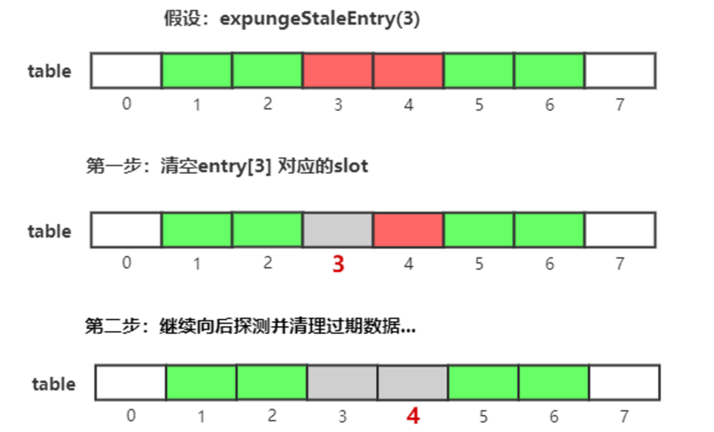

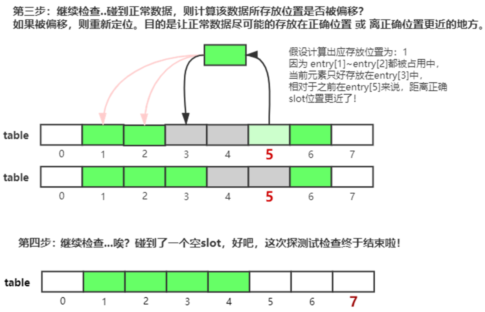

- 启发式清理：向后循环扫描过期数据，发现过期数据调用探测式清理方法，如果连续几次的循环都没有发现过期数据，就停止扫描

  ```java
  //  i 表示启发式清理工作开始位置，一般是空 slot，n 一般传递的是 table.length 
  private boolean cleanSomeSlots(int i, int n) {
      // 表示启发式清理工作是否清除了过期数据
      boolean removed = false;
      // 获取当前 map 的散列表引用
      Entry[] tab = table;
      int len = tab.length;
      do {
          // 获取下一个索引，因为探测式返回的 slot 为 null
          i = nextIndex(i, len);
          Entry e = tab[i];
          // 条件成立说明是过期的数据，key 被 gc 了
          if (e != null && e.get() == null) {
              // 【发现过期数据重置 n 为数组的长度】
              n = len;
              // 表示清理过过期数据
              removed = true;
              // 以当前过期的 slot 为开始节点 做一次探测式清理工作
              i = expungeStaleEntry(i);
          }
          // 假设 table 长度为 16
          // 16 >>> 1 ==> 8，8 >>> 1 ==> 4，4 >>> 1 ==> 2，2 >>> 1 ==> 1，1 >>> 1 ==> 0
          // 连续经过这么多次循环【没有扫描到过期数据】，就停止循环，扫描到空 slot 不算，因为不是过期数据
      } while ((n >>>= 1) != 0);
      
      // 返回清除标记
      return removed;
  }
  ```

参考视频：https://space.bilibili.com/457326371/

------

#### 内存泄漏

Memory leak：内存泄漏是指程序中动态分配的堆内存由于某种原因未释放或无法释放，造成系统内存的浪费，导致程序运行速度减慢甚至系统崩溃等严重后果，内存泄漏的堆积终将导致内存溢出

- 如果 key 使用强引用：使用完 ThreadLocal ，threadLocal Ref 被回收，但是 threadLocalMap 的 Entry 强引用了 threadLocal，造成 threadLocal 无法被回收，无法完全避免内存泄漏

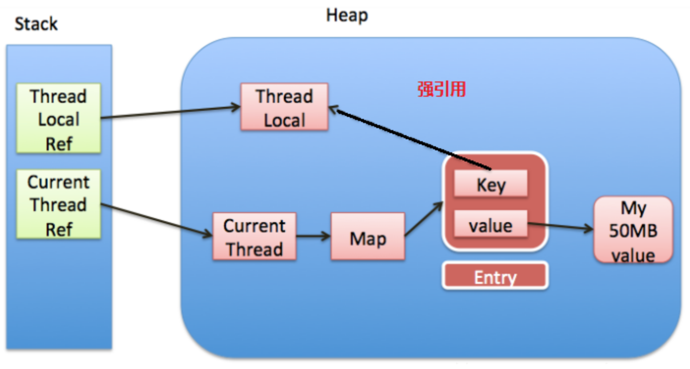

如果 key 使用弱引用：使用完 ThreadLocal ，threadLocal Ref 被回收，ThreadLocalMap 只持有 ThreadLocal 的弱引用，所以threadlocal 也可以被回收，此时 Entry 中的 key = null。但没有手动删除这个 Entry 或者 CurrentThread 依然运行，依然存在强引用链，value 不会被回收，而这块 value 永远不会被访问到，也会导致 value 内存泄漏

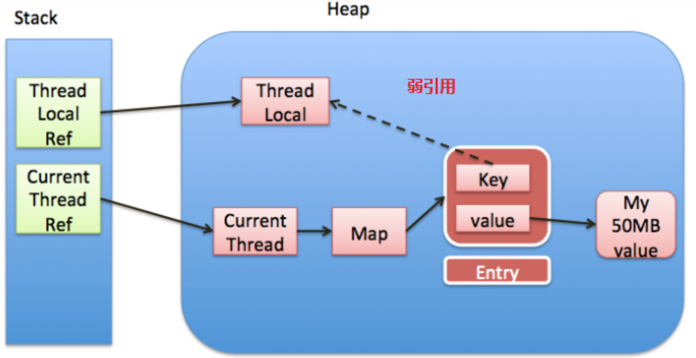

- 两个主要原因：
  - 没有手动删除这个 Entry
  - CurrentThread 依然运行

根本原因：ThreadLocalMap 是 Thread的一个属性，**生命周期跟 Thread 一样长**，如果没有手动删除对应 Entry 就会导致内存泄漏

解决方法：使用完 ThreadLocal 中存储的内容后将它 remove 掉就可以

ThreadLocal 内部解决方法：在 ThreadLocalMap 中的 set/getEntry 方法中，通过线性探测法对 key 进行判断，如果 key 为 null（ThreadLocal 为 null）会对 Entry 进行垃圾回收。所以**使用弱引用比强引用多一层保障**，就算不调用 remove，也有机会进行 GC

------

#### 变量传递

##### 基本使用

父子线程：**创建子线程的线程是父线程**，比如实例中的 main 线程就是父线程

ThreadLocal 中存储的是线程的局部变量，如果想实现线程间局部变量传递可以使用 InheritableThreadLocal 类

```java
public static void main(String[] args) {
    ThreadLocal<String> threadLocal = new InheritableThreadLocal<>();
    threadLocal.set("父线程设置的值");

    new Thread(() -> System.out.println("子线程输出：" + threadLocal.get())).start();
}
// 子线程输出：父线程设置的值
```

------

##### 实现原理

InheritableThreadLocal 源码：

```java
public class InheritableThreadLocal<T> extends ThreadLocal<T> {
    protected T childValue(T parentValue) {
        return parentValue;
    }
    ThreadLocalMap getMap(Thread t) {
       return t.inheritableThreadLocals;
    }
    void createMap(Thread t, T firstValue) {
        t.inheritableThreadLocals = new ThreadLocalMap(this, firstValue);
    }
}
```

实现父子线程间的局部变量共享需要追溯到 Thread 对象的构造方法：

```java
private void init(ThreadGroup g, Runnable target, String name, long stackSize, AccessControlContext acc,
                  // 该参数默认是 true
                  boolean inheritThreadLocals) {
  	// ...
    Thread parent = currentThread();

    // 判断父线程（创建子线程的线程）的 inheritableThreadLocals 属性不为 null
    if (inheritThreadLocals && parent.inheritableThreadLocals != null) {
        // 复制父线程的 inheritableThreadLocals 属性，实现父子线程局部变量共享
        this.inheritableThreadLocals = ThreadLocal.createInheritedMap(parent.inheritableThreadLocals); 
    }
    // ..
}
// 【本质上还是创建 ThreadLocalMap，只是把父类中的可继承数据设置进去了】
static ThreadLocalMap createInheritedMap(ThreadLocalMap parentMap) {
    return new ThreadLocalMap(parentMap);
}
private ThreadLocalMap(ThreadLocalMap parentMap) {
    // 获取父线程的哈希表
    Entry[] parentTable = parentMap.table;
    int len = parentTable.length;
    setThreshold(len);
    table = new Entry[len];
	// 【逐个复制父线程 ThreadLocalMap 中的数据】
    for (int j = 0; j < len; j++) {
        Entry e = parentTable[j];
        if (e != null) {
            ThreadLocal<Object> key = (ThreadLocal<Object>) e.get();
            if (key != null) {
                // 调用的是 InheritableThreadLocal#childValue(T parentValue)
                Object value = key.childValue(e.value);
                Entry c = new Entry(key, value);
                int h = key.threadLocalHashCode & (len - 1);
                // 线性探测
                while (table[h] != null)
                    h = nextIndex(h, len);
                table[h] = c;
                size++;
            }
        }
    }
}
```

参考文章：https://blog.csdn.net/feichitianxia/article/details/110495764

------

## 线程池

### 基本概述

线程池：一个容纳多个线程的容器，容器中的线程可以重复使用，省去了频繁创建和销毁线程对象的操作

线程池作用：

1. 降低资源消耗，减少了创建和销毁线程的次数，每个工作线程都可以被重复利用，可执行多个任务
2. 提高响应速度，当任务到达时，如果有线程可以直接用，不会出现系统僵死
3. 提高线程的可管理性，如果无限制的创建线程，不仅会消耗系统资源，还会降低系统的稳定性，使用线程池可以进行统一的分配，调优和监控

线程池的核心思想：**线程复用**，同一个线程可以被重复使用，来处理多个任务

池化技术 (Pool) ：一种编程技巧，核心思想是资源复用，在请求量大时能优化应用性能，降低系统频繁建连的资源开销

------

### 阻塞队列

#### 基本介绍

有界队列和无界队列：

- 有界队列：有固定大小的队列，比如设定了固定大小的 LinkedBlockingQueue，又或者大小为 0
- 无界队列：没有设置固定大小的队列，这些队列可以直接入队，直到溢出（超过 Integer.MAX_VALUE），所以相当于无界

java.util.concurrent.BlockingQueue 接口有以下阻塞队列的实现：**FIFO 队列**

- ArrayBlockQueue：由数组结构组成的有界阻塞队列
- LinkedBlockingQueue：由链表结构组成的无界（默认大小 Integer.MAX_VALUE）的阻塞队列
- PriorityBlockQueue：支持优先级排序的无界阻塞队列
- DelayedWorkQueue：使用优先级队列实现的延迟无界阻塞队列
- SynchronousQueue：不存储元素的阻塞队列，每一个生产线程会阻塞到有一个 put 的线程放入元素为止
- LinkedTransferQueue：由链表结构组成的无界阻塞队列
- LinkedBlockingDeque：由链表结构组成的**双向**阻塞队列

与普通队列（LinkedList、ArrayList等）的不同点在于阻塞队列中阻塞添加和阻塞删除方法，以及线程安全：

- 阻塞添加 put()：当阻塞队列元素已满时，添加队列元素的线程会被阻塞，直到队列元素不满时才重新唤醒线程执行
- 阻塞删除 take()：在队列元素为空时，删除队列元素的线程将被阻塞，直到队列不为空再执行删除操作（一般会返回被删除的元素)

------

#### 核心方法

| 方法类型         | 抛出异常  | 特殊值   | 阻塞   | 超时               |
| ---------------- | --------- | -------- | ------ | ------------------ |
| 插入（尾）       | add(e)    | offer(e) | put(e) | offer(e,time,unit) |
| 移除（头）       | remove()  | poll()   | take() | poll(time,unit)    |
| 检查（队首元素） | element() | peek()   | 不可用 | 不可用             |

- 抛出异常组：
  - 当阻塞队列满时：在往队列中 add 插入元素会抛出 IIIegalStateException: Queue full
  - 当阻塞队列空时：再往队列中 remove 移除元素，会抛出 NoSuchException
- 特殊值组：
  - 插入方法：成功 true，失败 false
  - 移除方法：成功返回出队列元素，队列没有就返回 null
- 阻塞组：
  - 当阻塞队列满时，生产者继续往队列里 put 元素，队列会一直阻塞生产线程直到队列有空间 put 数据或响应中断退出
  - 当阻塞队列空时，消费者线程试图从队列里 take 元素，队列会一直阻塞消费者线程直到队列中有可用元素
- 超时退出：当阻塞队列满时，队里会阻塞生产者线程一定时间，超过限时后生产者线程会退出

------

