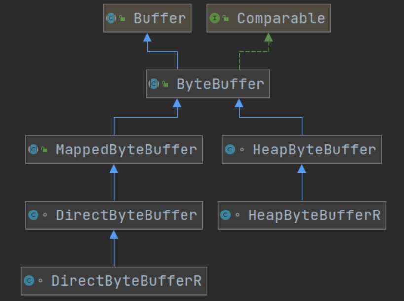

# NIO基础

# 一、三大组件简介

Channel与Buffer

Java NIO系统的**核心**在于：**通道(Channel)和缓冲区(Buffer)**。通道表示打开到 IO 设备(例如：文件、套接字)的连接。若需要使用 NIO 系统，需要获取用于**连接 IO 设备的通道**以及用于**容纳数据的缓冲区**。然后操作缓冲区，对数据进行处理

简而言之，**通道负责传输，缓冲区负责存储**

**常见的Channel有以下四种**，其中FileChannel主要用于文件传输，其余三种用于网络通信

- FileChannel
- DatagramChannel
- SocketChannel
- ServerSocketChannel

**Buffer有以下几种**，其中使用较多的是ByteBuffer

- ByteBuffer
  - MappedByteBuffer
  - DirectByteBuffer
  - HeapByteBuffer
- ShortBuffer
- IntBuffer
- LongBuffer
- FloatBuffer
- DoubleBuffer
- CharBuffer



## 1、Selector

在使用Selector之前，处理socket连接还有以下两种方法

**使用多线程技术**

为每个连接分别开辟一个线程，分别去处理对应的socke连接


这种方法存在以下几个问题

- 内存占用高
  - 每个线程都需要占用一定的内存，当连接较多时，会开辟大量线程，导致占用大量内存
- 线程上下文切换成本高
- 只适合连接数少的场景
  - 连接数过多，会导致创建很多线程，从而出现问题

**使用线程池技术**

使用线程池，让线程池中的线程去处理连接


这种方法存在以下几个问题

- 阻塞模式下，线程仅能处理一个连接

  - 线程池中的线程获取任务（task）后，**只有当其执行完任务之后（断开连接后），才会去获取并执行下一个任务**
  - 若socke连接一直未断开，则其对应的线程无法处理其他socke连接

- 仅适合

  短连接

  场景

  - 短连接即建立连接发送请求并响应后就立即断开，使得线程池中的线程可以快速处理其他连接

**使用选择器**

**selector 的作用就是配合一个线程来管理多个 channel（fileChannel因为是阻塞式的，所以无法使用selector）**，获取这些 channel 上发生的**事件**，这些 channel 工作在**非阻塞模式**下，当一个channel中没有执行任务时，可以去执行其他channel中的任务。**适合连接数多，但流量较少的场景**


若事件未就绪，调用 selector 的 select() 方法会阻塞线程，直到 channel 发生了就绪事件。这些事件就绪后，select 方法就会返回这些事件交给 thread 来处理

## 2、ByteBuffer

### 使用案例

#### 使用方式

- 向 buffer 写入数据，例如调用 channel.read(buffer)

- 调用 flip() 切换至

  读模式

  - **flip会使得buffer中的limit变为position，position变为0**

- 从 buffer 读取数据，例如调用 buffer.get()

- 调用 clear() 或者compact()切换至

  写模式

  - 调用clear()方法时**position=0，limit变为capacity**
  - 调用compact()方法时，**会将缓冲区中的未读数据压缩到缓冲区前面**

- 重复以上步骤

**使用ByteBuffer读取文件中的内容**

```java
public class TestByteBuffer {
    public static void main(String[] args) {
        // 获得FileChannel
        try (FileChannel channel = new FileInputStream("stu.txt").getChannel()) {
            // 获得缓冲区
            ByteBuffer buffer = ByteBuffer.allocate(10);
            int hasNext = 0;
            StringBuilder builder = new StringBuilder();
            while((hasNext = channel.read(buffer)) > 0) {
                // 切换模式 limit=position, position=0
                buffer.flip();
                // 当buffer中还有数据时，获取其中的数据
                while(buffer.hasRemaining()) {
                    builder.append((char)buffer.get());
                }
                // 切换模式 position=0, limit=capacity
                buffer.clear();
            }
            System.out.println(builder.toString());
        } catch (IOException e) {
        }
    }
}
```

### 核心属性

字节缓冲区的父类Buffer中有几个核心属性，如下

```java
// Invariants: mark <= position <= limit <= capacity
private int mark = -1;
private int position = 0;
private int limit;
private int capacity;Copy
```

- **capacity**：缓冲区的容量。通过构造函数赋予，一旦设置，无法更改
- **limit**：缓冲区的界限。位于limit 后的数据不可读写。缓冲区的限制不能为负，并且**不能大于其容量**
- **position**：**下一个**读写位置的索引（类似PC）。缓冲区的位置不能为负，并且**不能大于limit**
- **mark**：记录当前position的值。**position被改变后，可以通过调用reset() 方法恢复到mark的位置。**

以上四个属性必须满足以下要求

**mark <= position <= limit <= capacity**

### 核心方法

#### put()方法

- put()方法可以将一个数据放入到缓冲区中。
- 进行该操作后，postition的值会+1，指向下一个可以放入的位置。capacity = limit ，为缓冲区容量的值。


#### flip()方法

- flip()方法会**切换对缓冲区的操作模式**，由写->读 / 读->写
- 进行该操作后
  - 如果是写模式->读模式，position = 0 ， limit 指向最后一个元素的下一个位置，capacity不变
  - 如果是读->写，则恢复为put()方法中的值


#### get()方法

- get()方法会读取缓冲区中的一个值
- 进行该操作后，position会+1，如果超过了limit则会抛出异常
- **注意：get(i)方法不会改变position的值**


#### rewind()方法

- 该方法**只能在读模式下使用**
- rewind()方法后，会恢复position、limit和capacity的值，变为进行get()前的值


#### clean()方法

- clean()方法会将缓冲区中的各个属性恢复为最初的状态，position = 0, capacity = limit
- **此时缓冲区的数据依然存在**，处于“被遗忘”状态，下次进行写操作时会覆盖这些数据


#### mark()和reset()方法

- mark()方法会将postion的值保存到mark属性中
- reset()方法会将position的值改为mark中保存的值

#### compact()方法

**此方法为ByteBuffer的方法，而不是Buffer的方法**

- compact会把未读完的数据向前压缩，然后切换到写模式
- 数据前移后，原位置的值并未清零，写时会**覆盖**之前的值


#### clear() VS compact()

clear只是对position、limit、mark进行重置，而compact在对position进行设置，以及limit、mark进行重置的同时，还涉及到数据在内存中拷贝（会调用arraycopy）。**所以compact比clear更耗性能。**但compact能保存你未读取的数据，将新数据追加到为读取的数据之后；而clear则不行，若你调用了clear，则未读取的数据就无法再读取到了

**所以需要根据情况来判断使用哪种方法进行模式切换**

### 方法调用及演示

#### ByteBuffer调试工具类

需要先导入netty依赖

```xml
<dependency>
  <groupId>io.netty</groupId>
  <artifactId>netty-all</artifactId>
  <version>4.1.51.Final</version>
</dependency>
```

```java
import java.nio.ByteBuffer;

import io.netty.util.internal.MathUtil;
import io.netty.util.internal.StringUtil;
import io.netty.util.internal.MathUtil.*;


/**
 * @author Panwen Chen
 * @date 2021/4/12 15:59
 */
public class ByteBufferUtil {
    private static final char[] BYTE2CHAR = new char[256];
    private static final char[] HEXDUMP_TABLE = new char[256 * 4];
    private static final String[] HEXPADDING = new String[16];
    private static final String[] HEXDUMP_ROWPREFIXES = new String[65536 >>> 4];
    private static final String[] BYTE2HEX = new String[256];
    private static final String[] BYTEPADDING = new String[16];

    static {
        final char[] DIGITS = "0123456789abcdef".toCharArray();
        for (int i = 0; i < 256; i++) {
            HEXDUMP_TABLE[i << 1] = DIGITS[i >>> 4 & 0x0F];
            HEXDUMP_TABLE[(i << 1) + 1] = DIGITS[i & 0x0F];
        }

        int i;

        // Generate the lookup table for hex dump paddings
        for (i = 0; i < HEXPADDING.length; i++) {
            int padding = HEXPADDING.length - i;
            StringBuilder buf = new StringBuilder(padding * 3);
            for (int j = 0; j < padding; j++) {
                buf.append("   ");
            }
            HEXPADDING[i] = buf.toString();
        }

        // Generate the lookup table for the start-offset header in each row (up to 64KiB).
        for (i = 0; i < HEXDUMP_ROWPREFIXES.length; i++) {
            StringBuilder buf = new StringBuilder(12);
            buf.append(StringUtil.NEWLINE);
            buf.append(Long.toHexString(i << 4 & 0xFFFFFFFFL | 0x100000000L));
            buf.setCharAt(buf.length() - 9, '|');
            buf.append('|');
            HEXDUMP_ROWPREFIXES[i] = buf.toString();
        }

        // Generate the lookup table for byte-to-hex-dump conversion
        for (i = 0; i < BYTE2HEX.length; i++) {
            BYTE2HEX[i] = ' ' + StringUtil.byteToHexStringPadded(i);
        }

        // Generate the lookup table for byte dump paddings
        for (i = 0; i < BYTEPADDING.length; i++) {
            int padding = BYTEPADDING.length - i;
            StringBuilder buf = new StringBuilder(padding);
            for (int j = 0; j < padding; j++) {
                buf.append(' ');
            }
            BYTEPADDING[i] = buf.toString();
        }

        // Generate the lookup table for byte-to-char conversion
        for (i = 0; i < BYTE2CHAR.length; i++) {
            if (i <= 0x1f || i >= 0x7f) {
                BYTE2CHAR[i] = '.';
            } else {
                BYTE2CHAR[i] = (char) i;
            }
        }
    }

    /**
     * 打印所有内容
     * @param buffer
     */
    public static void debugAll(ByteBuffer buffer) {
        int oldlimit = buffer.limit();
        buffer.limit(buffer.capacity());
        StringBuilder origin = new StringBuilder(256);
        appendPrettyHexDump(origin, buffer, 0, buffer.capacity());
        System.out.println("+--------+-------------------- all ------------------------+----------------+");
        System.out.printf("position: [%d], limit: [%d]\n", buffer.position(), oldlimit);
        System.out.println(origin);
        buffer.limit(oldlimit);
    }

    /**
     * 打印可读取内容
     * @param buffer
     */
    public static void debugRead(ByteBuffer buffer) {
        StringBuilder builder = new StringBuilder(256);
        appendPrettyHexDump(builder, buffer, buffer.position(), buffer.limit() - buffer.position());
        System.out.println("+--------+-------------------- read -----------------------+----------------+");
        System.out.printf("position: [%d], limit: [%d]\n", buffer.position(), buffer.limit());
        System.out.println(builder);
    }

    private static void appendPrettyHexDump(StringBuilder dump, ByteBuffer buf, int offset, int length) {
        if (MathUtil.isOutOfBounds(offset, length, buf.capacity())) {
            throw new IndexOutOfBoundsException(
                    "expected: " + "0 <= offset(" + offset + ") <= offset + length(" + length
                            + ") <= " + "buf.capacity(" + buf.capacity() + ')');
        }
        if (length == 0) {
            return;
        }
        dump.append(
                "         +-------------------------------------------------+" +
                        StringUtil.NEWLINE + "         |  0  1  2  3  4  5  6  7  8  9  a  b  c  d  e  f |" +
                        StringUtil.NEWLINE + "+--------+-------------------------------------------------+----------------+");

        final int startIndex = offset;
        final int fullRows = length >>> 4;
        final int remainder = length & 0xF;

        // Dump the rows which have 16 bytes.
        for (int row = 0; row < fullRows; row++) {
            int rowStartIndex = (row << 4) + startIndex;

            // Per-row prefix.
            appendHexDumpRowPrefix(dump, row, rowStartIndex);

            // Hex dump
            int rowEndIndex = rowStartIndex + 16;
            for (int j = rowStartIndex; j < rowEndIndex; j++) {
                dump.append(BYTE2HEX[getUnsignedByte(buf, j)]);
            }
            dump.append(" |");

            // ASCII dump
            for (int j = rowStartIndex; j < rowEndIndex; j++) {
                dump.append(BYTE2CHAR[getUnsignedByte(buf, j)]);
            }
            dump.append('|');
        }

        // Dump the last row which has less than 16 bytes.
        if (remainder != 0) {
            int rowStartIndex = (fullRows << 4) + startIndex;
            appendHexDumpRowPrefix(dump, fullRows, rowStartIndex);

            // Hex dump
            int rowEndIndex = rowStartIndex + remainder;
            for (int j = rowStartIndex; j < rowEndIndex; j++) {
                dump.append(BYTE2HEX[getUnsignedByte(buf, j)]);
            }
            dump.append(HEXPADDING[remainder]);
            dump.append(" |");

            // Ascii dump
            for (int j = rowStartIndex; j < rowEndIndex; j++) {
                dump.append(BYTE2CHAR[getUnsignedByte(buf, j)]);
            }
            dump.append(BYTEPADDING[remainder]);
            dump.append('|');
        }

        dump.append(StringUtil.NEWLINE +
                "+--------+-------------------------------------------------+----------------+");
    }

    private static void appendHexDumpRowPrefix(StringBuilder dump, int row, int rowStartIndex) {
        if (row < HEXDUMP_ROWPREFIXES.length) {
            dump.append(HEXDUMP_ROWPREFIXES[row]);
        } else {
            dump.append(StringUtil.NEWLINE);
            dump.append(Long.toHexString(rowStartIndex & 0xFFFFFFFFL | 0x100000000L));
            dump.setCharAt(dump.length() - 9, '|');
            dump.append('|');
        }
    }

    public static short getUnsignedByte(ByteBuffer buffer, int index) {
        return (short) (buffer.get(index) & 0xFF);
    }
}
```

#### 调用ByteBuffer的方法

```java
public class TestByteBuffer {
    public static void main(String[] args) {
        ByteBuffer buffer = ByteBuffer.allocate(10);
        // 向buffer中写入1个字节的数据
        buffer.put((byte)97);
        // 使用工具类，查看buffer状态
        ByteBufferUtil.debugAll(buffer);

        // 向buffer中写入4个字节的数据
        buffer.put(new byte[]{98, 99, 100, 101});
        ByteBufferUtil.debugAll(buffer);

        // 获取数据
        buffer.flip();
        ByteBufferUtil.debugAll(buffer);
        System.out.println(buffer.get());
        System.out.println(buffer.get());
        ByteBufferUtil.debugAll(buffer);

        // 使用compact切换模式
        buffer.compact();
        ByteBufferUtil.debugAll(buffer);

        // 再次写入
        buffer.put((byte)102);
        buffer.put((byte)103);
        ByteBufferUtil.debugAll(buffer);
    }
}
```

运行结果

```java
// 向缓冲区写入了一个字节的数据，此时postition为1
+--------+-------------------- all ------------------------+----------------+
position: [1], limit: [10]
         +-------------------------------------------------+
         |  0  1  2  3  4  5  6  7  8  9  a  b  c  d  e  f |
+--------+-------------------------------------------------+----------------+
|00000000| 61 00 00 00 00 00 00 00 00 00                   |a.........      |
+--------+-------------------------------------------------+----------------+

// 向缓冲区写入四个字节的数据，此时position为5
+--------+-------------------- all ------------------------+----------------+
position: [5], limit: [10]
         +-------------------------------------------------+
         |  0  1  2  3  4  5  6  7  8  9  a  b  c  d  e  f |
+--------+-------------------------------------------------+----------------+
|00000000| 61 62 63 64 65 00 00 00 00 00                   |abcde.....      |
+--------+-------------------------------------------------+----------------+

// 调用flip切换模式，此时position为0，表示从第0个数据开始读取
+--------+-------------------- all ------------------------+----------------+
position: [0], limit: [5]
         +-------------------------------------------------+
         |  0  1  2  3  4  5  6  7  8  9  a  b  c  d  e  f |
+--------+-------------------------------------------------+----------------+
|00000000| 61 62 63 64 65 00 00 00 00 00                   |abcde.....      |
+--------+-------------------------------------------------+----------------+
// 读取两个字节的数据             
97
98
            
// position变为2             
+--------+-------------------- all ------------------------+----------------+
position: [2], limit: [5]
         +-------------------------------------------------+
         |  0  1  2  3  4  5  6  7  8  9  a  b  c  d  e  f |
+--------+-------------------------------------------------+----------------+
|00000000| 61 62 63 64 65 00 00 00 00 00                   |abcde.....      |
+--------+-------------------------------------------------+----------------+
             
// 调用compact切换模式，此时position及其后面的数据被压缩到ByteBuffer前面去了
// 此时position为3，会覆盖之前的数据             
+--------+-------------------- all ------------------------+----------------+
position: [3], limit: [10]
         +-------------------------------------------------+
         |  0  1  2  3  4  5  6  7  8  9  a  b  c  d  e  f |
+--------+-------------------------------------------------+----------------+
|00000000| 63 64 65 64 65 00 00 00 00 00                   |cdede.....      |
+--------+-------------------------------------------------+----------------+
             
// 再次写入两个字节的数据，之前的 0x64 0x65 被覆盖         
+--------+-------------------- all ------------------------+----------------+
position: [5], limit: [10]
         +-------------------------------------------------+
         |  0  1  2  3  4  5  6  7  8  9  a  b  c  d  e  f |
+--------+-------------------------------------------------+----------------+
|00000000| 63 64 65 66 67 00 00 00 00 00                   |cdefg.....      |
+--------+-------------------------------------------------+----------------+
```

### **字符串与ByteBuffer的相互转换**

#### 方法一

**编码**：字符串调用getByte方法获得byte数组，将byte数组放入ByteBuffer中

**解码**：**先调用ByteBuffer的flip方法，然后通过StandardCharsets的decoder方法解码**

```java
public class Translate {
    public static void main(String[] args) {
        // 准备两个字符串
        String str1 = "hello";
        String str2 = "";


        ByteBuffer buffer1 = ByteBuffer.allocate(16);
        // 通过字符串的getByte方法获得字节数组，放入缓冲区中
        buffer1.put(str1.getBytes());
        ByteBufferUtil.debugAll(buffer1);

        // 将缓冲区中的数据转化为字符串
        // 切换模式
        buffer1.flip();
        
        // 通过StandardCharsets解码，获得CharBuffer，再通过toString获得字符串
        str2 = StandardCharsets.UTF_8.decode(buffer1).toString();
        System.out.println(str2);
        ByteBufferUtil.debugAll(buffer1);
    }
}
```

运行结果

```java
+--------+-------------------- all ------------------------+----------------+
position: [5], limit: [16]
         +-------------------------------------------------+
         |  0  1  2  3  4  5  6  7  8  9  a  b  c  d  e  f |
+--------+-------------------------------------------------+----------------+
|00000000| 68 65 6c 6c 6f 00 00 00 00 00 00 00 00 00 00 00 |hello...........|
+--------+-------------------------------------------------+----------------+
hello
+--------+-------------------- all ------------------------+----------------+
position: [5], limit: [5]
         +-------------------------------------------------+
         |  0  1  2  3  4  5  6  7  8  9  a  b  c  d  e  f |
+--------+-------------------------------------------------+----------------+
|00000000| 68 65 6c 6c 6f 00 00 00 00 00 00 00 00 00 00 00 |hello...........|
+--------+-------------------------------------------------+----------------+
```

#### 方法二

**编码**：通过StandardCharsets的encode方法获得ByteBuffer，此时获得的ByteBuffer为读模式，无需通过flip切换模式

**解码**：通过StandardCharsets的decoder方法解码

```java
public class Translate {
    public static void main(String[] args) {
        // 准备两个字符串
        String str1 = "hello";
        String str2 = "";

        // 通过StandardCharsets的encode方法获得ByteBuffer
        // 此时获得的ByteBuffer为读模式，无需通过flip切换模式
        ByteBuffer buffer1 = StandardCharsets.UTF_8.encode(str1);
        ByteBufferUtil.debugAll(buffer1);

        // 将缓冲区中的数据转化为字符串
        // 通过StandardCharsets解码，获得CharBuffer，再通过toString获得字符串
        str2 = StandardCharsets.UTF_8.decode(buffer1).toString();
        System.out.println(str2);
        ByteBufferUtil.debugAll(buffer1);
    }
}
```

运行结果

```java
+--------+-------------------- all ------------------------+----------------+
position: [0], limit: [5]
         +-------------------------------------------------+
         |  0  1  2  3  4  5  6  7  8  9  a  b  c  d  e  f |
+--------+-------------------------------------------------+----------------+
|00000000| 68 65 6c 6c 6f                                  |hello           |
+--------+-------------------------------------------------+----------------+
hello
+--------+-------------------- all ------------------------+----------------+
position: [5], limit: [5]
         +-------------------------------------------------+
         |  0  1  2  3  4  5  6  7  8  9  a  b  c  d  e  f |
+--------+-------------------------------------------------+----------------+
|00000000| 68 65 6c 6c 6f                                  |hello           |
+--------+-------------------------------------------------+----------------+
```

#### **方法三**

**编码**：字符串调用getByte()方法获得字节数组，将字节数组传给**ByteBuffer的wrap()方法**，通过该方法获得ByteBuffer。**同样无需调用flip方法切换为读模式**

**解码**：通过StandardCharsets的decoder方法解码

```java
public class Translate {
    public static void main(String[] args) {
        // 准备两个字符串
        String str1 = "hello";
        String str2 = "";

        // 通过StandardCharsets的encode方法获得ByteBuffer
        // 此时获得的ByteBuffer为读模式，无需通过flip切换模式
        ByteBuffer buffer1 = ByteBuffer.wrap(str1.getBytes());
        ByteBufferUtil.debugAll(buffer1);

        // 将缓冲区中的数据转化为字符串
        // 通过StandardCharsets解码，获得CharBuffer，再通过toString获得字符串
        str2 = StandardCharsets.UTF_8.decode(buffer1).toString();
        System.out.println(str2);
        ByteBufferUtil.debugAll(buffer1);
    }
}
```

运行结果

```java
+--------+-------------------- all ------------------------+----------------+
position: [0], limit: [5]
         +-------------------------------------------------+
         |  0  1  2  3  4  5  6  7  8  9  a  b  c  d  e  f |
+--------+-------------------------------------------------+----------------+
|00000000| 68 65 6c 6c 6f                                  |hello           |
+--------+-------------------------------------------------+----------------+
hello
+--------+-------------------- all ------------------------+----------------+
position: [5], limit: [5]
         +-------------------------------------------------+
         |  0  1  2  3  4  5  6  7  8  9  a  b  c  d  e  f |
+--------+-------------------------------------------------+----------------+
|00000000| 68 65 6c 6c 6f                                  |hello           |
+--------+-------------------------------------------------+----------------+
```

### 粘包与半包

#### 现象

网络上有多条数据发送给服务端，数据之间使用 \n 进行分隔
但由于某种原因这些数据在接收时，被进行了重新组合，例如原始数据有3条为

- Hello,world\n
- I’m Nyima\n
- How are you?\n

变成了下面的两个 byteBuffer (粘包，半包)

- Hello,world\nI’m Nyima\nHo
- w are you?\n

#### 出现原因

**粘包**

发送方在发送数据时，并不是一条一条地发送数据，而是**将数据整合在一起**，当数据达到一定的数量后再一起发送。这就会导致多条信息被放在一个缓冲区中被一起发送出去

**半包**

接收方的缓冲区的大小是有限的，当接收方的缓冲区满了以后，就需要**将信息截断**，等缓冲区空了以后再继续放入数据。这就会发生一段完整的数据最后被截断的现象

#### 解决办法

- 通过get(index)方法遍历ByteBuffer，遇到分隔符时进行处理。

  注意

  ：get(index)不会改变position的值

  - 记录该段数据长度，以便于申请对应大小的缓冲区
  - 将缓冲区的数据通过get()方法写入到target中

- 调用**compact方法**切换模式，因为缓冲区中可能还有未读的数据

```java
public class ByteBufferDemo {
    public static void main(String[] args) {
        ByteBuffer buffer = ByteBuffer.allocate(32);
        // 模拟粘包+半包
        buffer.put("Hello,world\nI'm Nyima\nHo".getBytes());
        // 调用split函数处理
        split(buffer);
        buffer.put("w are you?\n".getBytes());
        split(buffer);
    }

    private static void split(ByteBuffer buffer) {
        // 切换为读模式
        buffer.flip();
        for(int i = 0; i < buffer.limit(); i++) {

            // 遍历寻找分隔符
            // get(i)不会移动position
            if (buffer.get(i) == '\n') {
                // 缓冲区长度
                int length = i+1-buffer.position();
                ByteBuffer target = ByteBuffer.allocate(length);
                // 将前面的内容写入target缓冲区
                for(int j = 0; j < length; j++) {
                    // 将buffer中的数据写入target中
                    target.put(buffer.get());
                }
                // 打印查看结果
                ByteBufferUtil.debugAll(target);
            }
        }
        // 切换为写模式，但是缓冲区可能未读完，这里需要使用compact
        buffer.compact();
    }
}
```

运行结果

```java
+--------+-------------------- all ------------------------+----------------+
position: [12], limit: [12]
         +-------------------------------------------------+
         |  0  1  2  3  4  5  6  7  8  9  a  b  c  d  e  f |
+--------+-------------------------------------------------+----------------+
|00000000| 48 65 6c 6c 6f 2c 77 6f 72 6c 64 0a             |Hello,world.    |
+--------+-------------------------------------------------+----------------+
+--------+-------------------- all ------------------------+----------------+
position: [10], limit: [10]
         +-------------------------------------------------+
         |  0  1  2  3  4  5  6  7  8  9  a  b  c  d  e  f |
+--------+-------------------------------------------------+----------------+
|00000000| 49 27 6d 20 4e 79 69 6d 61 0a                   |I'm Nyima.      |
+--------+-------------------------------------------------+----------------+
+--------+-------------------- all ------------------------+----------------+
position: [13], limit: [13]
         +-------------------------------------------------+
         |  0  1  2  3  4  5  6  7  8  9  a  b  c  d  e  f |
+--------+-------------------------------------------------+----------------+
|00000000| 48 6f 77 20 61 72 65 20 79 6f 75 3f 0a          |How are you?.   |
+--------+-------------------------------------------------+----------------+
```

# 二、文件编程

## 1、FileChannel

### 工作模式

FileChannel**只能在阻塞模式下工作**，所以无法搭配Selector

### 获取

不能直接打开 FileChannel，**必须**通过 FileInputStream、FileOutputStream 或者 RandomAccessFile 来获取 FileChannel，它们都有 getChannel 方法

- 通过 FileInputStream 获取的 channel **只能读**
- 通过 FileOutputStream 获取的 channel **只能写**
- 通过 RandomAccessFile 是否能读写**根据构造 RandomAccessFile 时的读写模式决定**

### 读取

通过 FileInputStream 获取channel，通过read方法将数据写入到ByteBuffer中

read方法的返回值表示读到了多少字节，若读到了文件末尾则返回-1

```java
int readBytes = channel.read(buffer);
```

**可根据返回值判断是否读取完毕**

```java
while(channel.read(buffer) > 0) {
    // 进行对应操作
    ...
}
```

### 写入

因为channel也是有大小的，所以 write 方法并不能保证一次将 buffer 中的内容全部写入 channel。必须**需要按照以下规则进行写入**

```java
// 通过hasRemaining()方法查看缓冲区中是否还有数据未写入到通道中
while(buffer.hasRemaining()) {
	channel.write(buffer);
}
```

### 关闭

通道需要close，一般情况通过try-with-resource进行关闭，**最好使用以下方法获取strea以及channel，避免某些原因使得资源未被关闭**

```java
public class TestChannel {
    public static void main(String[] args) throws IOException {
        try (FileInputStream fis = new FileInputStream("stu.txt");
             FileOutputStream fos = new FileOutputStream("student.txt");
             FileChannel inputChannel = fis.getChannel();
             FileChannel outputChannel = fos.getChannel()) {
            
            // 执行对应操作
            ...
        }
    }
}
```

### 位置

**position**

channel也拥有一个保存读取数据位置的属性，即position

```java
long pos = channel.position();
```

可以通过position(int pos)设置channel中position的值

```java
long newPos = ...;
channel.position(newPos);
```

设置当前位置时，如果设置为文件的末尾

- 这时读取会返回 -1
- 这时写入，会追加内容，但要注意如果 position 超过了文件末尾，再写入时在新内容和原末尾之间会有空洞（00）

### 强制写入

操作系统出于性能的考虑，会将数据缓存，不是立刻写入磁盘，而是等到缓存满了以后将所有数据一次性的写入磁盘。可以调用 **force(true)** 方法将文件内容和元数据（文件的权限等信息）立刻写入磁盘

## 2、两个Channel传输数据

### transferTo方法

使用transferTo方法可以快速、高效地将一个channel中的数据传输到另一个channel中，但**一次只能传输2G的内容**

transferTo底层使用了零拷贝技术

```java
public class TestChannel {
    public static void main(String[] args){
        try (FileInputStream fis = new FileInputStream("stu.txt");
             FileOutputStream fos = new FileOutputStream("student.txt");
             FileChannel inputChannel = fis.getChannel();
             FileChannel outputChannel = fos.getChannel()) {
            // 参数：inputChannel的起始位置，传输数据的大小，目的channel
            // 返回值为传输的数据的字节数
            // transferTo一次只能传输2G的数据
            inputChannel.transferTo(0, inputChannel.size(), outputChannel);
        } catch (IOException e) {
            e.printStackTrace();
        }
    }
}
```

当传输的文件**大于2G**时，需要使用以下方法进行多次传输

```java
public class TestChannel {
    public static void main(String[] args){
        try (FileInputStream fis = new FileInputStream("stu.txt");
             FileOutputStream fos = new FileOutputStream("student.txt");
             FileChannel inputChannel = fis.getChannel();
             FileChannel outputChannel = fos.getChannel()) {
            long size = inputChannel.size();
            long capacity = inputChannel.size();
            // 分多次传输
            while (capacity > 0) {
                // transferTo返回值为传输了的字节数
                capacity -= inputChannel.transferTo(size-capacity, capacity, outputChannel);
            }
        } catch (IOException e) {
            e.printStackTrace();
        }
    }
}
```

## 3、Path与Paths

- Path 用来表示文件路径
- Paths 是工具类，用来获取 Path 实例

```java
Path source = Paths.get("1.txt"); // 相对路径 不带盘符 使用 user.dir 环境变量来定位 1.txt

Path source = Paths.get("d:\\1.txt"); // 绝对路径 代表了  d:\1.txt 反斜杠需要转义

Path source = Paths.get("d:/1.txt"); // 绝对路径 同样代表了  d:\1.txt

Path projects = Paths.get("d:\\data", "projects"); // 代表了  d:\data\projects
```

- `.` 代表了当前路径
- `..` 代表了上一级路径

例如目录结构如下

```
d:
	|- data
		|- projects
			|- a
			|- b
```

代码

```java
Path path = Paths.get("d:\\data\\projects\\a\\..\\b");
System.out.println(path);
System.out.println(path.normalize()); // 正常化路径 会去除 . 以及 ..
```

输出结果为

```
d:\data\projects\a\..\b
d:\data\projects\b
```

## 4、Files

### 查找

检查文件是否存在

```java
Path path = Paths.get("helloword/data.txt");
System.out.println(Files.exists(path));
```

### 创建

创建**一级目录**

```java
Path path = Paths.get("helloword/d1");
Files.createDirectory(path);
```

- 如果目录已存在，会抛异常 FileAlreadyExistsException
- 不能一次创建多级目录，否则会抛异常 NoSuchFileException

创建**多级目录用**

```java
Path path = Paths.get("helloword/d1/d2");
Files.createDirectories(path);
```

### 拷贝及移动

**拷贝文件**

```java
Path source = Paths.get("helloword/data.txt");
Path target = Paths.get("helloword/target.txt");

Files.copy(source, target);
```

- 如果文件已存在，会抛异常 FileAlreadyExistsException

如果希望用 source **覆盖**掉 target，需要用 StandardCopyOption 来控制

```java
Files.copy(source, target, StandardCopyOption.REPLACE_EXISTING);
```

移动文件

```java
Path source = Paths.get("helloword/data.txt");
Path target = Paths.get("helloword/data.txt");

Files.move(source, target, StandardCopyOption.ATOMIC_MOVE);
```

- **StandardCopyOption.ATOMIC_MOVE 保证文件移动的原子性**

### 删除

删除文件

```java
Path target = Paths.get("helloword/target.txt");

Files.delete(target);
```

- 如果文件不存在，会抛异常 NoSuchFileException

删除目录

```java
Path target = Paths.get("helloword/d1");

Files.delete(target);
```

- 如果**目录还有内容**，会抛异常 DirectoryNotEmptyException

### 遍历

可以**使用Files工具类中的walkFileTree(Path, FileVisitor)方法**，其中需要传入两个参数

- Path：文件起始路径

- FileVisitor：文件访问器，

  使用访问者模式

  - 接口的实现类

    SimpleFileVisitor

    有四个方法

    - preVisitDirectory：访问目录前的操作
    - visitFile：访问文件的操作
    - visitFileFailed：访问文件失败时的操作
    - postVisitDirectory：访问目录后的操作

```java
public class TestWalkFileTree {
    public static void main(String[] args) throws IOException {
        Path path = Paths.get("F:\\JDK 8");
        // 文件目录数目
        AtomicInteger dirCount = new AtomicInteger();
        // 文件数目
        AtomicInteger fileCount = new AtomicInteger();
        Files.walkFileTree(path, new SimpleFileVisitor<Path>(){
            @Override
            public FileVisitResult preVisitDirectory(Path dir, BasicFileAttributes attrs) throws IOException {
                System.out.println("===>"+dir);
                // 增加文件目录数
                dirCount.incrementAndGet();
                return super.preVisitDirectory(dir, attrs);
            }

            @Override
            public FileVisitResult visitFile(Path file, BasicFileAttributes attrs) throws IOException {
                System.out.println(file);
                // 增加文件数
                fileCount.incrementAndGet();
                return super.visitFile(file, attrs);
            }
        });
        // 打印数目
        System.out.println("文件目录数:"+dirCount.get());
        System.out.println("文件数:"+fileCount.get());
    }
}
```

运行结果如下

```java
...
===>F:\JDK 8\lib\security\policy\unlimited
F:\JDK 8\lib\security\policy\unlimited\local_policy.jar
F:\JDK 8\lib\security\policy\unlimited\US_export_policy.jar
F:\JDK 8\lib\security\trusted.libraries
F:\JDK 8\lib\sound.properties
F:\JDK 8\lib\tzdb.dat
F:\JDK 8\lib\tzmappings
F:\JDK 8\LICENSE
F:\JDK 8\README.txt
F:\JDK 8\release
F:\JDK 8\THIRDPARTYLICENSEREADME-JAVAFX.txt
F:\JDK 8\THIRDPARTYLICENSEREADME.txt
F:\JDK 8\Welcome.html
文件目录数:23
文件数:279
```

# 三、网络编程

## 1、阻塞

- 阻塞模式下，相关方法都会导致线程暂停
  - ServerSocketChannel.accept 会在**没有连接建立时**让线程暂停
  - SocketChannel.read 会在**通道中没有数据可读时**让线程暂停
  - 阻塞的表现其实就是线程暂停了，暂停期间不会占用 cpu，但线程相当于闲置
- 单线程下，阻塞方法之间相互影响，几乎不能正常工作，需要多线程支持
- 但多线程下，有新的问题，体现在以下方面
  - 32 位 jvm 一个线程 320k，64 位 jvm 一个线程 1024k，如果连接数过多，必然导致 OOM，并且线程太多，反而会因为频繁上下文切换导致性能降低
  - 可以采用线程池技术来减少线程数和线程上下文切换，但治标不治本，如果有很多连接建立，但长时间 inactive，会阻塞线程池中所有线程，因此不适合长连接，只适合短连接

**服务端代码**

```java
public class Server {
    public static void main(String[] args) {
        // 创建缓冲区
        ByteBuffer buffer = ByteBuffer.allocate(16);
        // 获得服务器通道
        try(ServerSocketChannel server = ServerSocketChannel.open()) {
            // 为服务器通道绑定端口
            server.bind(new InetSocketAddress(8080));
            // 用户存放连接的集合
            ArrayList<SocketChannel> channels = new ArrayList<>();
            // 循环接收连接
            while (true) {
                System.out.println("before connecting...");
                // 没有连接时，会阻塞线程
                SocketChannel socketChannel = server.accept();
                System.out.println("after connecting...");
                channels.add(socketChannel);
                // 循环遍历集合中的连接
                for(SocketChannel channel : channels) {
                    System.out.println("before reading");
                    // 处理通道中的数据
                    // 当通道中没有数据可读时，会阻塞线程
                    channel.read(buffer);
                    buffer.flip();
                    ByteBufferUtil.debugRead(buffer);
                    buffer.clear();
                    System.out.println("after reading");
                }
            }
        } catch (IOException e) {
            e.printStackTrace();
        }
    }
}
```

**客户端代码**

```java
public class Client {
    public static void main(String[] args) {
        try (SocketChannel socketChannel = SocketChannel.open()) {
            // 建立连接
            socketChannel.connect(new InetSocketAddress("localhost", 8080));
            System.out.println("waiting...");
        } catch (IOException e) {
            e.printStackTrace();
        }
    }
}
```

## 2、非阻塞

- 可以通过ServerSocketChannel的configureBlocking(**false**)方法将**获得连接设置为非阻塞的**。此时若没有连接，accept会返回null
- 可以通过SocketChannel的configureBlocking(**false**)方法将从通道中**读取数据设置为非阻塞的**。若此时通道中没有数据可读，read会返回-1

**服务器代码如下**

```java
public class Server {
    public static void main(String[] args) {
        // 创建缓冲区
        ByteBuffer buffer = ByteBuffer.allocate(16);
        // 获得服务器通道
        try(ServerSocketChannel server = ServerSocketChannel.open()) {
            // 为服务器通道绑定端口
            server.bind(new InetSocketAddress(8080));
            // 用户存放连接的集合
            ArrayList<SocketChannel> channels = new ArrayList<>();
            // 循环接收连接
            while (true) {
                // 设置为非阻塞模式，没有连接时返回null，不会阻塞线程
                server.configureBlocking(false);
                SocketChannel socketChannel = server.accept();
                // 通道不为空时才将连接放入到集合中
                if (socketChannel != null) {
                    System.out.println("after connecting...");
                    channels.add(socketChannel);
                }
                // 循环遍历集合中的连接
                for(SocketChannel channel : channels) {
                    // 处理通道中的数据
                    // 设置为非阻塞模式，若通道中没有数据，会返回0，不会阻塞线程
                    channel.configureBlocking(false);
                    int read = channel.read(buffer);
                    if(read > 0) {
                        buffer.flip();
                        ByteBufferUtil.debugRead(buffer);
                        buffer.clear();
                        System.out.println("after reading");
                    }
                }
            }
        } catch (IOException e) {
            e.printStackTrace();
        }
    }
}
```

这样写存在一个问题，因为设置为了非阻塞，会一直执行while(true)中的代码，CPU一直处于忙碌状态，会使得性能变低，所以实际情况中不使用这种方法处理请求

## 3、Selector

### 多路复用

单线程可以配合 Selector 完成对多个 Channel 可读写事件的监控，这称之为多路复用

- **多路复用仅针对网络 IO**，普通文件 IO **无法**利用多路复用
- 如果不用 Selector 的非阻塞模式，线程大部分时间都在做无用功，而 Selector 能够保证
  - 有可连接事件时才去连接
  - 有可读事件才去读取
  - 有可写事件才去写入
    - 限于网络传输能力，Channel 未必时时可写，一旦 Channel 可写，会触发 Selector 的可写事件

## 4、使用及Accpet事件

要使用Selector实现多路复用，服务端代码如下改进