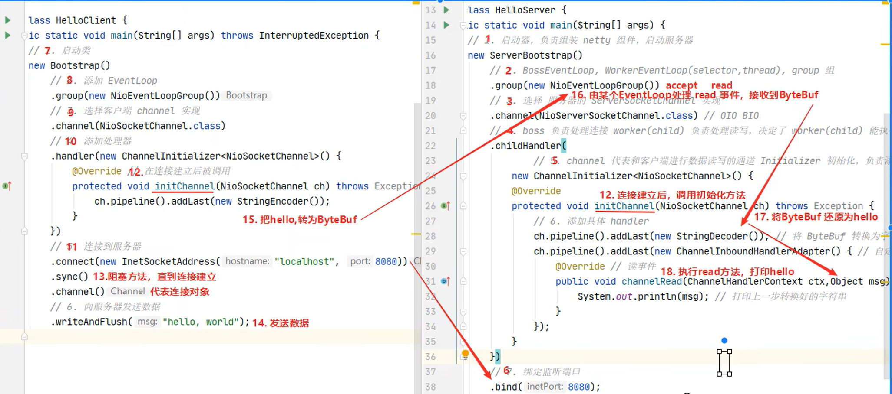
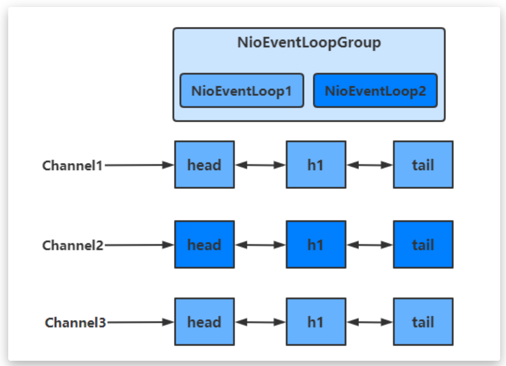
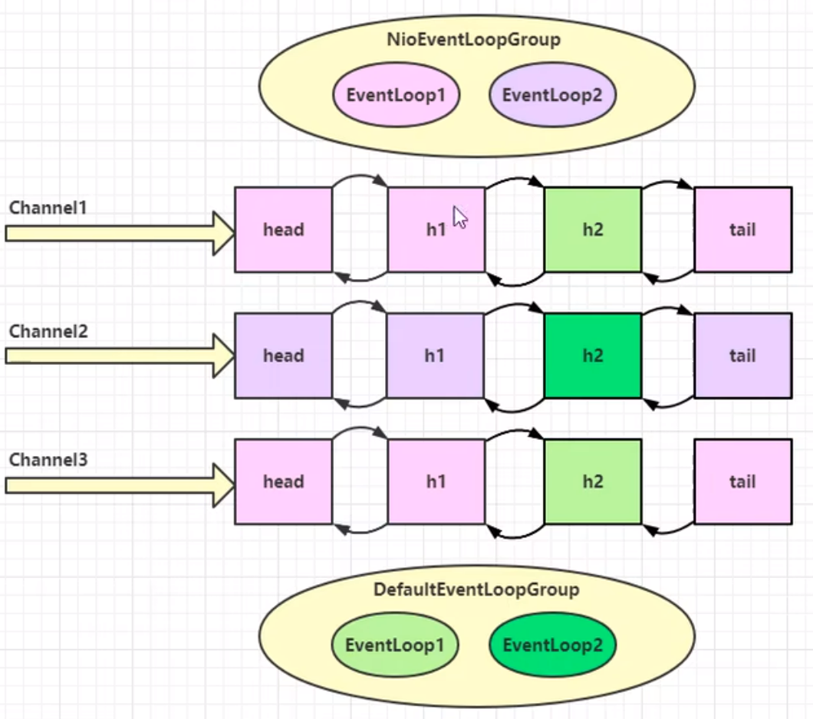

# 一、概述

## 1、什么是Netty

```
Netty is an asynchronous event-driven network application framework
for rapid development of maintainable high performance protocol servers & clients.
```

Netty 是一个异步的、基于事件驱动的网络应用框架，用于快速开发可维护、高性能的网络服务器和客户端

**注意**：`netty的异步还是基于多路复用的，并没有实现真正意义上的异步IO`

## 2、Netty的优势

如果使用传统NIO，其工作量大，bug 多

- 需要自己构建协议
- 解决 TCP 传输问题，如粘包、半包
- 因为bug的存在，epoll 空轮询导致 CPU 100%

Netty 对 API 进行增强，使之更易用，如

- FastThreadLocal => ThreadLocal
- ByteBuf => ByteBuffer

# 二、入门案例

## 1、服务器端代码

```java
import io.netty.bootstrap.ServerBootstrap;
import io.netty.channel.ChannelHandlerContext;
import io.netty.channel.ChannelInboundHandlerAdapter;
import io.netty.channel.ChannelInitializer;
import io.netty.channel.nio.NioEventLoopGroup;
import io.netty.channel.socket.nio.NioServerSocketChannel;
import io.netty.channel.socket.nio.NioSocketChannel;
import io.netty.handler.codec.string.StringDecoder;

public class HelloServer {
    public static void main(String[] args) {
        // 1. 启动器，负责组装 netty 组件，启动服务器
        new ServerBootstrap()
                // 2. BossEventLoop, WorkerEventLoop(selector, thread), group 组
                .group(new NioEventLoopGroup())
                // 3.选择服务器的 ServerSocketChannel 实现
                .channel(NioServerSocketChannel.class)
                // 4. boss 负责处理连接 worker(child) 负责处理读写，决定了 worker(child) 能执行哪些操作 (handler)
                .childHandler(
                        // 5. Channel 代表和客户端进行数据读写的通道 Initializer 初始化，负责添加别的 handler
                        new ChannelInitializer<NioSocketChannel>() {
                    @Override
                    protected void initChannel(NioSocketChannel ch) throws Exception {
                        // 6. 添加具体 handler
                        ch.pipeline().addLast(new StringDecoder()); // 将 ByteBuf 转换为字符串
                        ch.pipeline().addLast(new ChannelInboundHandlerAdapter(){   // 自定义 handler
                            @Override   // 读事件
                            public void channelRead(ChannelHandlerContext ctx, Object msg) throws Exception {
                                // 打印上一步转换好的字符串
                                System.out.println(msg);
                            }
                        });
                    }
                })
                // 7. 绑定监听端口
                .bind(8080);
    }
}
```

## 2、客户端代码

```java
import io.netty.bootstrap.Bootstrap;
import io.netty.channel.ChannelInitializer;
import io.netty.channel.nio.NioEventLoopGroup;
import io.netty.channel.socket.nio.NioSocketChannel;
import io.netty.handler.codec.string.StringEncoder;

import java.net.InetSocketAddress;

public class HelloClient {
    public static void main(String[] args) throws InterruptedException {
        // 1. 启动器
        new Bootstrap()
                // 2. 添加 EventLoop
                .group(new NioEventLoopGroup())
                // 3. 选择客户端 channel 实现
                .channel(NioSocketChannel.class)
                // 4. 添加处理器
                .handler(new ChannelInitializer<NioSocketChannel>() {
                    @Override // 在连接建立后被调用
                    protected void initChannel(NioSocketChannel ch) throws Exception {
                        ch.pipeline().addLast(new StringEncoder());
                    }
                })
                // 5. 连接到服务器
                .connect(new InetSocketAddress("localhost", 8080))
                .sync() // 阻塞方法，直到连接建立
                .channel() // 代表连接对象
                // 6. 向服务器发送数据
                .writeAndFlush("hello, world!");
    }
}
```

## 3、运行流程

**左：客户端 右：服务器端**



### 组件解释

- channel 可以理解为数据的通道

- msg 理解为流动的数据，最开始输入是 ByteBuf，但经过 pipeline 中的各个 handler 加工，会变成其它类型对象，最后输出又变成 ByteBuf

- handler 可以理解为数据的处理工序

  - 工序有多道，

    合在一起就是 pipeline（传递途径）

    ，pipeline 负责发布事件（读、读取完成…）传播给每个 handler， handler 对自己感兴趣的事件进行处理（重写了相应事件处理方法）

    - pipeline 中有多个 handler，处理时会依次调用其中的 handler

  - handler 分 Inbound 和 Outbound 两类

    - Inbound 入站
    - Outbound 出站

- eventLoop 可以理解为处理数据的工人

  - eventLoop 可以管理多个 channel 的 io 操作，并且一旦 eventLoop 负责了某个 channel，就**会将其与channel进行绑定**，以后该 channel 中的 io 操作都由该 eventLoop 负责
  - eventLoop 既可以执行 io 操作，**也可以进行任务处理**，每个 eventLoop 有自己的任务队列，队列里可以堆放多个 channel 的待处理任务，任务分为普通任务、定时任务
  - eventLoop 按照 pipeline 顺序，依次按照 handler 的规划（代码）处理数据，可以为每个 handler 指定不同的 eventLoop

# 三、组件

## 1、EventLoop

**事件循环对象** EventLoop

EventLoop 本质是一个**单线程执行器**（同时**维护了一个 Selector**），里面有 run 方法处理一个或多个 Channel 上源源不断的 io 事件

它的继承关系如下

- 继承自 j.u.c.ScheduledExecutorService 因此包含了线程池中所有的方法
- 继承自 netty 自己的 OrderedEventExecutor
  - 提供了 boolean inEventLoop(Thread thread) 方法判断一个线程是否属于此 EventLoop
  - 提供了 EventLoopGroup parent() 方法来看看自己属于哪个 EventLoopGroup

**事件循环组** EventLoopGroup

EventLoopGroup 是一组 EventLoop，Channel 一般会调用 EventLoopGroup 的 register 方法来绑定其中一个 EventLoop，后续这个 Channel 上的 io 事件都由此 EventLoop 来处理（保证了 io 事件处理时的线程安全）

- 继承自 netty 自己的 EventExecutorGroup
  - 实现了 Iterable 接口提供遍历 EventLoop 的能力
  - 另有 next 方法获取集合中下一个 EventLoop

### 处理普通与定时任务

```java
public class TestEventLoop {
    public static void main(String[] args) {
        // 创建拥有两个EventLoop的NioEventLoopGroup，对应两个线程
        EventLoopGroup group = new NioEventLoopGroup(2);
        // 通过next方法可以获得下一个 EventLoop
        System.out.println(group.next());
        System.out.println(group.next());

        // 通过EventLoop执行普通任务
        group.next().execute(()->{
            System.out.println(Thread.currentThread().getName() + " hello");
        });

        // 通过EventLoop执行定时任务
        group.next().scheduleAtFixedRate(()->{
            System.out.println(Thread.currentThread().getName() + " hello2");
        }, 0, 1, TimeUnit.SECONDS);
        
        // 优雅地关闭
        group.shutdownGracefully();
    }
}
```

**关闭 EventLoopGroup**

优雅关闭 `shutdownGracefully` 方法。该方法会首先切换 `EventLoopGroup` 到关闭状态从而拒绝新的任务的加入，然后在任务队列的任务都处理完成后，停止线程的运行。从而确保整体应用是在正常有序的状态下退出的

### 处理IO任务

#### 服务器代码

```java
public class MyServer {
    public static void main(String[] args) {
        new ServerBootstrap()
                .group(new NioEventLoopGroup())
                .channel(NioServerSocketChannel.class)
                .childHandler(new ChannelInitializer<SocketChannel>() {
                    @Override
                    protected void initChannel(SocketChannel socketChannel) throws Exception {
                        socketChannel.pipeline().addLast(new ChannelInboundHandlerAdapter() {
                            @Override
                            public void channelRead(ChannelHandlerContext ctx, Object msg) throws Exception {
                                ByteBuf buf = (ByteBuf) msg;
                                System.out.println(Thread.currentThread().getName() + " " + buf.toString(StandardCharsets.UTF_8));

                            }
                        });
                    }
                })
                .bind(8080);
    }
}
```

#### 客户端代码

```java
public class MyClient {
    public static void main(String[] args) throws IOException, InterruptedException {
        Channel channel = new Bootstrap()
                .group(new NioEventLoopGroup())
                .channel(NioSocketChannel.class)
                .handler(new ChannelInitializer<SocketChannel>() {
                    @Override
                    protected void initChannel(SocketChannel socketChannel) throws Exception {
                        socketChannel.pipeline().addLast(new StringEncoder());
                    }
                })
                .connect(new InetSocketAddress("localhost", 8080))
                .sync()
                .channel();
        System.out.println(channel);
        // 此处打断点调试，调用 channel.writeAndFlush(...);
        System.in.read();
    }
}
```

### 分工

Bootstrap的group()方法**可以传入两个EventLoopGroup参数**，分别负责处理不同的事件

```java
public class MyServer {
    public static void main(String[] args) {
        new ServerBootstrap()
            	// 两个Group，分别为Boss 负责Accept事件，Worker 负责读写事件
                .group(new NioEventLoopGroup(1), new NioEventLoopGroup(2))
            
				...
    }
}
```

一个EventLoop可以**负责多个**Channel，且EventLoop一旦与Channel绑定，则**一直负责**处理该Channel中的事件



#### 增加自定义EventLoopGroup

当有的**任务需要较长的时间处理时，可以使用非NioEventLoopGroup**，避免同一个NioEventLoop中的其他Channel在较长的时间内都无法得到处理

```java
public class MyServer {
    public static void main(String[] args) {
        // 增加自定义的非NioEventLoopGroup
        EventLoopGroup group = new DefaultEventLoopGroup();
        
        new ServerBootstrap()
                .group(new NioEventLoopGroup(1), new NioEventLoopGroup(2))
                .channel(NioServerSocketChannel.class)
                .childHandler(new ChannelInitializer<SocketChannel>() {
                    @Override
                    protected void initChannel(SocketChannel socketChannel) throws Exception {
                        // 增加两个handler，第一个使用NioEventLoopGroup处理，第二个使用自定义EventLoopGroup处理
                        socketChannel.pipeline().addLast("nioHandler",new ChannelInboundHandlerAdapter() {
                            @Override
                            public void channelRead(ChannelHandlerContext ctx, Object msg) throws Exception {
                                ByteBuf buf = (ByteBuf) msg;
                                System.out.println(Thread.currentThread().getName() + " " + buf.toString(StandardCharsets.UTF_8));
                                // 调用下一个handler
                                ctx.fireChannelRead(msg);
                            }
                        })
                        // 该handler绑定自定义的Group
                        .addLast(group, "myHandler", new ChannelInboundHandlerAdapter() {
                            @Override
                            public void channelRead(ChannelHandlerContext ctx, Object msg) throws Exception {
                                ByteBuf buf = (ByteBuf) msg;
                                System.out.println(Thread.currentThread().getName() + " " + buf.toString(StandardCharsets.UTF_8));
                            }
                        });
                    }
                })
                .bind(8080);
    }
}
```

客户端与服务器之间的事件，被nioEventLoopGroup和defaultEventLoopGroup分别处理



## 2、Channel

Channel 的常用方法

- close() 可以用来关闭Channel
- closeFuture() 用来处理 Channel 的关闭
  - sync 方法作用是同步等待 Channel 关闭
  - 而 addListener 方法是异步等待 Channel 关闭
- pipeline() 方法用于添加处理器
- write() 方法将数据写入
  - 因为缓冲机制，数据被写入到 Channel 中以后，不会立即被发送
  - **只有当缓冲满了或者调用了flush()方法后**，才会将数据通过 Channel 发送出去
- writeAndFlush() 方法将数据写入并**立即发送（刷出）**

### ChannelFuture

#### 连接问题

**拆分客户端代码**

```java
public class MyClient {
    public static void main(String[] args) throws IOException, InterruptedException {
        ChannelFuture channelFuture = new Bootstrap()
                .group(new NioEventLoopGroup())
                .channel(NioSocketChannel.class)
                .handler(new ChannelInitializer<SocketChannel>() {
                    @Override
                    protected void initChannel(SocketChannel socketChannel) throws Exception {
                        socketChannel.pipeline().addLast(new StringEncoder());
                    }
                })
                // 该方法为异步非阻塞方法，主线程调用后不会被阻塞，真正去执行连接操作的是NIO线程
            	// NIO线程：NioEventLoop 中的线程
                .connect(new InetSocketAddress("localhost", 8080));
        
        // 该方法用于等待连接真正建立
        channelFuture.sync();
        
        // 获取客户端-服务器之间的Channel对象
        Channel channel = channelFuture.channel();
        channel.writeAndFlush("hello world");
        System.in.read();
    }
}
```

如果我们去掉`channelFuture.sync()`方法，会服务器无法收到`hello world`

这是因为建立连接(connect)的过程是**异步非阻塞**的，若不通过`sync()`方法阻塞主线程，等待连接真正建立，这时通过 channelFuture.channel() **拿到的 Channel 对象，并不是真正与服务器建立好连接的 Channel**，也就没法将信息正确的传输给服务器端

所以需要通过`channelFuture.sync()`方法，阻塞主线程，**同步处理结果**，等待连接真正建立好以后，再去获得 Channel 传递数据。使用该方法，获取 Channel 和发送数据的线程**都是主线程**

下面还有一种方法，用于**异步**获取建立连接后的 Channel 和发送数据，使得执行这些操作的线程是 NIO 线程（去执行connect操作的线程）

**addListener方法**

通过这种方法可以**在NIO线程中获取 Channel 并发送数据**，而不是在主线程中执行这些操作

```java
public class MyClient {
    public static void main(String[] args) throws IOException, InterruptedException {
        ChannelFuture channelFuture = new Bootstrap()
                .group(new NioEventLoopGroup())
                .channel(NioSocketChannel.class)
                .handler(new ChannelInitializer<SocketChannel>() {
                    @Override
                    protected void initChannel(SocketChannel socketChannel) throws Exception {
                        socketChannel.pipeline().addLast(new StringEncoder());
                    }
                })
                // 该方法为异步非阻塞方法，主线程调用后不会被阻塞，真正去执行连接操作的是NIO线程
                // NIO线程：NioEventLoop 中的线程
                .connect(new InetSocketAddress("localhost", 8080));
        
		// 当connect方法执行完毕后，也就是连接真正建立后
        // 会在NIO线程中调用operationComplete方法
        channelFuture.addListener(new ChannelFutureListener() {
            @Override
            public void operationComplete(ChannelFuture channelFuture) throws Exception {
                Channel channel = channelFuture.channel();
                channel.writeAndFlush("hello world");
            }
        });
        System.in.read();
    }
}
```

#### 处理关闭

```java
public class ReadClient {
    public static void main(String[] args) throws InterruptedException {
        // 创建EventLoopGroup，使用完毕后关闭
        NioEventLoopGroup group = new NioEventLoopGroup();
        
        ChannelFuture channelFuture = new Bootstrap()
                .group(group)
                .channel(NioSocketChannel.class)
                .handler(new ChannelInitializer<SocketChannel>() {
                    @Override
                    protected void initChannel(SocketChannel socketChannel) throws Exception {
                        socketChannel.pipeline().addLast(new StringEncoder());
                    }
                })
                .connect(new InetSocketAddress("localhost", 8080));
        channelFuture.sync();

        Channel channel = channelFuture.channel();
        Scanner scanner = new Scanner(System.in);

        // 创建一个线程用于输入并向服务器发送
        new Thread(()->{
            while (true) {
                String msg = scanner.next();
                if ("q".equals(msg)) {
                    // 关闭操作是异步的，在NIO线程中执行
                    channel.close();
                    break;
                }
                channel.writeAndFlush(msg);
            }
        }, "inputThread").start();

        // 获得closeFuture对象
        ChannelFuture closeFuture = channel.closeFuture();
        System.out.println("waiting close...");
        
        // 同步等待NIO线程执行完close操作
        closeFuture.sync();
        
        // 关闭之后执行一些操作，可以保证执行的操作一定是在channel关闭以后执行的
        System.out.println("关闭之后执行一些额外操作...");
        
        // 关闭EventLoopGroup
        group.shutdownGracefully();
    }
}
```

