# 一、概述

## 1、什么是Netty

```
Netty is an asynchronous event-driven network application framework
for rapid development of maintainable high performance protocol servers & clients.
```

Netty 是一个异步的、基于事件驱动的网络应用框架，用于快速开发可维护、高性能的网络服务器和客户端

**注意**：`netty的异步还是基于多路复用的，并没有实现真正意义上的异步IO`

## 2、Netty的优势

如果使用传统NIO，其工作量大，bug 多

- 需要自己构建协议
- 解决 TCP 传输问题，如粘包、半包
- 因为bug的存在，epoll 空轮询导致 CPU 100%

Netty 对 API 进行增强，使之更易用，如

- FastThreadLocal => ThreadLocal
- ByteBuf => ByteBuffer

# 二、入门案例

## 1、服务器端代码

```java
import io.netty.bootstrap.ServerBootstrap;
import io.netty.channel.ChannelHandlerContext;
import io.netty.channel.ChannelInboundHandlerAdapter;
import io.netty.channel.ChannelInitializer;
import io.netty.channel.nio.NioEventLoopGroup;
import io.netty.channel.socket.nio.NioServerSocketChannel;
import io.netty.channel.socket.nio.NioSocketChannel;
import io.netty.handler.codec.string.StringDecoder;

public class HelloServer {
    public static void main(String[] args) {
        // 1. 启动器，负责组装 netty 组件，启动服务器
        new ServerBootstrap()
                // 2. BossEventLoop, WorkerEventLoop(selector, thread), group 组
                .group(new NioEventLoopGroup())
                // 3.选择服务器的 ServerSocketChannel 实现
                .channel(NioServerSocketChannel.class)
                // 4. boss 负责处理连接 worker(child) 负责处理读写，决定了 worker(child) 能执行哪些操作 (handler)
                .childHandler(
                        // 5. Channel 代表和客户端进行数据读写的通道 Initializer 初始化，负责添加别的 handler
                        new ChannelInitializer<NioSocketChannel>() {
                    @Override
                    protected void initChannel(NioSocketChannel ch) throws Exception {
                        // 6. 添加具体 handler
                        ch.pipeline().addLast(new StringDecoder()); // 将 ByteBuf 转换为字符串
                        ch.pipeline().addLast(new ChannelInboundHandlerAdapter(){   // 自定义 handler
                            @Override   // 读事件
                            public void channelRead(ChannelHandlerContext ctx, Object msg) throws Exception {
                                // 打印上一步转换好的字符串
                                System.out.println(msg);
                            }
                        });
                    }
                })
                // 7. 绑定监听端口
                .bind(8080);
    }
}
```

## 2、客户端代码

```java
import io.netty.bootstrap.Bootstrap;
import io.netty.channel.ChannelInitializer;
import io.netty.channel.nio.NioEventLoopGroup;
import io.netty.channel.socket.nio.NioSocketChannel;
import io.netty.handler.codec.string.StringEncoder;

import java.net.InetSocketAddress;

public class HelloClient {
    public static void main(String[] args) throws InterruptedException {
        // 1. 启动器
        new Bootstrap()
                // 2. 添加 EventLoop
                .group(new NioEventLoopGroup())
                // 3. 选择客户端 channel 实现
                .channel(NioSocketChannel.class)
                // 4. 添加处理器
                .handler(new ChannelInitializer<NioSocketChannel>() {
                    @Override // 在连接建立后被调用
                    protected void initChannel(NioSocketChannel ch) throws Exception {
                        ch.pipeline().addLast(new StringEncoder());
                    }
                })
                // 5. 连接到服务器
                .connect(new InetSocketAddress("localhost", 8080))
                .sync() // 阻塞方法，直到连接建立
                .channel() // 代表连接对象
                // 6. 向服务器发送数据
                .writeAndFlush("hello, world!");
    }
}
```

## 3、运行流程

**左：客户端 右：服务器端**


### 组件解释

- channel 可以理解为数据的通道

- msg 理解为流动的数据，最开始输入是 ByteBuf，但经过 pipeline 中的各个 handler 加工，会变成其它类型对象，最后输出又变成 ByteBuf

- handler 可以理解为数据的处理工序

  - 工序有多道，

    合在一起就是 pipeline（传递途径）

    ，pipeline 负责发布事件（读、读取完成…）传播给每个 handler， handler 对自己感兴趣的事件进行处理（重写了相应事件处理方法）

    - pipeline 中有多个 handler，处理时会依次调用其中的 handler

  - handler 分 Inbound 和 Outbound 两类

    - Inbound 入站
    - Outbound 出站

- eventLoop 可以理解为处理数据的工人

  - eventLoop 可以管理多个 channel 的 io 操作，并且一旦 eventLoop 负责了某个 channel，就**会将其与channel进行绑定**，以后该 channel 中的 io 操作都由该 eventLoop 负责
  - eventLoop 既可以执行 io 操作，**也可以进行任务处理**，每个 eventLoop 有自己的任务队列，队列里可以堆放多个 channel 的待处理任务，任务分为普通任务、定时任务
  - eventLoop 按照 pipeline 顺序，依次按照 handler 的规划（代码）处理数据，可以为每个 handler 指定不同的 eventLoop

# 三、组件

## 1、EventLoop

**事件循环对象** EventLoop

EventLoop 本质是一个**单线程执行器**（同时**维护了一个 Selector**），里面有 run 方法处理一个或多个 Channel 上源源不断的 io 事件

它的继承关系如下

- 继承自 j.u.c.ScheduledExecutorService 因此包含了线程池中所有的方法
- 继承自 netty 自己的 OrderedEventExecutor
  - 提供了 boolean inEventLoop(Thread thread) 方法判断一个线程是否属于此 EventLoop
  - 提供了 EventLoopGroup parent() 方法来看看自己属于哪个 EventLoopGroup

**事件循环组** EventLoopGroup

EventLoopGroup 是一组 EventLoop，Channel 一般会调用 EventLoopGroup 的 register 方法来绑定其中一个 EventLoop，后续这个 Channel 上的 io 事件都由此 EventLoop 来处理（保证了 io 事件处理时的线程安全）

- 继承自 netty 自己的 EventExecutorGroup
  - 实现了 Iterable 接口提供遍历 EventLoop 的能力
  - 另有 next 方法获取集合中下一个 EventLoop

### 处理普通与定时任务

```java
public class TestEventLoop {
    public static void main(String[] args) {
        // 创建拥有两个EventLoop的NioEventLoopGroup，对应两个线程
        EventLoopGroup group = new NioEventLoopGroup(2);
        // 通过next方法可以获得下一个 EventLoop
        System.out.println(group.next());
        System.out.println(group.next());

        // 通过EventLoop执行普通任务
        group.next().execute(()->{
            System.out.println(Thread.currentThread().getName() + " hello");
        });

        // 通过EventLoop执行定时任务
        group.next().scheduleAtFixedRate(()->{
            System.out.println(Thread.currentThread().getName() + " hello2");
        }, 0, 1, TimeUnit.SECONDS);
        
        // 优雅地关闭
        group.shutdownGracefully();
    }
}
```

**关闭 EventLoopGroup**

优雅关闭 `shutdownGracefully` 方法。该方法会首先切换 `EventLoopGroup` 到关闭状态从而拒绝新的任务的加入，然后在任务队列的任务都处理完成后，停止线程的运行。从而确保整体应用是在正常有序的状态下退出的

### 处理IO任务

#### 服务器代码

```java
public class MyServer {
    public static void main(String[] args) {
        new ServerBootstrap()
                .group(new NioEventLoopGroup())
                .channel(NioServerSocketChannel.class)
                .childHandler(new ChannelInitializer<SocketChannel>() {
                    @Override
                    protected void initChannel(SocketChannel socketChannel) throws Exception {
                        socketChannel.pipeline().addLast(new ChannelInboundHandlerAdapter() {
                            @Override
                            public void channelRead(ChannelHandlerContext ctx, Object msg) throws Exception {
                                ByteBuf buf = (ByteBuf) msg;
                                System.out.println(Thread.currentThread().getName() + " " + buf.toString(StandardCharsets.UTF_8));

                            }
                        });
                    }
                })
                .bind(8080);
    }
}
```

#### 客户端代码

```java
public class MyClient {
    public static void main(String[] args) throws IOException, InterruptedException {
        Channel channel = new Bootstrap()
                .group(new NioEventLoopGroup())
                .channel(NioSocketChannel.class)
                .handler(new ChannelInitializer<SocketChannel>() {
                    @Override
                    protected void initChannel(SocketChannel socketChannel) throws Exception {
                        socketChannel.pipeline().addLast(new StringEncoder());
                    }
                })
                .connect(new InetSocketAddress("localhost", 8080))
                .sync()
                .channel();
        System.out.println(channel);
        // 此处打断点调试，调用 channel.writeAndFlush(...);
        System.in.read();
    }
}
```

### 分工

Bootstrap的group()方法**可以传入两个EventLoopGroup参数**，分别负责处理不同的事件

```java
public class MyServer {
    public static void main(String[] args) {
        new ServerBootstrap()
            	// 两个Group，分别为Boss 负责Accept事件，Worker 负责读写事件
                .group(new NioEventLoopGroup(1), new NioEventLoopGroup(2))
            
				...
    }
}
```

一个EventLoop可以**负责多个**Channel，且EventLoop一旦与Channel绑定，则**一直负责**处理该Channel中的事件


#### 增加自定义EventLoopGroup

当有的**任务需要较长的时间处理时，可以使用非NioEventLoopGroup**，避免同一个NioEventLoop中的其他Channel在较长的时间内都无法得到处理

```java
public class MyServer {
    public static void main(String[] args) {
        // 增加自定义的非NioEventLoopGroup
        EventLoopGroup group = new DefaultEventLoopGroup();
        
        new ServerBootstrap()
                .group(new NioEventLoopGroup(1), new NioEventLoopGroup(2))
                .channel(NioServerSocketChannel.class)
                .childHandler(new ChannelInitializer<SocketChannel>() {
                    @Override
                    protected void initChannel(SocketChannel socketChannel) throws Exception {
                        // 增加两个handler，第一个使用NioEventLoopGroup处理，第二个使用自定义EventLoopGroup处理
                        socketChannel.pipeline().addLast("nioHandler",new ChannelInboundHandlerAdapter() {
                            @Override
                            public void channelRead(ChannelHandlerContext ctx, Object msg) throws Exception {
                                ByteBuf buf = (ByteBuf) msg;
                                System.out.println(Thread.currentThread().getName() + " " + buf.toString(StandardCharsets.UTF_8));
                                // 调用下一个handler
                                ctx.fireChannelRead(msg);
                            }
                        })
                        // 该handler绑定自定义的Group
                        .addLast(group, "myHandler", new ChannelInboundHandlerAdapter() {
                            @Override
                            public void channelRead(ChannelHandlerContext ctx, Object msg) throws Exception {
                                ByteBuf buf = (ByteBuf) msg;
                                System.out.println(Thread.currentThread().getName() + " " + buf.toString(StandardCharsets.UTF_8));
                            }
                        });
                    }
                })
                .bind(8080);
    }
}
```

客户端与服务器之间的事件，被nioEventLoopGroup和defaultEventLoopGroup分别处理


## 2、Channel

Channel 的常用方法

- close() 可以用来关闭Channel
- closeFuture() 用来处理 Channel 的关闭
  - sync 方法作用是同步等待 Channel 关闭
  - 而 addListener 方法是异步等待 Channel 关闭
- pipeline() 方法用于添加处理器
- write() 方法将数据写入
  - 因为缓冲机制，数据被写入到 Channel 中以后，不会立即被发送
  - **只有当缓冲满了或者调用了flush()方法后**，才会将数据通过 Channel 发送出去
- writeAndFlush() 方法将数据写入并**立即发送（刷出）**

### ChannelFuture

#### 连接问题

**拆分客户端代码**

```java
public class MyClient {
    public static void main(String[] args) throws IOException, InterruptedException {
        ChannelFuture channelFuture = new Bootstrap()
                .group(new NioEventLoopGroup())
                .channel(NioSocketChannel.class)
                .handler(new ChannelInitializer<SocketChannel>() {
                    @Override
                    protected void initChannel(SocketChannel socketChannel) throws Exception {
                        socketChannel.pipeline().addLast(new StringEncoder());
                    }
                })
                // 该方法为异步非阻塞方法，主线程调用后不会被阻塞，真正去执行连接操作的是NIO线程
            	// NIO线程：NioEventLoop 中的线程
                .connect(new InetSocketAddress("localhost", 8080));
        
        // 该方法用于等待连接真正建立
        channelFuture.sync();
        
        // 获取客户端-服务器之间的Channel对象
        Channel channel = channelFuture.channel();
        channel.writeAndFlush("hello world");
        System.in.read();
    }
}
```

如果我们去掉`channelFuture.sync()`方法，会服务器无法收到`hello world`

这是因为建立连接(connect)的过程是**异步非阻塞**的，若不通过`sync()`方法阻塞主线程，等待连接真正建立，这时通过 channelFuture.channel() **拿到的 Channel 对象，并不是真正与服务器建立好连接的 Channel**，也就没法将信息正确的传输给服务器端

所以需要通过`channelFuture.sync()`方法，阻塞主线程，**同步处理结果**，等待连接真正建立好以后，再去获得 Channel 传递数据。使用该方法，获取 Channel 和发送数据的线程**都是主线程**

下面还有一种方法，用于**异步**获取建立连接后的 Channel 和发送数据，使得执行这些操作的线程是 NIO 线程（去执行connect操作的线程）

**addListener方法**

通过这种方法可以**在NIO线程中获取 Channel 并发送数据**，而不是在主线程中执行这些操作

```java
public class MyClient {
    public static void main(String[] args) throws IOException, InterruptedException {
        ChannelFuture channelFuture = new Bootstrap()
                .group(new NioEventLoopGroup())
                .channel(NioSocketChannel.class)
                .handler(new ChannelInitializer<SocketChannel>() {
                    @Override
                    protected void initChannel(SocketChannel socketChannel) throws Exception {
                        socketChannel.pipeline().addLast(new StringEncoder());
                    }
                })
                // 该方法为异步非阻塞方法，主线程调用后不会被阻塞，真正去执行连接操作的是NIO线程
                // NIO线程：NioEventLoop 中的线程
                .connect(new InetSocketAddress("localhost", 8080));
        
		// 当connect方法执行完毕后，也就是连接真正建立后
        // 会在NIO线程中调用operationComplete方法
        channelFuture.addListener(new ChannelFutureListener() {
            @Override
            public void operationComplete(ChannelFuture channelFuture) throws Exception {
                Channel channel = channelFuture.channel();
                channel.writeAndFlush("hello world");
            }
        });
        System.in.read();
    }
}
```

#### 处理关闭

```java
public class ReadClient {
    public static void main(String[] args) throws InterruptedException {
        // 创建EventLoopGroup，使用完毕后关闭
        NioEventLoopGroup group = new NioEventLoopGroup();
        
        ChannelFuture channelFuture = new Bootstrap()
                .group(group)
                .channel(NioSocketChannel.class)
                .handler(new ChannelInitializer<SocketChannel>() {
                    @Override
                    protected void initChannel(SocketChannel socketChannel) throws Exception {
                        socketChannel.pipeline().addLast(new StringEncoder());
                    }
                })
                .connect(new InetSocketAddress("localhost", 8080));
        channelFuture.sync();

        Channel channel = channelFuture.channel();
        Scanner scanner = new Scanner(System.in);

        // 创建一个线程用于输入并向服务器发送
        new Thread(()->{
            while (true) {
                String msg = scanner.next();
                if ("q".equals(msg)) {
                    // 关闭操作是异步的，在NIO线程中执行
                    channel.close();
                    break;
                }
                channel.writeAndFlush(msg);
            }
        }, "inputThread").start();

        // 获得closeFuture对象
        ChannelFuture closeFuture = channel.closeFuture();
        System.out.println("waiting close...");
        
        // 同步等待NIO线程执行完close操作
        closeFuture.sync();
        
        // 关闭之后执行一些操作，可以保证执行的操作一定是在channel关闭以后执行的
        System.out.println("关闭之后执行一些额外操作...");
        
        // 关闭EventLoopGroup
        group.shutdownGracefully();
    }
}
```

**关闭channel**

当我们要关闭channel时，可以调用channel.close()方法进行关闭。但是该方法也是一个**异步方法**。真正的关闭操作并不是在调用该方法的线程中执行的，而是**在NIO线程中执行真正的关闭操作**

如果我们想在channel**真正关闭以后**，执行一些额外的操作，可以选择以下两种方法来实现

- 通过channel.closeFuture()方法获得对应的ChannelFuture对象，然后调用**sync()方法**阻塞执行操作的线程，等待channel真正关闭后，再执行其他操作

  ```java
  // 获得closeFuture对象
  ChannelFuture closeFuture = channel.closeFuture();
  
  // 同步等待NIO线程执行完close操作
  closeFuture.sync();
  ```

- 调用**closeFuture.addListener**方法，添加close的后续操作

  ```java
  closeFuture.addListener(new ChannelFutureListener() {
      @Override
      public void operationComplete(ChannelFuture channelFuture) throws Exception {
          // 等待channel关闭后才执行的操作
          System.out.println("关闭之后执行一些额外操作...");
          // 关闭EventLoopGroup
          group.shutdownGracefully();
      }
  });
  ```

## 3、Future与Promise

### 概念

netty 中的 Future 与 jdk 中的 Future **同名**，但是是两个接口

netty 的 Future 继承自 jdk 的 Future，而 Promise 又对 netty Future 进行了扩展

- jdk Future 只能同步等待任务结束（或成功、或失败）才能得到结果
- netty Future 可以同步等待任务结束得到结果，也可以异步方式得到结果，但**都是要等任务结束**
- netty Promise 不仅有 netty Future 的功能，而且脱离了任务独立存在，**只作为两个线程间传递结果的容器**

| 功能/名称    | jdk Future                     | netty Future                                                 | Promise      |
| ------------ | ------------------------------ | ------------------------------------------------------------ | ------------ |
| cancel       | 取消任务                       | -                                                            | -            |
| isCanceled   | 任务是否取消                   | -                                                            | -            |
| isDone       | 任务是否完成，不能区分成功失败 | -                                                            | -            |
| get          | 获取任务结果，阻塞等待         | -                                                            | -            |
| getNow       | -                              | 获取任务结果，非阻塞，还未产生结果时返回 null                | -            |
| await        | -                              | 等待任务结束，如果任务失败，**不会抛异常**，而是通过 isSuccess 判断 | -            |
| sync         | -                              | 等待任务结束，如果任务失败，抛出异常                         | -            |
| isSuccess    | -                              | 判断任务是否成功                                             | -            |
| cause        | -                              | 获取失败信息，非阻塞，如果没有失败，返回null                 | -            |
| addLinstener | -                              | 添加回调，异步接收结果                                       | -            |
| setSuccess   | -                              | -                                                            | 设置成功结果 |
| setFailure   | -                              | -                                                            | 设置失败结果 |

### JDK Future

```java
@Slf4j
public class TestJdkFuture {
    public static void main(String[] args) throws ExecutionException, InterruptedException {
        // 1. 线程池
        ExecutorService service = Executors.newFixedThreadPool(2);

        // 2. 提交任务
        Future<Integer> future = service.submit(new Callable<Integer>() {
            @Override
            public Integer call() throws Exception {
                log.debug("执行计算");
                Thread.sleep(1000);
                return 50;
            }
        });

        // 3. 主线程通过 future 来获取结果
        log.debug("等待结果");
        log.debug("结果是 {}", future.get());
    }
}
```

### Netty Future

```java
@Slf4j
public class TestNettyFuture {
    public static void main(String[] args) throws ExecutionException, InterruptedException {
        NioEventLoopGroup group = new NioEventLoopGroup();
        EventLoop eventLoop = group.next();

        Future<Integer> future = eventLoop.submit(new Callable<Integer>() {
            @Override
            public Integer call() throws Exception {
                log.debug("执行计算");
                Thread.sleep(1000);
                return 70;
            }
        });

//        log.debug("等待结果");
//        log.debug("结果是 {}", future.get());
        future.addListener(new GenericFutureListener<Future<? super Integer>>(){

            @Override
            public void operationComplete(Future<? super Integer> future) throws Exception {
                log.debug("接受结果是 {}", future.getNow());
            }
        });
    }
}
```

Netty中的Future对象，可以通过EventLoop的sumbit()方法得到

- 可以通过Future对象的**get方法**，阻塞地获取返回结果
- 也可以通过**getNow方法**，获取结果，若还没有结果，则返回null，该方法是非阻塞的
- 还可以通过**future.addListener方法**，在Callable方法执行的线程中，异步获取返回结果

### Netty Promise

Promise相当于一个容器，可以用于存放各个线程中的结果，然后让其他线程去获取该结果

```java
@Slf4j
public class TestNettyPromise {
    public static void main(String[] args) throws ExecutionException, InterruptedException {
        // 1. 准备 EventLoop 对象
        EventLoop eventLoop = new NioEventLoopGroup().next();

        // 2. 可以主动创建 promise, 结果容器
        DefaultPromise<Integer> promise = new DefaultPromise<>(eventLoop);

        // 3. 任意一个线程执行计算，计算完毕后向 promise 填充结果
        new Thread(() -> {
            log.debug("开始计算");
            try {
                Thread.sleep(1000);
            } catch (InterruptedException e) {
                e.printStackTrace();
            }
            promise.setSuccess(80);
        }).start();

        // 4. 接收结果的线程
        log.debug("等待结果");
        log.debug("结果是 {}", promise.get());
    }
}
```

## 4、Handler与Pipeline

### Pipeline

```java
@Slf4j
public class TestPipeline {
    public static void main(String[] args) {
        new ServerBootstrap()
                .group(new NioEventLoopGroup())
                .channel(NioServerSocketChannel.class)
                .childHandler(new ChannelInitializer<SocketChannel>() {
                    @Override
                    protected void initChannel(SocketChannel socketChannel) throws Exception {
                        // 在socketChannel的pipeline中添加handler
                        // pipeline中handler是带有head与tail节点的双向链表，的实际结构为
                        // head <-> handler1 <-> ... <-> handler4 <->tail
                        // Inbound主要处理入站操作，一般为读操作，发生入站操作时会触发Inbound方法
                        // 入站时，handler是从head向后调用的
                        socketChannel.pipeline().addLast("handler1" ,new ChannelInboundHandlerAdapter() {
                            @Override
                            public void channelRead(ChannelHandlerContext ctx, Object msg) throws Exception {
                                log.debug(Thread.currentThread().getName() + " Inbound handler 1");
                                // 父类该方法内部会调用fireChannelRead
                                // 将数据传递给下一个handler
                                super.channelRead(ctx, msg);
                            }
                        });
                        socketChannel.pipeline().addLast("handler2", new ChannelInboundHandlerAdapter() {
                            @Override
                            public void channelRead(ChannelHandlerContext ctx, Object msg) throws Exception {
                                log.debug(Thread.currentThread().getName() + " Inbound handler 2");
                                // 执行write操作，使得Outbound的方法能够得到调用
                                socketChannel.writeAndFlush(ctx.alloc().buffer().writeBytes("Server...".getBytes(StandardCharsets.UTF_8)));
                                super.channelRead(ctx, msg);
                            }
                        });
                        // Outbound主要处理出站操作，一般为写操作，发生出站操作时会触发Outbound方法
                        // 出站时，handler的调用是从tail向前调用的
                        socketChannel.pipeline().addLast("handler3" ,new ChannelOutboundHandlerAdapter(){
                            @Override
                            public void write(ChannelHandlerContext ctx, Object msg, ChannelPromise promise) throws Exception {
                                log.debug(Thread.currentThread().getName() + " Outbound handler 1");
                                super.write(ctx, msg, promise);
                            }
                        });
                        socketChannel.pipeline().addLast("handler4" ,new ChannelOutboundHandlerAdapter(){
                            @Override
                            public void write(ChannelHandlerContext ctx, Object msg, ChannelPromise promise) throws Exception {
                                log.debug(Thread.currentThread().getName() + " Outbound handler 2");
                                super.write(ctx, msg, promise);
                            }
                        });
                    }
                })
                .bind(8080);
    }
}
```

通过channel.pipeline().addLast(name, handler)添加handler时，**记得给handler取名字**。这样可以调用pipeline的**addAfter、addBefore等方法更灵活地向pipeline中添加handler**

handler需要放入通道的pipeline中，才能根据放入顺序来使用handler

- pipeline是结构是一个带有head与tail指针的双向链表，其中的节点为handler
  - 要通过ctx.fireChannelRead(msg)等方法，**将当前handler的处理结果传递给下一个handler**
- 当有**入站**（Inbound）操作时，会从**head开始向后**调用handler，直到handler不是处理Inbound操作为止
- 当有**出站**（Outbound）操作时，会从**tail开始向前**调用handler，直到handler不是处理Outbound操作为止

**具体结构如下**

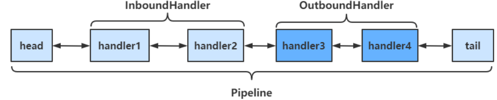

**调用顺序如下**

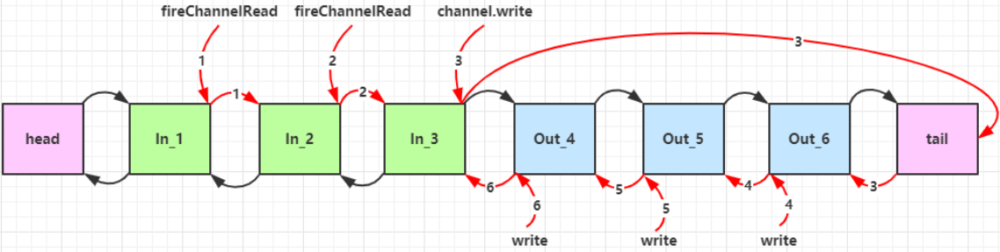

### OutboundHandler

#### socketChannel.writeAndFlush()

当handler中调用该方法进行写操作时，会触发Outbound操作，**此时是从tail向前寻找OutboundHandler**

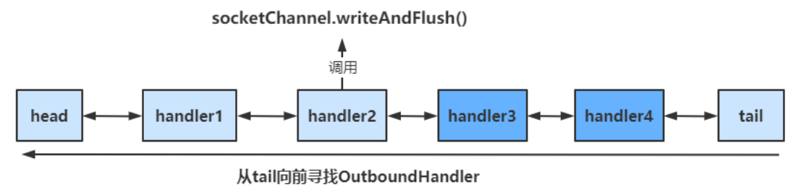

#### ctx.writeAndFlush()

当handler中调用该方法进行写操作时，会触发Outbound操作，**此时是从当前handler向前寻找OutboundHandler**

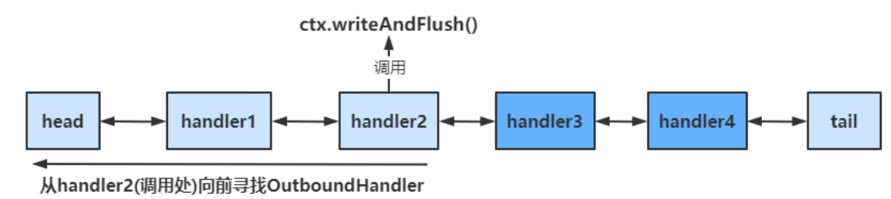

### EmbeddedChannel

EmbeddedChannel可以用于测试各个handler，通过其构造函数按顺序传入需要测试handler，然后调用对应的Inbound和Outbound方法即可

## 5、ByteBuf

**调试工具方法**

```java
private static void log(ByteBuf buffer) {
    int length = buffer.readableBytes();
    int rows = length / 16 + (length % 15 == 0 ? 0 : 1) + 4;
    StringBuilder buf = new StringBuilder(rows * 80 * 2)
        .append("read index:").append(buffer.readerIndex())
        .append(" write index:").append(buffer.writerIndex())
        .append(" capacity:").append(buffer.capacity())
        .append(NEWLINE);
    appendPrettyHexDump(buf, buffer);
    System.out.println(buf.toString());
}
```

该方法可以帮助我们更为详细地查看ByteBuf中的内容

### 创建

```java
public static void main(String[] args) {
    ByteBuf buf = ByteBufAllocator.DEFAULT.buffer();

    log(buf);

    StringBuilder sb = new StringBuilder();

    for (int i = 0; i < 300; i++) {
        sb.append("a");
    }

    buf.writeBytes(sb.toString().getBytes());

    log(buf);
}
```

ByteBuf**通过`ByteBufAllocator`选择allocator并调用对应的buffer()方法来创建的**，默认使用**直接内存**作为ByteBuf，容量为256个字节，可以指定初始容量的大小

当ByteBuf的容量无法容纳所有数据时，**ByteBuf会进行扩容操作**

**如果在handler中创建ByteBuf，建议使用`ChannelHandlerContext ctx.alloc().buffer()`来创建**

### 直接内存与堆内存

通过该方法创建的ByteBuf，使用的是**基于直接内存**的ByteBuf

```java
ByteBuf buffer = ByteBufAllocator.DEFAULT.buffer(16);
```

可以使用下面的代码来创建池化**基于堆**的 ByteBuf

```java
ByteBuf buffer = ByteBufAllocator.DEFAULT.heapBuffer(16);
```

也可以使用下面的代码来创建池化**基于直接内存**的 ByteBuf

```java
ByteBuf buffer = ByteBufAllocator.DEFAULT.directBuffer(16);
```

- 直接内存创建和销毁的代价昂贵，但读写性能高（少一次内存复制），适合配合池化功能一起用
- 直接内存对 GC 压力小，因为这部分内存不受 JVM 垃圾回收的管理，但也要注意及时主动释放

**验证**

```java
public class ByteBufStudy {
    public static void main(String[] args) {
        ByteBuf buffer = ByteBufAllocator.DEFAULT.buffer(16);
        System.out.println(buffer.getClass());

        buffer = ByteBufAllocator.DEFAULT.heapBuffer(16);
        System.out.println(buffer.getClass());

        buffer = ByteBufAllocator.DEFAULT.directBuffer(16);
        System.out.println(buffer.getClass());
    }
}
```

```java
// 使用池化的直接内存
class io.netty.buffer.PooledUnsafeDirectByteBuf
    
// 使用池化的堆内存    
class io.netty.buffer.PooledUnsafeHeapByteBuf
    
// 使用池化的直接内存    
class io.netty.buffer.PooledUnsafeDirectByteBuf
```

### 池化与非池化

池化的最大意义在于可以**重用** ByteBuf，优点有

- 没有池化，则每次都得创建新的 ByteBuf 实例，这个操作对直接内存代价昂贵，就算是堆内存，也会增加 GC 压力
- 有了池化，则可以重用池中 ByteBuf 实例，并且采用了与 jemalloc 类似的内存分配算法提升分配效率
- 高并发时，池化功能更节约内存，减少内存溢出的可能

池化功能是否开启，可以通过下面的系统环境变量来设置

```java
-Dio.netty.allocator.type={unpooled|pooled}
```

- 4.1 以后，**非 Android 平台默认启用池化实现**，Android 平台启用非池化实现
- 4.1 之前，池化功能还不成熟，默认是非池化实现

### 组成

ByteBuf主要有以下几个组成部分

- 最大容量与当前容量

  - 在构造ByteBuf时，可传入两个参数，分别代表初始容量和最大容量，若未传入第二个参数（最大容量），最大容量默认为Integer.MAX_VALUE
  - 当ByteBuf容量无法容纳所有数据时，会进行扩容操作，若**超出最大容量**，会抛出`java.lang.IndexOutOfBoundsException`异常

- 读写操作不同于ByteBuffer只用position进行控制，

  ByteBuf分别由读指针和写指针两个指针控制

  。进行读写操作时，无需进行模式的切换

  - 读指针前的部分被称为废弃部分，是已经读过的内容
  - 读指针与写指针之间的空间称为可读部分
  - 写指针与当前容量之间的空间称为可写部分

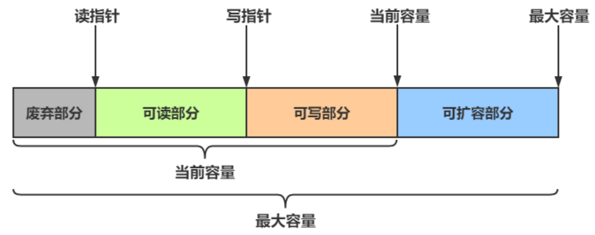

### 写入

常用方法如下

| 方法签名                                                     | 含义                       | 备注                                                    |
| ------------------------------------------------------------ | -------------------------- | ------------------------------------------------------- |
| writeBoolean(boolean value)                                  | 写入 boolean 值            | **用一字节 01\|00 代表 true\|false**                    |
| writeByte(int value)                                         | 写入 byte 值               |                                                         |
| writeShort(int value)                                        | 写入 short 值              |                                                         |
| writeInt(int value)                                          | 写入 int 值                | Big Endian（大端写入），即 0x250，写入后 00 00 02 50    |
| writeIntLE(int value)                                        | 写入 int 值                | Little Endian（小端写入），即 0x250，写入后 50 02 00 00 |
| writeLong(long value)                                        | 写入 long 值               |                                                         |
| writeChar(int value)                                         | 写入 char 值               |                                                         |
| writeFloat(float value)                                      | 写入 float 值              |                                                         |
| writeDouble(double value)                                    | 写入 double 值             |                                                         |
| writeBytes(ByteBuf src)                                      | 写入 netty 的 ByteBuf      |                                                         |
| writeBytes(byte[] src)                                       | 写入 byte[]                |                                                         |
| writeBytes(ByteBuffer src)                                   | 写入 nio 的 **ByteBuffer** |                                                         |
| int writeCharSequence(CharSequence sequence, Charset charset) | 写入字符串                 | CharSequence为字符串类的父类，第二个参数为对应的字符集  |

> 注意
>
> - 这些方法的未指明返回值的，其返回值都是 ByteBuf，意味着可以链式调用来写入不同的数据
> - 网络传输中，**默认习惯是 Big Endian**，使用 writeInt(int value)

**使用方法**

```java
public class ByteBufStudy {
    public static void main(String[] args) {
        // 创建ByteBuf
        ByteBuf buffer = ByteBufAllocator.DEFAULT.buffer(16, 20);
        log(buffer);

        // 向buffer中写入数据
        buffer.writeBytes(new byte[]{1, 2, 3, 4});
        log(buffer);

        buffer.writeInt(5);
        log(buffer);

        buffer.writeIntLE(6);
        log(buffer);

        buffer.writeLong(7);
        log(buffer);
    }
}
```

还有一类方法是 **set 开头**的一系列方法，也**可以写入数据，但不会改变写指针位置**

### 扩容

当ByteBuf中的容量无法容纳写入的数据时，会进行扩容操作

```java
buffer.writeLong(7);
log(buffer);
```

#### 扩容规则

- 如何写入后数据大小未超过 512 字节，则选择下一个 16 的整数倍进行扩容

  - 例如写入后大小为 12 字节，则扩容后 capacity 是 16 字节

- 如果写入后数据大小超过 512 字节，则选择下一个 2

  n

  - 例如写入后大小为 513 字节，则扩容后 capacity 是 210=1024 字节（29=512 已经不够了）

- 扩容**不能超过** maxCapacity，否则会抛出`java.lang.IndexOutOfBoundsException`异常

### 读取

读取主要是通过一系列read方法进行读取，读取时会根据读取数据的字节数移动读指针

如果需要**重复读取**，需要调用`buffer.markReaderIndex()`对读指针进行标记，并通过`buffer.resetReaderIndex()`将读指针恢复到mark标记的位置

```java
public class ByteBufStudy {
    public static void main(String[] args) {
        // 创建ByteBuf
        ByteBuf buffer = ByteBufAllocator.DEFAULT.buffer(16, 20);

        // 向buffer中写入数据
        buffer.writeBytes(new byte[]{1, 2, 3, 4});
        buffer.writeInt(5);

        // 读取4个字节
        System.out.println(buffer.readByte());
        System.out.println(buffer.readByte());
        System.out.println(buffer.readByte());
        System.out.println(buffer.readByte());
        ByteBufUtil.log(buffer);

        // 通过mark与reset实现重复读取
        buffer.markReaderIndex();
        System.out.println(buffer.readInt());
        ByteBufUtil.log(buffer);

        // 恢复到mark标记处
        buffer.resetReaderIndex();
        ByteBufUtil.log(buffer);
    }
}
```

```java
1
2
3
4
read index:4 write index:8 capacity:16
         +-------------------------------------------------+
         |  0  1  2  3  4  5  6  7  8  9  a  b  c  d  e  f |
+--------+-------------------------------------------------+----------------+
|00000000| 00 00 00 05                                     |....            |
+--------+-------------------------------------------------+----------------+
5
read index:8 write index:8 capacity:16

read index:4 write index:8 capacity:16
         +-------------------------------------------------+
         |  0  1  2  3  4  5  6  7  8  9  a  b  c  d  e  f |
+--------+-------------------------------------------------+----------------+
|00000000| 00 00 00 05                                     |....            |
+--------+-------------------------------------------------+----------------+
```

还有以 get 开头的一系列方法，这些**方法不会改变读指针的位置**


### 释放

由于 Netty 中有堆外内存（直接内存）的 ByteBuf 实现，**堆外内存最好是手动来释放**，而不是等 GC 垃圾回收。

- UnpooledHeapByteBuf 使用的是 JVM 内存，只需等 GC 回收内存即可
- UnpooledDirectByteBuf 使用的就是直接内存了，需要特殊的方法来回收内存
- PooledByteBuf 和它的子类使用了池化机制，需要更复杂的规则来回收内存

Netty 这里采用了引用计数法来控制回收内存，每个 ByteBuf 都实现了 ReferenceCounted 接口

- 每个 ByteBuf 对象的初始计数为 1
- 调用 release 方法计数减 1，如果计数为 0，ByteBuf 内存被回收
- 调用 retain 方法计数加 1，表示调用者没用完之前，其它 handler 即使调用了 release 也不会造成回收
- 当计数为 0 时，底层内存会被回收，这时即使 ByteBuf 对象还在，其各个方法均无法正常使用

#### 释放规则

因为 pipeline 的存在，一般需要将 ByteBuf 传递给下一个 ChannelHandler，如果在每个 ChannelHandler 中都去调用 release ，就失去了传递性（如果在这个 ChannelHandler 内这个 ByteBuf 已完成了它的使命，那么便无须再传递）

**基本规则是，谁是最后使用者，谁负责 release**

- 起点，对于 NIO 实现来讲，在 io.netty.channel.nio.AbstractNioByteChannel.NioByteUnsafe.read 方法中首次创建 ByteBuf 放入 pipeline（line 163 pipeline.fireChannelRead(byteBuf)）

- 入站 ByteBuf 处理原则

  - 对原始 ByteBuf 不做处理，调用 ctx.fireChannelRead(msg) 向后传递，这时无须 release
  - **将原始 ByteBuf 转换为其它类型的 Java 对象，这时 ByteBuf 就没用了，必须 release**
  - **如果不调用 ctx.fireChannelRead(msg) 向后传递，那么也必须 release**
  - **注意各种异常，如果 ByteBuf 没有成功传递到下一个 ChannelHandler，必须 release**
  - 假设消息**一直向后传**，那么 TailContext 会负责释放未处理消息（原始的 ByteBuf）

- 出站 ByteBuf 处理原则

  - **出站消息最终都会转为 ByteBuf 输出，一直向前传，由 HeadContext flush 后 release**

- 异常处理原则

  - 有时候不清楚 ByteBuf 被引用了多少次，但又必须彻底释放，可以**循环调用 release 直到返回 true**

    ```java
    while (!buffer.release()) {}
    ```

当ByteBuf**被传到了pipeline的head与tail时**，ByteBuf会被其中的方法彻底释放，但**前提是ByteBuf被传递到了head与tail中**

**TailConext中释放ByteBuf的源码**

```java
protected void onUnhandledInboundMessage(Object msg) {
    try {
        logger.debug("Discarded inbound message {} that reached at the tail of the pipeline. Please check your pipeline configuration.", msg);
    } finally {
        // 具体的释放方法
        ReferenceCountUtil.release(msg);
    }
}
```

判断传过来的是否为ByteBuf，是的话才需要释放

```java
public static boolean release(Object msg) {
	return msg instanceof ReferenceCounted ? ((ReferenceCounted)msg).release() : false;
}
```

### 切片

ByteBuf切片是【零拷贝】的体现之一，对原始 ByteBuf 进行切片成多个 ByteBuf，**切片后的 ByteBuf 并没有发生内存复制，还是使用原始 ByteBuf 的内存**，切片后的 ByteBuf 维护独立的 read，write 指针

得到分片后的buffer后，要调用其retain方法，使其内部的引用计数加一。避免原ByteBuf释放，导致切片buffer无法使用

修改原ByteBuf中的值，也会影响切片后得到的ByteBuf

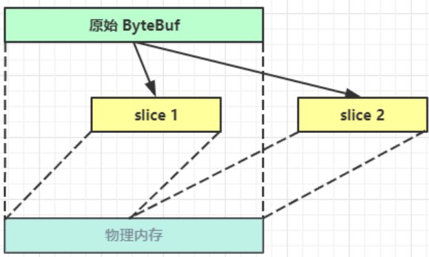

```java
public class TestSlice {
    public static void main(String[] args) {
        // 创建ByteBuf
        ByteBuf buffer = ByteBufAllocator.DEFAULT.buffer(16, 20);

        // 向buffer中写入数据
        buffer.writeBytes(new byte[]{1, 2, 3, 4, 5, 6, 7, 8, 9, 10});

        // 将buffer分成两部分
        ByteBuf slice1 = buffer.slice(0, 5);
        ByteBuf slice2 = buffer.slice(5, 5);

        // 需要让分片的buffer引用计数加一
        // 避免原Buffer释放导致分片buffer无法使用
        slice1.retain();
        slice2.retain();
        
        ByteBufUtil.log(slice1);
        ByteBufUtil.log(slice2);

        // 更改原始buffer中的值
        System.out.println("===========修改原buffer中的值===========");
        buffer.setByte(0,5);

        System.out.println("===========打印slice1===========");
        ByteBufUtil.log(slice1);
    }
}
```

```java
read index:0 write index:5 capacity:5
         +-------------------------------------------------+
         |  0  1  2  3  4  5  6  7  8  9  a  b  c  d  e  f |
+--------+-------------------------------------------------+----------------+
|00000000| 01 02 03 04 05                                  |.....           |
+--------+-------------------------------------------------+----------------+
read index:0 write index:5 capacity:5
         +-------------------------------------------------+
         |  0  1  2  3  4  5  6  7  8  9  a  b  c  d  e  f |
+--------+-------------------------------------------------+----------------+
|00000000| 06 07 08 09 0a                                  |.....           |
+--------+-------------------------------------------------+----------------+
===========修改原buffer中的值===========
===========打印slice1===========
read index:0 write index:5 capacity:5
         +-------------------------------------------------+
         |  0  1  2  3  4  5  6  7  8  9  a  b  c  d  e  f |
+--------+-------------------------------------------------+----------------+
|00000000| 05 02 03 04 05                                  |.....           |
+--------+-------------------------------------------------+----------------+
```

### 优势

- 池化思想 - 可以重用池中 ByteBuf 实例，更节约内存，减少内存溢出的可能
- **读写指针分离**，不需要像 ByteBuffer 一样切换读写模式
- 可以**自动扩容**
- 支持链式调用，使用更流畅
- 很多地方体现零拷贝，例如
  - slice、duplicate、CompositeByteBuf

# 四、应用

## 1、粘包与半包

### 服务器代码

```java
public class HelloServer {
    static final Logger log = LoggerFactory.getLogger(HelloServer.class);
    void start() {
        NioEventLoopGroup boss = new NioEventLoopGroup(1);
        NioEventLoopGroup worker = new NioEventLoopGroup();
        try {
            ServerBootstrap serverBootstrap = new ServerBootstrap();
            serverBootstrap.channel(NioServerSocketChannel.class);
            serverBootstrap.group(boss, worker);
            serverBootstrap.childHandler(new ChannelInitializer<SocketChannel>() {
                @Override
                protected void initChannel(SocketChannel ch) {
                    ch.pipeline().addLast(new LoggingHandler(LogLevel.DEBUG));
                    ch.pipeline().addLast(new ChannelInboundHandlerAdapter() {
                        @Override
                        public void channelActive(ChannelHandlerContext ctx) throws Exception {
                            // 连接建立时会执行该方法
                            log.debug("connected {}", ctx.channel());
                            super.channelActive(ctx);
                        }

                        @Override
                        public void channelInactive(ChannelHandlerContext ctx) throws Exception {
                            // 连接断开时会执行该方法
                            log.debug("disconnect {}", ctx.channel());
                            super.channelInactive(ctx);
                        }
                    });
                }
            });
            ChannelFuture channelFuture = serverBootstrap.bind(8080);
            log.debug("{} binding...", channelFuture.channel());
            channelFuture.sync();
            log.debug("{} bound...", channelFuture.channel());
            // 关闭channel
            channelFuture.channel().closeFuture().sync();
        } catch (InterruptedException e) {
            log.error("server error", e);
        } finally {
            boss.shutdownGracefully();
            worker.shutdownGracefully();
            log.debug("stopped");
        }
    }

    public static void main(String[] args) {
        new HelloServer().start();
    }
}
```

### 粘包现象

**客户端代码**

```java
public class HelloClient {
    static final Logger log = LoggerFactory.getLogger(HelloClient.class);
    public static void main(String[] args) {
        NioEventLoopGroup worker = new NioEventLoopGroup();
        try {
            Bootstrap bootstrap = new Bootstrap();
            bootstrap.channel(NioSocketChannel.class);
            bootstrap.group(worker);
            bootstrap.handler(new ChannelInitializer<SocketChannel>() {
                @Override
                protected void initChannel(SocketChannel ch) throws Exception {
                    log.debug("connected...");
                    ch.pipeline().addLast(new ChannelInboundHandlerAdapter() {
                        @Override
                        public void channelActive(ChannelHandlerContext ctx) throws Exception {
                            log.debug("sending...");
                            // 每次发送16个字节的数据，共发送10次
                            for (int i = 0; i < 10; i++) {
                                ByteBuf buffer = ctx.alloc().buffer();
                                buffer.writeBytes(new byte[]{0, 1, 2, 3, 4, 5, 6, 7, 8, 9, 10, 11, 12, 13, 14, 15});
                                ctx.writeAndFlush(buffer);
                            }
                        }
                    });
                }
            });
            ChannelFuture channelFuture = bootstrap.connect("127.0.0.1", 8080).sync();
            channelFuture.channel().closeFuture().sync();

        } catch (InterruptedException e) {
            log.error("client error", e);
        } finally {
            worker.shutdownGracefully();
        }
    }
}
```

**服务器接收结果**

```java
7999 [nioEventLoopGroup-3-1] DEBUG io.netty.handler.logging.LoggingHandler  - [id: 0x5b43ecb0, L:/127.0.0.1:8080 - R:/127.0.0.1:53797] READ: 160B
         +-------------------------------------------------+
         |  0  1  2  3  4  5  6  7  8  9  a  b  c  d  e  f |
+--------+-------------------------------------------------+----------------+
|00000000| 00 01 02 03 04 05 06 07 08 09 0a 0b 0c 0d 0e 0f |................|
|00000010| 00 01 02 03 04 05 06 07 08 09 0a 0b 0c 0d 0e 0f |................|
|00000020| 00 01 02 03 04 05 06 07 08 09 0a 0b 0c 0d 0e 0f |................|
|00000030| 00 01 02 03 04 05 06 07 08 09 0a 0b 0c 0d 0e 0f |................|
|00000040| 00 01 02 03 04 05 06 07 08 09 0a 0b 0c 0d 0e 0f |................|
|00000050| 00 01 02 03 04 05 06 07 08 09 0a 0b 0c 0d 0e 0f |................|
|00000060| 00 01 02 03 04 05 06 07 08 09 0a 0b 0c 0d 0e 0f |................|
|00000070| 00 01 02 03 04 05 06 07 08 09 0a 0b 0c 0d 0e 0f |................|
|00000080| 00 01 02 03 04 05 06 07 08 09 0a 0b 0c 0d 0e 0f |................|
|00000090| 00 01 02 03 04 05 06 07 08 09 0a 0b 0c 0d 0e 0f |................|
+--------+-------------------------------------------------+----------------+
```

可见虽然客户端是分别以16字节为单位，通过channel向服务器发送了10次数据，可是**服务器端却只接收了一次，接收数据的大小为160B，即客户端发送的数据总大小，这就是粘包现象**

### 半包现象

将客户端-服务器之间的channel容量进行调整

**服务器代码**

```java
// 调整channel的容量
serverBootstrap.option(ChannelOption.SO_RCVBUF, 10);
```

**注意**

> serverBootstrap.option(ChannelOption.SO_RCVBUF, 10) 影响的底层接收缓冲区（即滑动窗口）大小，仅决定了 netty 读取的最小单位，**netty 实际每次读取的一般是它的整数倍**

**服务器接收结果**

```java
5901 [nioEventLoopGroup-3-1] DEBUG io.netty.handler.logging.LoggingHandler  - [id: 0xc73284f3, L:/127.0.0.1:8080 - R:/127.0.0.1:49679] READ: 36B
         +-------------------------------------------------+
         |  0  1  2  3  4  5  6  7  8  9  a  b  c  d  e  f |
+--------+-------------------------------------------------+----------------+
|00000000| 00 01 02 03 04 05 06 07 08 09 0a 0b 0c 0d 0e 0f |................|
|00000010| 00 01 02 03 04 05 06 07 08 09 0a 0b 0c 0d 0e 0f |................|
|00000020| 00 01 02 03                                     |....            |
+--------+-------------------------------------------------+----------------+

5901 [nioEventLoopGroup-3-1] DEBUG io.netty.handler.logging.LoggingHandler  - [id: 0xc73284f3, L:/127.0.0.1:8080 - R:/127.0.0.1:49679] READ: 40B
         +-------------------------------------------------+
         |  0  1  2  3  4  5  6  7  8  9  a  b  c  d  e  f |
+--------+-------------------------------------------------+----------------+
|00000000| 04 05 06 07 08 09 0a 0b 0c 0d 0e 0f 00 01 02 03 |................|
|00000010| 04 05 06 07 08 09 0a 0b 0c 0d 0e 0f 00 01 02 03 |................|
|00000020| 04 05 06 07 08 09 0a 0b                         |........        |
+--------+-------------------------------------------------+----------------+

5901 [nioEventLoopGroup-3-1] DEBUG io.netty.handler.logging.LoggingHandler  - [id: 0xc73284f3, L:/127.0.0.1:8080 - R:/127.0.0.1:49679] READ: 40B
         +-------------------------------------------------+
         |  0  1  2  3  4  5  6  7  8  9  a  b  c  d  e  f |
+--------+-------------------------------------------------+----------------+
|00000000| 0c 0d 0e 0f 00 01 02 03 04 05 06 07 08 09 0a 0b |................|
|00000010| 0c 0d 0e 0f 00 01 02 03 04 05 06 07 08 09 0a 0b |................|
|00000020| 0c 0d 0e 0f 00 01 02 03                         |........        |
+--------+-------------------------------------------------+----------------+

5901 [nioEventLoopGroup-3-1] DEBUG io.netty.handler.logging.LoggingHandler  - [id: 0xc73284f3, L:/127.0.0.1:8080 - R:/127.0.0.1:49679] READ: 40B
         +-------------------------------------------------+
         |  0  1  2  3  4  5  6  7  8  9  a  b  c  d  e  f |
+--------+-------------------------------------------------+----------------+
|00000000| 04 05 06 07 08 09 0a 0b 0c 0d 0e 0f 00 01 02 03 |................|
|00000010| 04 05 06 07 08 09 0a 0b 0c 0d 0e 0f 00 01 02 03 |................|
|00000020| 04 05 06 07 08 09 0a 0b                         |........        |
+--------+-------------------------------------------------+----------------+

5901 [nioEventLoopGroup-3-1] DEBUG io.netty.handler.logging.LoggingHandler  - [id: 0xc73284f3, L:/127.0.0.1:8080 - R:/127.0.0.1:49679] READ: 4B
         +-------------------------------------------------+
         |  0  1  2  3  4  5  6  7  8  9  a  b  c  d  e  f |
+--------+-------------------------------------------------+----------------+
|00000000| 0c 0d 0e 0f                                     |....            |
+--------+-------------------------------------------------+----------------+
```

可见客户端每次发送的数据，**因channel容量不足，无法将发送的数据一次性接收**，便产生了半包现象

### 现象分析

#### 粘包

- 现象
  - 发送 abc def，接收 abcdef
- 原因
  - 应用层
    - 接收方 ByteBuf 设置太大（Netty 默认 1024）
  - 传输层-网络层
    - 滑动窗口：假设发送方 256 bytes 表示一个完整报文，但由于接收方处理不及时且**窗口大小足够大（大于256 bytes），这 256 bytes 字节就会缓冲在接收方的滑动窗口中，**当滑动窗口中缓冲了多个报文就会粘包
    - Nagle 算法：会造成粘包

#### 半包

- 现象
  - 发送 abcdef，接收 abc def
- 原因
  - 应用层
    - 接收方 ByteBuf 小于实际发送数据量
  - 传输层-网络层
    - 滑动窗口：假设接收方的窗口只剩了 128 bytes，发送方的报文大小是 256 bytes，这时**接收方窗口中无法容纳发送方的全部报文，发送方只能先发送前 128 bytes，等待 ack 后才能发送剩余部分，这就造成了半包**
  - 数据链路层
    - MSS 限制：当发送的数据超过 MSS 限制后，会将数据切分发送，就会造成半包

#### 本质

发生粘包与半包现象的本质是**因为 TCP 是流式协议，消息无边界**

### 解决方案

#### 短链接

**客户端每次向服务器发送数据以后，就与服务器断开连接，此时的消息边界为连接建立到连接断开**。这时便无需使用滑动窗口等技术来缓冲数据，则不会发生粘包现象。但如果一次性数据发送过多，接收方无法一次性容纳所有数据，还是会发生半包现象，所以**短链接无法解决半包现象**

**客户端代码改进**

修改channelActive方法

```java
public void channelActive(ChannelHandlerContext ctx) throws Exception {
    log.debug("sending...");
    ByteBuf buffer = ctx.alloc().buffer(16);
    buffer.writeBytes(new byte[]{0, 1, 2, 3, 4, 5, 6, 7, 8, 9, 10, 11, 12, 13, 14, 15});
    ctx.writeAndFlush(buffer);
    // 使用短链接，每次发送完毕后就断开连接
    ctx.channel().close();
}
```

将发送步骤整体封装为send()方法，调用10次send()方法，模拟发送10次数据

```java
public static void main(String[] args) {
    // 发送10次
    for (int i = 0; i < 10; i++) {
        send();
    }
}
```

**运行结果**

```java
6452 [nioEventLoopGroup-3-1] DEBUG io.netty.handler.logging.LoggingHandler  - [id: 0x3eb6a684, L:/127.0.0.1:8080 - R:/127.0.0.1:65024] ACTIVE

6468 [nioEventLoopGroup-3-1] DEBUG io.netty.handler.logging.LoggingHandler  - [id: 0x3eb6a684, L:/127.0.0.1:8080 - R:/127.0.0.1:65024] READ: 16B
         +-------------------------------------------------+
         |  0  1  2  3  4  5  6  7  8  9  a  b  c  d  e  f |
+--------+-------------------------------------------------+----------------+
|00000000| 00 01 02 03 04 05 06 07 08 09 0a 0b 0c 0d 0e 0f |................|
+--------+-------------------------------------------------+----------------+

6468 [nioEventLoopGroup-3-1] DEBUG io.netty.handler.logging.LoggingHandler  - [id: 0x3eb6a684, L:/127.0.0.1:8080 ! R:/127.0.0.1:65024] INACTIVE

6483 [nioEventLoopGroup-3-2] DEBUG io.netty.handler.logging.LoggingHandler  - [id: 0x7dcc31ff, L:/127.0.0.1:8080 - R:/127.0.0.1:65057] ACTIVE

6483 [nioEventLoopGroup-3-2] DEBUG io.netty.handler.logging.LoggingHandler  - [id: 0x7dcc31ff, L:/127.0.0.1:8080 - R:/127.0.0.1:65057] READ: 16B
         +-------------------------------------------------+
         |  0  1  2  3  4  5  6  7  8  9  a  b  c  d  e  f |
+--------+-------------------------------------------------+----------------+
|00000000| 00 01 02 03 04 05 06 07 08 09 0a 0b 0c 0d 0e 0f |................|
+--------+-------------------------------------------------+----------------+

6483 [nioEventLoopGroup-3-2] DEBUG io.netty.handler.logging.LoggingHandler  - [id: 0x7dcc31ff, L:/127.0.0.1:8080 ! R:/127.0.0.1:65057] INACTIVE

...
```

客户端先于服务器建立连接，此时控制台打印`ACTIVE`，之后客户端向服务器发送了16B的数据，发送后断开连接，此时控制台打印`INACTIVE`，可见**未出现粘包现象**

#### 定长解码器

客户端于服务器**约定一个最大长度，保证客户端每次发送的数据长度都不会大于该长度**。若发送数据长度不足则需要**补齐**至该长度

服务器接收数据时，**将接收到的数据按照约定的最大长度进行拆分**，即使发送过程中产生了粘包，也可以通过定长解码器将数据正确地进行拆分。**服务端需要用到`FixedLengthFrameDecoder`对数据进行定长解码**，具体使用方法如下

```java
ch.pipeline().addLast(new FixedLengthFrameDecoder(16));
```

**客户端代码**

客户端发送数据的代码如下

```java
// 约定最大长度为16
final int maxLength = 16;
// 被发送的数据
char c = 'a';
// 向服务器发送10个报文
for (int i = 0; i < 10; i++) {
    ByteBuf buffer = ctx.alloc().buffer(maxLength);
    // 定长byte数组，未使用部分会以0进行填充
    byte[] bytes = new byte[maxLength];
    // 生成长度为0~15的数据
    for (int j = 0; j < (int)(Math.random()*(maxLength-1)); j++) {
        bytes[j] = (byte) c;
    }
    buffer.writeBytes(bytes);
    c++;
    // 将数据发送给服务器
    ctx.writeAndFlush(buffer);
}
```

**服务器代码**

使用`FixedLengthFrameDecoder`对粘包数据进行拆分，该handler需要添加在`LoggingHandler`之前，保证数据被打印时已被拆分

```java
// 通过定长解码器对粘包数据进行拆分
ch.pipeline().addLast(new FixedLengthFrameDecoder(16));
ch.pipeline().addLast(new LoggingHandler(LogLevel.DEBUG));
```

**运行结果**

```java
8222 [nioEventLoopGroup-3-1] DEBUG io.netty.handler.logging.LoggingHandler  - [id: 0xbc122d07, L:/127.0.0.1:8080 - R:/127.0.0.1:52954] READ: 16B
         +-------------------------------------------------+
         |  0  1  2  3  4  5  6  7  8  9  a  b  c  d  e  f |
+--------+-------------------------------------------------+----------------+
|00000000| 61 61 61 61 00 00 00 00 00 00 00 00 00 00 00 00 |aaaa............|
+--------+-------------------------------------------------+----------------+

8222 [nioEventLoopGroup-3-1] DEBUG io.netty.handler.logging.LoggingHandler  - [id: 0xbc122d07, L:/127.0.0.1:8080 - R:/127.0.0.1:52954] READ: 16B
         +-------------------------------------------------+
         |  0  1  2  3  4  5  6  7  8  9  a  b  c  d  e  f |
+--------+-------------------------------------------------+----------------+
|00000000| 62 62 62 00 00 00 00 00 00 00 00 00 00 00 00 00 |bbb.............|
+--------+-------------------------------------------------+----------------+


8222 [nioEventLoopGroup-3-1] DEBUG io.netty.handler.logging.LoggingHandler  - [id: 0xbc122d07, L:/127.0.0.1:8080 - R:/127.0.0.1:52954] READ: 16B
         +-------------------------------------------------+
         |  0  1  2  3  4  5  6  7  8  9  a  b  c  d  e  f |
+--------+-------------------------------------------------+----------------+
|00000000| 63 63 00 00 00 00 00 00 00 00 00 00 00 00 00 00 |cc..............|
+--------+-------------------------------------------------+----------------+

...
```

#### 行解码器

行解码器的是**通过分隔符对数据进行拆分**来解决粘包半包问题的

可以通过`LineBasedFrameDecoder(int maxLength)`来拆分以**换行符(\n)**为分隔符的数据，也可以通过`DelimiterBasedFrameDecoder(int maxFrameLength, ByteBuf... delimiters)`来**指定通过什么分隔符来拆分数据（可以传入多个分隔符）**

两种解码器**都需要传入数据的最大长度**，若超出最大长度，会抛出`TooLongFrameException`异常

**以换行符 \n 为分隔符**

客户端代码

```java
// 约定最大长度为 64
final int maxLength = 64;
// 被发送的数据
char c = 'a';
for (int i = 0; i < 10; i++) {
    ByteBuf buffer = ctx.alloc().buffer(maxLength);
    // 生成长度为0~62的数据
    Random random = new Random();
    StringBuilder sb = new StringBuilder();
    for (int j = 0; j < (int)(random.nextInt(maxLength-2)); j++) {
        sb.append(c);
    }
    // 数据以 \n 结尾
    sb.append("\n");
    buffer.writeBytes(sb.toString().getBytes(StandardCharsets.UTF_8));
    c++;
    // 将数据发送给服务器
    ctx.writeAndFlush(buffer);
}
```

服务器代码

```java
// 通过行解码器对粘包数据进行拆分，以 \n 为分隔符
// 需要指定最大长度
ch.pipeline().addLast(new DelimiterBasedFrameDecoder(64));
ch.pipeline().addLast(new LoggingHandler(LogLevel.DEBUG));
```

运行结果

```java
4184 [nioEventLoopGroup-3-1] DEBUG io.netty.handler.logging.LoggingHandler  - [id: 0x9d6ac701, L:/127.0.0.1:8080 - R:/127.0.0.1:58282] READ: 10B
         +-------------------------------------------------+
         |  0  1  2  3  4  5  6  7  8  9  a  b  c  d  e  f |
+--------+-------------------------------------------------+----------------+
|00000000| 61 61 61 61 61 61 61 61 61 61                   |aaaaaaaaaa      |
+--------+-------------------------------------------------+----------------+

4184 [nioEventLoopGroup-3-1] DEBUG io.netty.handler.logging.LoggingHandler  - [id: 0x9d6ac701, L:/127.0.0.1:8080 - R:/127.0.0.1:58282] READ: 11B
         +-------------------------------------------------+
         |  0  1  2  3  4  5  6  7  8  9  a  b  c  d  e  f |
+--------+-------------------------------------------------+----------------+
|00000000| 62 62 62 62 62 62 62 62 62 62 62                |bbbbbbbbbbb     |
+--------+-------------------------------------------------+----------------+

4184 [nioEventLoopGroup-3-1] DEBUG io.netty.handler.logging.LoggingHandler  - [id: 0x9d6ac701, L:/127.0.0.1:8080 - R:/127.0.0.1:58282] READ: 2B
         +-------------------------------------------------+
         |  0  1  2  3  4  5  6  7  8  9  a  b  c  d  e  f |
+--------+-------------------------------------------------+----------------+
|00000000| 63 63                                           |cc              |
+--------+-------------------------------------------------+----------------+

...
```

#### 长度字段解码器

在传送数据时可以在数据中**添加一个用于表示有用数据长度的字段**，在解码时读取出这个用于表明长度的字段，同时读取其他相关参数，即可知道最终需要的数据是什么样子的

`LengthFieldBasedFrameDecoder`解码器可以提供更为丰富的拆分方法，其构造方法有五个参数

```java
public LengthFieldBasedFrameDecoder(
    int maxFrameLength,
    int lengthFieldOffset, int lengthFieldLength,
    int lengthAdjustment, int initialBytesToStrip)
```

**参数解析**

- maxFrameLength 数据最大长度
  - 表示数据的最大长度（包括附加信息、长度标识等内容）
- lengthFieldOffset **数据长度标识的起始偏移量**
  - 用于指明数据第几个字节开始是用于标识有用字节长度的，因为前面可能还有其他附加信息
- lengthFieldLength **数据长度标识所占字节数**（用于指明有用数据的长度）
  - 数据中用于表示有用数据长度的标识所占的字节数
- lengthAdjustment **长度表示与有用数据的偏移量**
  - 用于指明数据长度标识和有用数据之间的距离，因为两者之间还可能有附加信息
- initialBytesToStrip **数据读取起点**
  - 读取起点，**不读取** 0 ~ initialBytesToStrip 之间的数据

**参数图解**

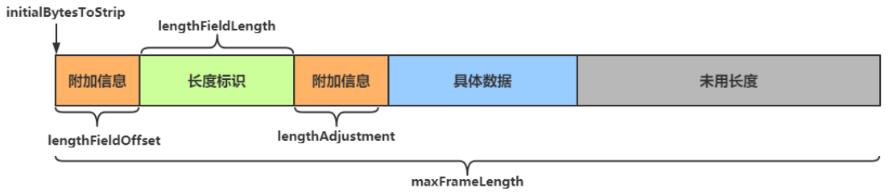

```java
lengthFieldOffset   = 0
lengthFieldLength   = 2
lengthAdjustment    = 0
initialBytesToStrip = 0 (= do not strip header)
  
BEFORE DECODE (14 bytes)         AFTER DECODE (14 bytes)
+--------+----------------+      +--------+----------------+
| Length | Actual Content |----->| Length | Actual Content |
| 0x000C | "HELLO, WORLD" |      | 0x000C | "HELLO, WORLD" |
+--------+----------------+      +--------+----------------+
```

从0开始即为长度标识，长度标识长度为2个字节

**0x000C** 即为后面 `HELLO, WORLD`的长度

------

```java
lengthFieldOffset   = 0
lengthFieldLength   = 2
lengthAdjustment    = 0
initialBytesToStrip = 2 (= the length of the Length field)
  
BEFORE DECODE (14 bytes)         AFTER DECODE (12 bytes)
+--------+----------------+      +----------------+
| Length | Actual Content |----->| Actual Content |
| 0x000C | "HELLO, WORLD" |      | "HELLO, WORLD" |
+--------+----------------+      +----------------+
```

从0开始即为长度标识，长度标识长度为2个字节，**读取时从第二个字节开始读取**（此处即跳过长度标识）

因为**跳过了用于表示长度的2个字节**，所以此处直接读取`HELLO, WORLD`

------

```java
lengthFieldOffset   = 2 (= the length of Header 1)
lengthFieldLength   = 3
lengthAdjustment    = 0
initialBytesToStrip = 0
  
BEFORE DECODE (17 bytes)                      AFTER DECODE (17 bytes)
+----------+----------+----------------+      +----------+----------+----------------+
| Header 1 |  Length  | Actual Content |----->| Header 1 |  Length  | Actual Content |
|  0xCAFE  | 0x00000C | "HELLO, WORLD" |      |  0xCAFE  | 0x00000C | "HELLO, WORLD" |
+----------+----------+----------------+      +----------+----------+----------------+
```

长度标识**前面还有2个字节的其他内容**（0xCAFE），第三个字节开始才是长度标识，长度表示长度为3个字节(0x00000C)

Header1中有附加信息，**读取长度标识时需要跳过这些附加信息来获取长度**

------

```java
lengthFieldOffset   = 0
lengthFieldLength   = 3
lengthAdjustment    = 2 (= the length of Header 1)
initialBytesToStrip = 0
  
BEFORE DECODE (17 bytes)                      AFTER DECODE (17 bytes)
+----------+----------+----------------+      +----------+----------+----------------+
|  Length  | Header 1 | Actual Content |----->|  Length  | Header 1 | Actual Content |
| 0x00000C |  0xCAFE  | "HELLO, WORLD" |      | 0x00000C |  0xCAFE  | "HELLO, WORLD" |
+----------+----------+----------------+      +----------+----------+----------------+
```

从0开始即为长度标识，长度标识长度为3个字节，**长度标识之后还有2个字节的其他内容**（0xCAFE）

长度标识(0x00000C)表示的是**从其后lengthAdjustment（2个字节）开始的数据的长度，即`HELLO, WORLD`**，不包括0xCAFE

------

```java
lengthFieldOffset   = 1 (= the length of HDR1)
lengthFieldLength   = 2
lengthAdjustment    = 1 (= the length of HDR2)
initialBytesToStrip = 3 (= the length of HDR1 + LEN)
  
BEFORE DECODE (16 bytes)                       AFTER DECODE (13 bytes)
+------+--------+------+----------------+      +------+----------------+
| HDR1 | Length | HDR2 | Actual Content |----->| HDR2 | Actual Content |
| 0xCA | 0x000C | 0xFE | "HELLO, WORLD" |      | 0xFE | "HELLO, WORLD" |
+------+--------+------+----------------+      +------+----------------+
```

长度标识**前面有1个字节的其他内容，后面也有1个字节的其他内容，读取时从长度标识之后3个字节处开始读取**，即读取 `0xFE HELLO, WORLD`

------

**使用**

通过 **EmbeddedChannel** 对 handler 进行测试

```java
public class TestLengthFieldDecoder {
    public static void main(String[] args) {
        // 模拟服务器
        // 使用EmbeddedChannel测试handler
        EmbeddedChannel channel = new EmbeddedChannel(
                // 数据最大长度为1KB，长度标识前后各有1个字节的附加信息，长度标识长度为4个字节（int）
                new LengthFieldBasedFrameDecoder(1024, 1, 4, 1, 0),
                new LoggingHandler(LogLevel.DEBUG)
        );

        // 模拟客户端，写入数据
        ByteBuf buffer = ByteBufAllocator.DEFAULT.buffer();
        send(buffer, "Hello");
        channel.writeInbound(buffer);
        send(buffer, "World");
        channel.writeInbound(buffer);
    }

    private static void send(ByteBuf buf, String msg) {
        // 得到数据的长度
        int length = msg.length();
        byte[] bytes = msg.getBytes(StandardCharsets.UTF_8);
        // 将数据信息写入buf
        // 写入长度标识前的其他信息
        buf.writeByte(0xCA);
        // 写入数据长度标识
        buf.writeInt(length);
        // 写入长度标识后的其他信息
        buf.writeByte(0xFE);
        // 写入具体的数据
        buf.writeBytes(bytes);
    }
}
```

运行结果

```java
146  [main] DEBUG io.netty.handler.logging.LoggingHandler  - [id: 0xembedded, L:embedded - R:embedded] READ: 11B
         +-------------------------------------------------+
         |  0  1  2  3  4  5  6  7  8  9  a  b  c  d  e  f |
+--------+-------------------------------------------------+----------------+
|00000000| ca 00 00 00 05 fe 48 65 6c 6c 6f                |......Hello     |
+--------+-------------------------------------------------+----------------+

146  [main] DEBUG io.netty.handler.logging.LoggingHandler  - [id: 0xembedded, L:embedded - R:embedded] READ: 11B
         +-------------------------------------------------+
         |  0  1  2  3  4  5  6  7  8  9  a  b  c  d  e  f |
+--------+-------------------------------------------------+----------------+
|00000000| ca 00 00 00 05 fe 57 6f 72 6c 64                |......World     |
+--------+-------------------------------------------------+----------------+
```

## 2、协议设计与解析

### 协议的作用

TCP/IP 中消息传输基于流的方式，没有边界

**协议的目的就是划定消息的边界，制定通信双方要共同遵守的通信规则**

### Redis协议

如果我们要向Redis服务器发送一条`set name Nyima`的指令，需要遵守如下协议

```java
// 该指令一共有3部分，每条指令之后都要添加回车与换行符
*3\r\n
// 第一个指令的长度是3
$3\r\n
// 第一个指令是set指令
set\r\n
// 下面的指令以此类推
$4\r\n
name\r\n
$5\r\n
Nyima\r\n
```

**客户端代码如下**

```java
public class TestRedis {
    public static void main(String[] args) {
        NioEventLoopGroup group =  new NioEventLoopGroup();
        try {
            ChannelFuture channelFuture = new Bootstrap()
                    .group(group)
                    .channel(NioSocketChannel.class)
                    .handler(new ChannelInitializer<SocketChannel>() {
                        @Override
                        protected void initChannel(SocketChannel ch) {
                            // 打印日志
                            ch.pipeline().addLast(new LoggingHandler(LogLevel.DEBUG));
                            ch.pipeline().addLast(new ChannelInboundHandlerAdapter() {
                                @Override
                                public void channelActive(ChannelHandlerContext ctx) throws Exception {
                                    // 回车与换行符
                                    final byte[] LINE = {'\r','\n'};
                                    // 获得ByteBuf
                                    ByteBuf buffer = ctx.alloc().buffer();
                                    // 连接建立后，向Redis中发送一条指令，注意添加回车与换行
                                    // set name Nyima
                                    buffer.writeBytes("*3".getBytes());
                                    buffer.writeBytes(LINE);
                                    buffer.writeBytes("$3".getBytes());
                                    buffer.writeBytes(LINE);
                                    buffer.writeBytes("set".getBytes());
                                    buffer.writeBytes(LINE);
                                    buffer.writeBytes("$4".getBytes());
                                    buffer.writeBytes(LINE);
                                    buffer.writeBytes("name".getBytes());
                                    buffer.writeBytes(LINE);
                                    buffer.writeBytes("$5".getBytes());
                                    buffer.writeBytes(LINE);
                                    buffer.writeBytes("Nyima".getBytes());
                                    buffer.writeBytes(LINE);
                                    ctx.writeAndFlush(buffer);
                                }

                            });
                        }
                    })
                    .connect(new InetSocketAddress("localhost", 6379));
            channelFuture.sync();
            // 关闭channel
            channelFuture.channel().close().sync();
        } catch (InterruptedException e) {
            e.printStackTrace();
        } finally {
            // 关闭group
            group.shutdownGracefully();
        }
    }
}
```

**控制台打印结果**

```java
1600 [nioEventLoopGroup-2-1] DEBUG io.netty.handler.logging.LoggingHandler  - [id: 0x28c994f1, L:/127.0.0.1:60792 - R:localhost/127.0.0.1:6379] WRITE: 34B
         +-------------------------------------------------+
         |  0  1  2  3  4  5  6  7  8  9  a  b  c  d  e  f |
+--------+-------------------------------------------------+----------------+
|00000000| 2a 33 0d 0a 24 33 0d 0a 73 65 74 0d 0a 24 34 0d |*3..$3..set..$4.|
|00000010| 0a 6e 61 6d 65 0d 0a 24 35 0d 0a 4e 79 69 6d 61 |.name..$5..Nyima|
|00000020| 0d 0a                                           |..              |
+--------+-------------------------------------------------+----------------+
```

### HTTP协议

HTTP协议在请求行请求头中都有很多的内容，自己实现较为困难，可以使用`HttpServerCodec`作为**服务器端的解码器与编码器，来处理HTTP请求**

```java
// HttpServerCodec 中既有请求的解码器 HttpRequestDecoder 又有响应的编码器 HttpResponseEncoder
// Codec(CodeCombine) 一般代表该类既作为 编码器 又作为 解码器
public final class HttpServerCodec extends CombinedChannelDuplexHandler<HttpRequestDecoder, HttpResponseEncoder>
        implements HttpServerUpgradeHandler.SourceCodec
```

**服务器代码**

```java
@Slf4j
public class TestHttp {
    public static void main(String[] args) {
        NioEventLoopGroup group = new NioEventLoopGroup();
        new ServerBootstrap()
                .group(group)
                .channel(NioServerSocketChannel.class)
                .childHandler(new ChannelInitializer<SocketChannel>() {
                    @Override
                    protected void initChannel(SocketChannel ch) {
                        ch.pipeline().addLast(new LoggingHandler(LogLevel.DEBUG));
                        // 作为服务器，使用 HttpServerCodec 作为编码器与解码器
                        ch.pipeline().addLast(new HttpServerCodec());
                        // 服务器只处理HTTPRequest
                        ch.pipeline().addLast(new SimpleChannelInboundHandler<HttpRequest>() {
                            @Override
                            protected void channelRead0(ChannelHandlerContext ctx, HttpRequest msg) {
                                // 获得请求uri
                                log.debug(msg.uri());

                                // 获得完整响应，设置版本号与状态码
                                DefaultFullHttpResponse response = new DefaultFullHttpResponse(msg.protocolVersion(), HttpResponseStatus.OK);
                                // 设置响应内容
                                byte[] bytes = "<h1>Hello, World!</h1>".getBytes(StandardCharsets.UTF_8);
                                // 设置响应体长度，避免浏览器一直接收响应内容
                                response.headers().setInt(CONTENT_LENGTH, bytes.length);
                                // 设置响应体
                                response.content().writeBytes(bytes);

                                // 写回响应
                                ctx.writeAndFlush(response);
                            }
                        });
                    }
                })
                .bind(8080);
    }
}
```

服务器负责处理请求并响应浏览器。所以**只需要处理HTTP请求**即可

```java
// 服务器只处理HTTPRequest
ch.pipeline().addLast(new SimpleChannelInboundHandler<HttpRequest>()
```

获得请求后，需要返回响应给浏览器。需要创建响应对象`DefaultFullHttpResponse`，设置HTTP版本号及状态码，为避免浏览器获得响应后，因为获得`CONTENT_LENGTH`而一直空转，需要添加`CONTENT_LENGTH`字段，表明响应体中数据的具体长度

```java
// 获得完整响应，设置版本号与状态码
DefaultFullHttpResponse response = new DefaultFullHttpResponse(msg.protocolVersion(), HttpResponseStatus.OK);
// 设置响应内容
byte[] bytes = "<h1>Hello, World!</h1>".getBytes(StandardCharsets.UTF_8);
// 设置响应体长度，避免浏览器一直接收响应内容
response.headers().setInt(CONTENT_LENGTH, bytes.length);
// 设置响应体
response.content().writeBytes(bytes);
```

### 自定义协议

#### 组成要素

- **魔数**：用来在第一时间判定接收的数据是否为无效数据包

- **版本号**：可以支持协议的升级

- 序列化算法

  ：消息正文到底采用哪种序列化反序列化方式

  - 如：json、protobuf、hessian、jdk

- **指令类型**：是登录、注册、单聊、群聊… 跟业务相关

- **请求序号**：为了双工通信，提供异步能力

- **正文长度**

- **消息正文**

#### 编码器与解码器

```java
public class MessageCodec extends ByteToMessageCodec<Message> {

    @Override
    protected void encode(ChannelHandlerContext ctx, Message msg, ByteBuf out) throws Exception {
        // 设置魔数 4个字节
        out.writeBytes(new byte[]{'N','Y','I','M'});
        // 设置版本号 1个字节
        out.writeByte(1);
        // 设置序列化方式 1个字节
        out.writeByte(1);
        // 设置指令类型 1个字节
        out.writeByte(msg.getMessageType());
        // 设置请求序号 4个字节
        out.writeInt(msg.getSequenceId());
        // 为了补齐为16个字节，填充1个字节的数据
        out.writeByte(0xff);

        // 获得序列化后的msg
        ByteArrayOutputStream bos = new ByteArrayOutputStream();
        ObjectOutputStream oos = new ObjectOutputStream(bos);
        oos.writeObject(msg);
        byte[] bytes = bos.toByteArray();

        // 获得并设置正文长度 长度用4个字节标识
        out.writeInt(bytes.length);
        // 设置消息正文
        out.writeBytes(bytes);
    }

    @Override
    protected void decode(ChannelHandlerContext ctx, ByteBuf in, List<Object> out) throws Exception {
        // 获取魔数
        int magic = in.readInt();
        // 获取版本号
        byte version = in.readByte();
        // 获得序列化方式
        byte seqType = in.readByte();
        // 获得指令类型
        byte messageType = in.readByte();
        // 获得请求序号
        int sequenceId = in.readInt();
        // 移除补齐字节
        in.readByte();
        // 获得正文长度
        int length = in.readInt();
        // 获得正文
        byte[] bytes = new byte[length];
        in.readBytes(bytes, 0, length);
        ObjectInputStream ois = new ObjectInputStream(new ByteArrayInputStream(bytes));
        Message message = (Message) ois.readObject();
		// 将信息放入List中，传递给下一个handler
        out.add(message);
        
        // 打印获得的信息正文
        System.out.println("===========魔数===========");
        System.out.println(magic);
        System.out.println("===========版本号===========");
        System.out.println(version);
        System.out.println("===========序列化方法===========");
        System.out.println(seqType);
        System.out.println("===========指令类型===========");
        System.out.println(messageType);
        System.out.println("===========请求序号===========");
        System.out.println(sequenceId);
        System.out.println("===========正文长度===========");
        System.out.println(length);
        System.out.println("===========正文===========");
        System.out.println(message);
    }
}
```

- 编码器与解码器方法源于**父类ByteToMessageCodec**，通过该类可以自定义编码器与解码器，**泛型类型为被编码与被解码的类**。此处使用了自定义类Message，代表消息

  ```java
  public class MessageCodec extends ByteToMessageCodec<Message>
  ```

- 编码器**负责将附加信息与正文信息写入到ByteBuf中**，其中附加信息**总字节数最好为2n，不足需要补齐**。正文内容如果为对象，需要通过**序列化**将其放入到ByteBuf中

- 解码器**负责将ByteBuf中的信息取出，并放入List中**，该List用于将信息传递给下一个handler

**编写测试类**

```java
public class TestCodec {
    static final org.slf4j.Logger log = LoggerFactory.getLogger(StudyServer.class);
    public static void main(String[] args) throws Exception {
        EmbeddedChannel channel = new EmbeddedChannel();
        // 添加解码器，避免粘包半包问题
        channel.pipeline().addLast(new LengthFieldBasedFrameDecoder(1024, 12, 4, 0, 0));
        channel.pipeline().addLast(new LoggingHandler(LogLevel.DEBUG));
        channel.pipeline().addLast(new MessageCodec());
        LoginRequestMessage user = new LoginRequestMessage("Nyima", "123");

        // 测试编码与解码
        ByteBuf byteBuf = ByteBufAllocator.DEFAULT.buffer();
        new MessageCodec().encode(null, user, byteBuf);
        channel.writeInbound(byteBuf);
    }
}
```

- 测试类中用到了LengthFieldBasedFrameDecoder，避免粘包半包问题
- 通过MessageCodec的encode方法将附加信息与正文写入到ByteBuf中，通过channel执行入站操作。入站时会调用decode方法进行解码

运行结果

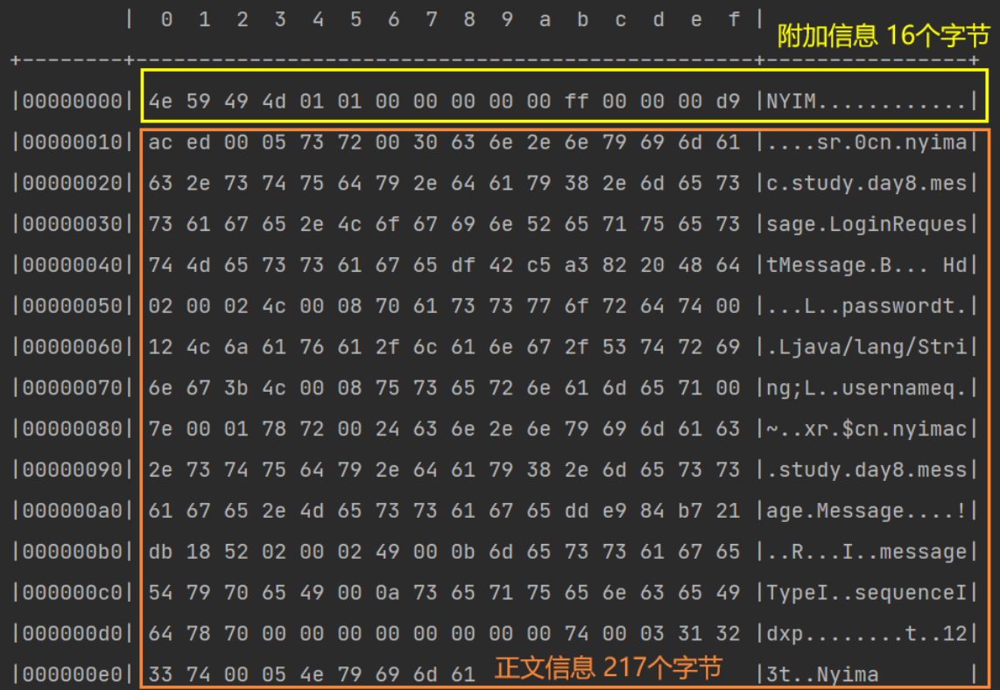

#### @Sharable注解

为了**提高handler的复用率，可以将handler创建为handler对象**，然后在不同的channel中使用该handler对象进行处理操作

```java
LoggingHandler loggingHandler = new LoggingHandler(LogLevel.DEBUG);
// 不同的channel中使用同一个handler对象，提高复用率
channel1.pipeline().addLast(loggingHandler);
channel2.pipeline().addLast(loggingHandler);
```

但是**并不是所有的handler都能通过这种方法来提高复用率的**，例如`LengthFieldBasedFrameDecoder`。如果多个channel中使用同一个LengthFieldBasedFrameDecoder对象，则可能发生如下问题

- channel1中收到了一个半包，LengthFieldBasedFrameDecoder发现不是一条完整的数据，则没有继续向下传播
- 此时channel2中也收到了一个半包，**因为两个channel使用了同一个LengthFieldBasedFrameDecoder，存入其中的数据刚好拼凑成了一个完整的数据包**。LengthFieldBasedFrameDecoder让该数据包继续向下传播，**最终引发错误**

为了提高handler的复用率，同时又避免出现一些并发问题，**Netty中原生的handler中用`@Sharable`注解来标明，该handler能否在多个channel中共享。**

**只有带有该注解，才能通过对象的方式被共享**，否则无法被共享

#### **自定义编解码器能否使用@Sharable注解**

**这需要根据自定义的handler的处理逻辑进行分析**

我们的MessageCodec本身接收的是LengthFieldBasedFrameDecoder处理之后的数据，那么数据肯定是完整的，按分析来说是可以添加@Sharable注解的

但是实际情况我们并**不能**添加该注解，会抛出异常信息`ChannelHandler cn.nyimac.study.day8.protocol.MessageCodec is not allowed to be shared`

- 因为MessageCodec**继承自ByteToMessageCodec**，ByteToMessageCodec类的注解如下

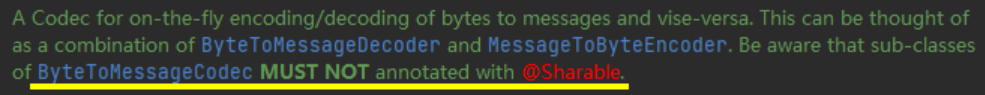

- 这就意味着**ByteToMessageCodec不能被多个channel所共享的**
  - 原因：**因为该类的目标是：将ByteBuf转化为Message，意味着传进该handler的数据还未被处理过**。所以传过来的ByteBuf**可能并不是完整的数据**，如果共享则会出现问题

**如果想要共享，需要怎么办呢？**

继承**MessageToMessageDecoder**即可。**该类的目标是：将已经被处理的完整数据再次被处理。**传过来的Message**如果是被处理过的完整数据**，那么被共享也就不会出现问题了，也就可以使用@Sharable注解了。实现方式与ByteToMessageCodec类似

```java
@ChannelHandler.Sharable
public class MessageSharableCodec extends MessageToMessageCodec<ByteBuf, Message> {
    @Override
    protected void encode(ChannelHandlerContext ctx, Message msg, List<Object> out) throws Exception {
        ...
    }

    @Override
    protected void decode(ChannelHandlerContext ctx, ByteBuf msg, List<Object> out) throws Exception {
		...
    }
}
```

## 3、在线聊天室

见工程中的项目，org.study.asm包下

#### 整体结构

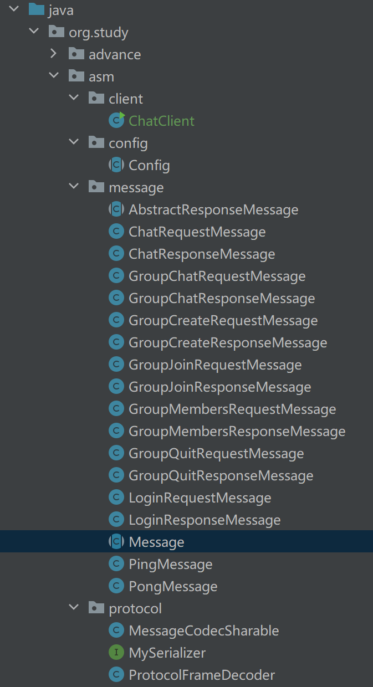

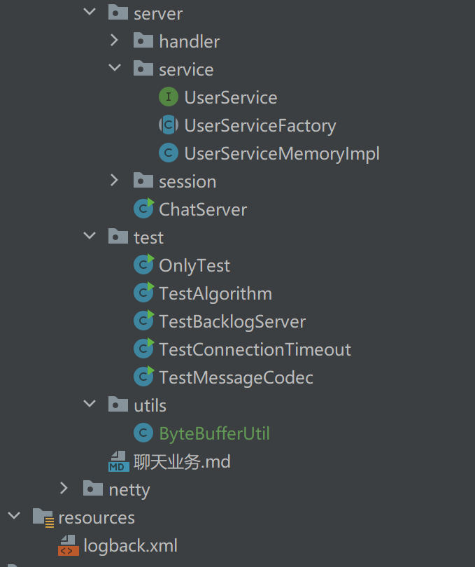

- client包：存放客户端相关类
- message包：存放各种类型的消息
- protocol包：存放自定义协议
- server包：存放服务器相关类
  - service包：存放用户相关类
  - session包：单聊及群聊相关会话类

# 五、优化

## 1、拓展序列化算法

### 序列化接口

```java
public interface Serializer {
    /**
     * 序列化
     * @param object 被序列化的对象
     * @param <T> 被序列化对象类型
     * @return 序列化后的字节数组
     */
    <T> byte[] serialize(T object);

    /**
     * 反序列化
     * @param clazz 反序列化的目标类的Class对象
     * @param bytes 被反序列化的字节数组
     * @param <T> 反序列化目标类
     * @return 反序列化后的对象
     */
    <T> T deserialize(Class<T> clazz, byte[] bytes);
}
```

### 枚举实现类

```java
public enum SerializerAlgorithm implements Serializer {
    // Java的序列化和反序列化
    Java {
        @Override
        public <T> byte[] serialize(T object) {
            // 序列化后的字节数组
            byte[] bytes = null;
            try (ByteArrayOutputStream bos = new ByteArrayOutputStream();
                 ObjectOutputStream oos = new ObjectOutputStream(bos)) {
                oos.writeObject(object);
                bytes = bos.toByteArray();
            } catch (IOException e) {
                e.printStackTrace();
            }
            return bytes;
        }

        @Override
        public <T> T deserialize(Class<T> clazz, byte[] bytes) {
            T target = null;
            System.out.println(Arrays.toString(bytes));
            try (ByteArrayInputStream bis = new ByteArrayInputStream(bytes);
                 ObjectInputStream ois = new ObjectInputStream(bis)) {
                target = (T) ois.readObject();
            } catch (IOException | ClassNotFoundException e) {
                e.printStackTrace();
            }
            // 返回反序列化后的对象
            return target;
        }
    }
    
     // Json的序列化和反序列化
    Json {
        @Override
        public <T> byte[] serialize(T object) {
            String s = new Gson().toJson(object);
            System.out.println(s);
            // 指定字符集，获得字节数组
            return s.getBytes(StandardCharsets.UTF_8);
        }

        @Override
        public <T> T deserialize(Class<T> clazz, byte[] bytes) {
            String s = new String(bytes, StandardCharsets.UTF_8);
            System.out.println(s);
            // 此处的clazz为具体类型的Class对象，而不是父类Message的
            return new Gson().fromJson(s, clazz);
        }
    }
}
```

### 修改原编解码器

**编码**

```java
// 获得序列化后的msg
// 使用指定的序列化方式
SerializerAlgorithm[] values = SerializerAlgorithm.values();
// 获得序列化后的对象
byte[] bytes = values[out.getByte(5)-1].serialize(msg);
```

**解码**

```java
// 获得反序列化方式
SerializerAlgorithm[] values = SerializerAlgorithm.values();
// 通过指定方式进行反序列化
// 需要通过Message的方法获得具体的消息类型
Message message = values[seqType-1].deserialize(Message.getMessageClass(messageType), bytes);
```

## 2、参数调优

### CONNECT_TIMEOUT_MILLIS

- 属于 **SocketChannal** 的参数
- 用在**客户端建立连接**时，如果在指定毫秒内无法连接，会抛出 timeout 异常
- **注意**：Netty 中不要用成了SO_TIMEOUT 主要用在阻塞 IO，而 Netty 是非阻塞 IO

#### **使用**

```java
public class TestParam {
    public static void main(String[] args) {
        // SocketChannel 5s内未建立连接就抛出异常
        new Bootstrap().option(ChannelOption.CONNECT_TIMEOUT_MILLIS, 5000);
        
        // ServerSocketChannel 5s内未建立连接就抛出异常
        new ServerBootstrap().option(ChannelOption.CONNECT_TIMEOUT_MILLIS,5000);
        // SocketChannel 5s内未建立连接就抛出异常
        new ServerBootstrap().childOption(ChannelOption.CONNECT_TIMEOUT_MILLIS, 5000);
    }
}
```

- 客户端通过 `Bootstrap.option` 函数来配置参数，**配置参数作用于 SocketChannel**
- 服务器通过`ServerBootstrap`来配置参数，但是对于不同的 Channel 需要选择不同的方法
  - 通过 `option` 来配置 **ServerSocketChannel** 上的参数
  - 通过 `childOption` 来配置 **SocketChannel** 上的参数

#### 源码分析

客户端中连接服务器的线程是 NIO 线程，抛出异常的是主线程。这是如何做到超时判断以及线程通信的呢？

`AbstractNioChannel.AbstractNioUnsafe.connect`方法中

```java
public final void connect(
                final SocketAddress remoteAddress, final SocketAddress localAddress, final ChannelPromise promise) {
    
    ...
        
    // Schedule connect timeout.
    // 设置超时时间，通过option方法传入的CONNECT_TIMEOUT_MILLIS参数进行设置
    int connectTimeoutMillis = config().getConnectTimeoutMillis();
    // 如果超时时间大于0
    if (connectTimeoutMillis > 0) {
        // 创建一个定时任务，延时connectTimeoutMillis（设置的超时时间时间）后执行
        // schedule(Runnable command, long delay, TimeUnit unit)
        connectTimeoutFuture = eventLoop().schedule(new Runnable() {
            @Override
            public void run() {
                // 判断是否建立连接，Promise进行NIO线程与主线程之间的通信
                // 如果超时，则通过tryFailure方法将异常放入Promise中
                // 在主线程中抛出
                ChannelPromise connectPromise = AbstractNioChannel.this.connectPromise;
                ConnectTimeoutException cause = new ConnectTimeoutException("connection timed out: " + remoteAddress);
                if (connectPromise != null && connectPromise.tryFailure(cause)) {
                    close(voidPromise());
                }
            }
        }, connectTimeoutMillis, TimeUnit.MILLISECONDS);
    }
    
   	...
        
}
```

超时的判断**主要是通过 Eventloop 的 schedule 方法和 Promise 共同实现的**

- schedule 设置了一个定时任务，延迟`connectTimeoutMillis`秒后执行该方法
- 如果指定时间内没有建立连接，则会执行其中的任务
  - 任务负责创建 `ConnectTimeoutException` 异常，并将异常通过 Pormise 传给主线程并抛出

### SO_BACKLOG

该参数是 **ServerSocketChannel** 的参数

#### 三次握手与连接队列

第一次握手时，因为客户端与服务器之间的连接还未完全建立，连接会被放入**半连接队列**中

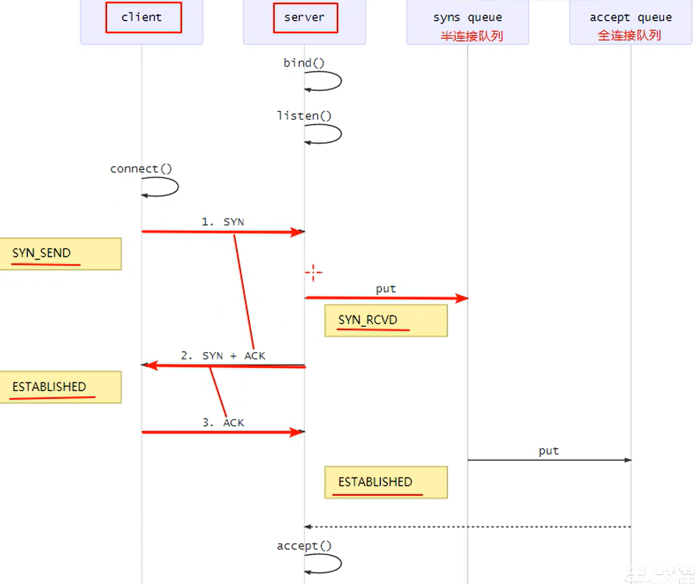

在 linux 2.2 之前，backlog 大小包括了两个队列的大小，**在 linux 2.2 之后，分别用下面两个参数来控制**

- 半连接队列 - sync queue
  - 大小通过 /proc/sys/net/ipv4/tcp_max_syn_backlog 指定，在 `syncookies` 启用的情况下，逻辑上没有最大值限制，这个设置便被忽略
- 全连接队列 - accept queue
  - 其大小通过 /proc/sys/net/core/somaxconn 指定，在使用 listen 函数时，**内核会根据传入的 backlog 参数与系统参数，取二者的较小值**
  - 如果 accpet queue 队列满了，server 将发送一个拒绝连接的错误信息到 client

#### 作用

在Netty中，`SO_BACKLOG`主要用于设置全连接队列的大小。**当处理Accept的速率小于连接建立的速率时，全连接队列中堆积的连接数大于`SO_BACKLOG`设置的值是，便会抛出异常**

**设置方式如下**

```java
// 设置全连接队列，大小为2
new ServerBootstrap().option(ChannelOption.SO_BACKLOG, 2);
```

#### 默认值

backlog参数在`NioSocketChannel.doBind`方法被使用

```java
@Override
protected void doBind(SocketAddress localAddress) throws Exception {
    if (PlatformDependent.javaVersion() >= 7) {
        javaChannel().bind(localAddress, config.getBacklog());
    } else {
        javaChannel().socket().bind(localAddress, config.getBacklog());
    }
}
```

其中backlog被保存在了`DefaultServerSocketChannelConfig`配置类中

```java
private volatile int backlog = NetUtil.SOMAXCONN;
```

具体的赋值操作如下

```java
SOMAXCONN = AccessController.doPrivileged(new PrivilegedAction<Integer>() {
    @Override
    public Integer run() {
        // Determine the default somaxconn (server socket backlog) value of the platform.
        // The known defaults:
        // - Windows NT Server 4.0+: 200
        // - Linux and Mac OS X: 128
        int somaxconn = PlatformDependent.isWindows() ? 200 : 128;
        File file = new File("/proc/sys/net/core/somaxconn");
        BufferedReader in = null;
        try {
            // file.exists() may throw a SecurityException if a SecurityManager is used, so execute it in the
            // try / catch block.
            // See https://github.com/netty/netty/issues/4936
            if (file.exists()) {
                in = new BufferedReader(new FileReader(file));
                // 将somaxconn设置为Linux配置文件中设置的值
                somaxconn = Integer.parseInt(in.readLine());
                if (logger.isDebugEnabled()) {
                    logger.debug("{}: {}", file, somaxconn);
                }
            } else {
                ...
            }
            ...
        }  
        // 返回backlog的值
        return somaxconn;
    }
}
```

- backlog的值会根据操作系统的不同，来

  选择不同的默认值

  - Windows 200
  - Linux/Mac OS 128

- **如果配置文件`/proc/sys/net/core/somaxconn`存在**，会读取配置文件中的值，并将backlog的值设置为配置文件中指定的

### ulimit -n

* 属于操作系统参数

### TCP_NODELAY

- 属于 **SocketChannal** 参数
- 因为 Nagle 算法，数据包会堆积到一定的数量后一起发送，这就**可能导致数据的发送存在一定的延时**
- **该参数默认为false**，如果不希望的发送被延时，则需要将该值设置为true

### SO_SNDBUF & SO_RCVBUF

- SO_SNDBUF 属于 **SocketChannal** 参数
- SO_RCVBUF **既可用于 SocketChannal 参数，也可以用于 ServerSocketChannal 参数**（建议设置到 ServerSocketChannal 上）
- 该参数用于**指定接收方与发送方的滑动窗口大小**

### ALLOCATOR

- 属于 **SocketChannal** 参数
- 用来配置 ByteBuf 是池化还是非池化，是直接内存还是堆内存

#### 使用

```java
// 选择ALLOCATOR参数，设置SocketChannel中分配的ByteBuf类型
// 第二个参数需要传入一个ByteBufAllocator，用于指定生成的 ByteBuf 的类型
new ServerBootstrap().childOption(ChannelOption.ALLOCATOR, new PooledByteBufAllocator());
```

**ByteBufAllocator类型**

- 池化并使用直接内存

  ```java
  // true表示使用直接内存
  new PooledByteBufAllocator(true);
  ```

- 池化并使用堆内存

  ```java
  // false表示使用堆内存
  new PooledByteBufAllocator(false);
  ```

- 非池化并使用直接内存

  ```java
  // ture表示使用直接内存
  new UnpooledByteBufAllocator(true);
  ```

- 非池化并使用堆内存

  ```java
  // false表示使用堆内存
  new UnpooledByteBufAllocator(false);
  ```

### RCVBUF_ALLOCATOR

- 属于 **SocketChannal** 参数
- **控制 Netty 接收缓冲区大小**
- 负责入站数据的分配，决定入站缓冲区的大小（并可动态调整），**统一采用 direct 直接内存**，具体池化还是非池化由 allocator 决定

## 3、RPC框架

见项目源码

